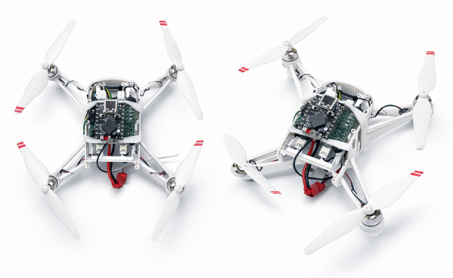
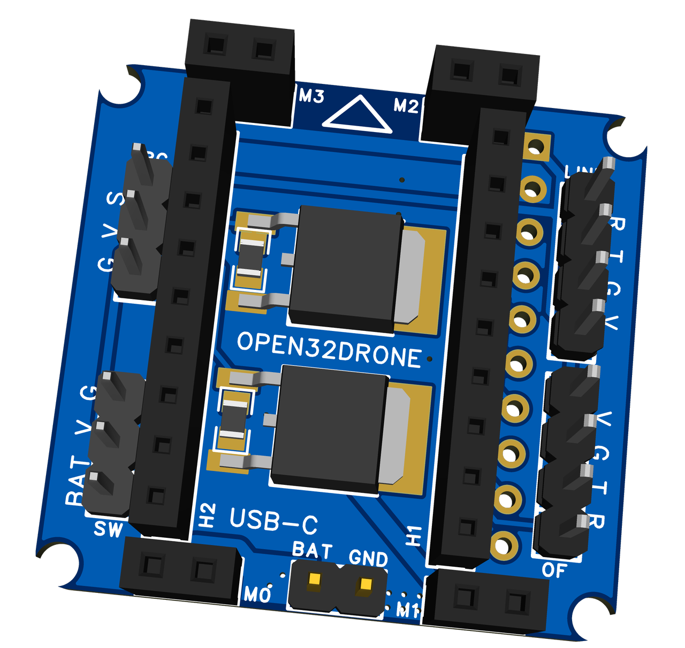
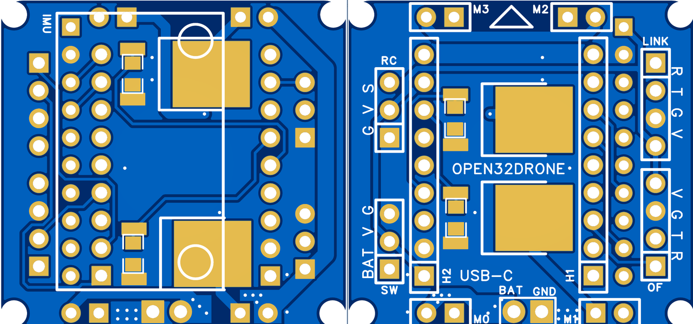
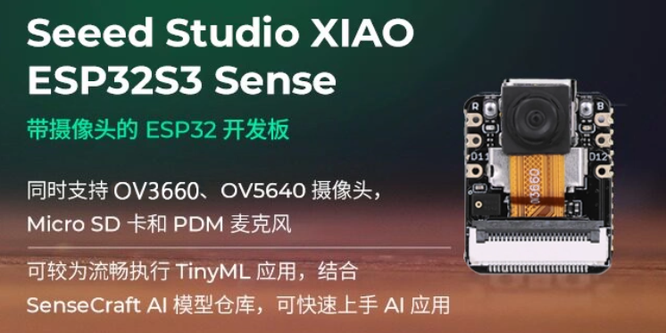
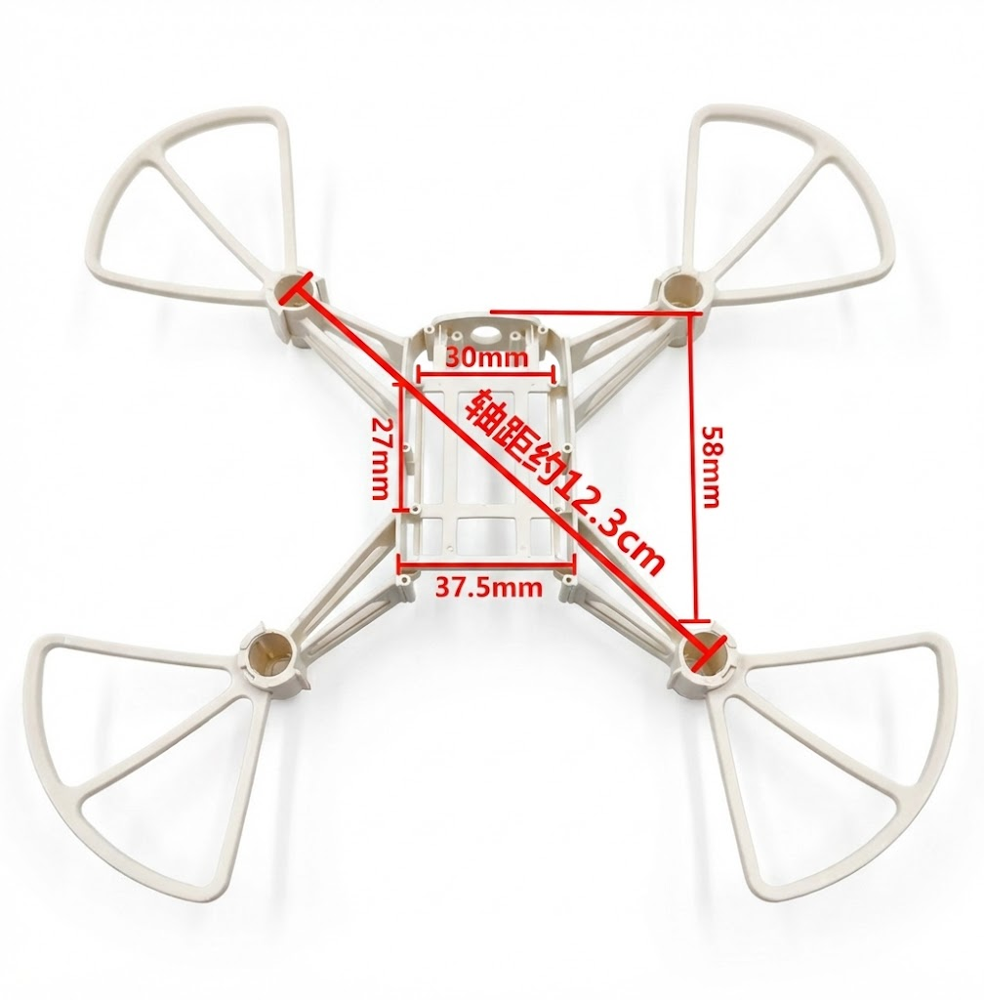
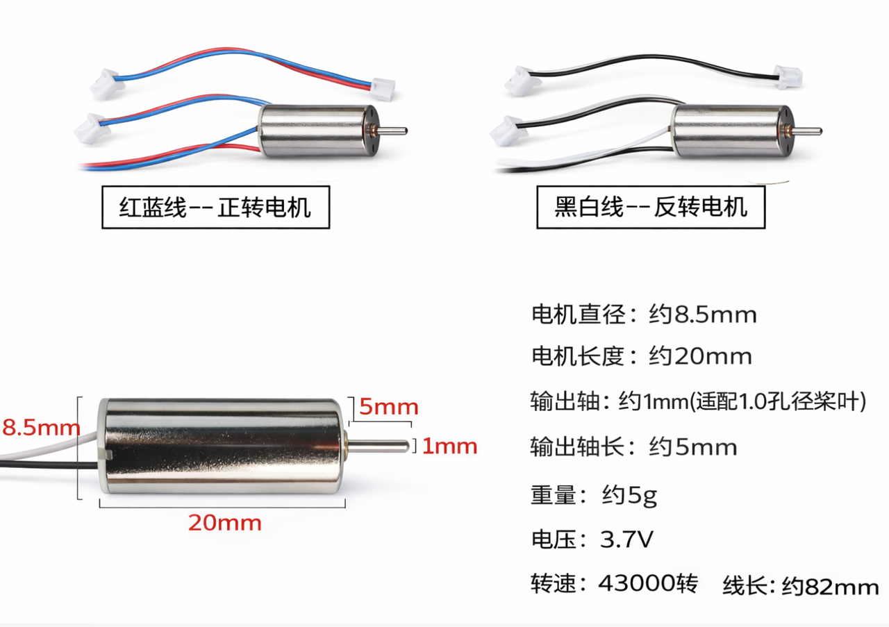
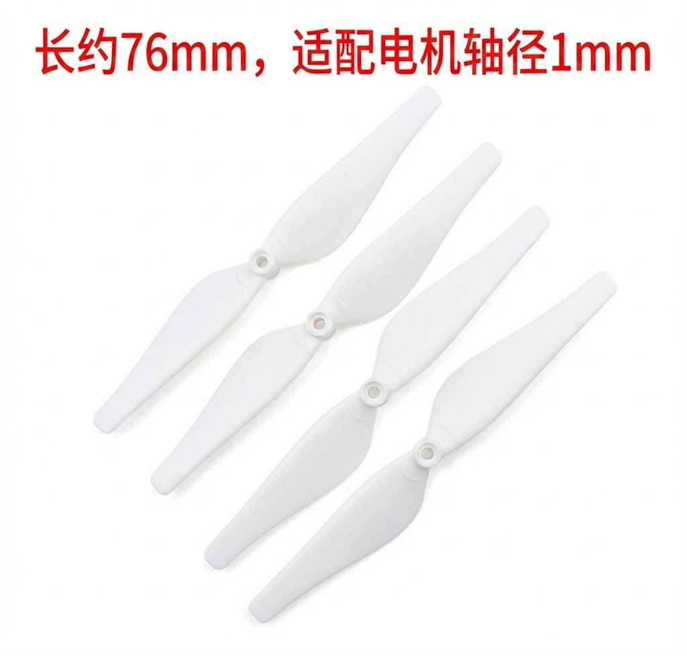
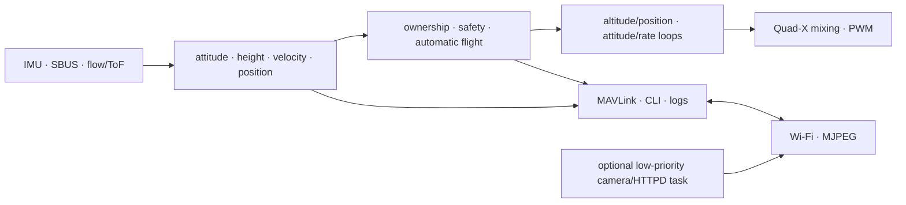
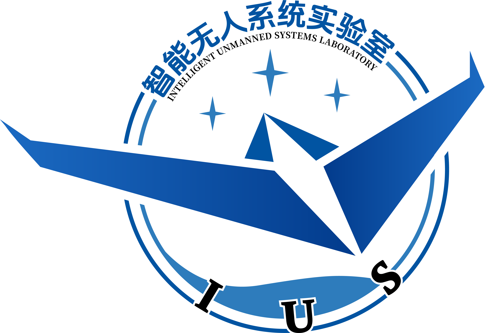
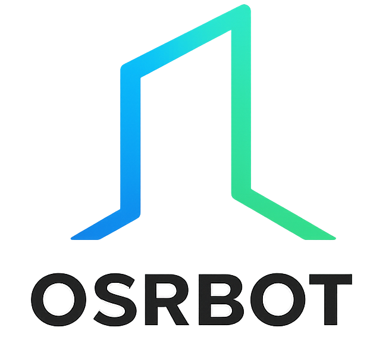

# Open32Drone Minimal

    

  <strong>
    <a href="./README_zh_CN.md">简体中文</a> &nbsp;|&nbsp;
    <a href="./README.md">English</a>
  </strong>

**Open32Drone** is an open-source micro-UAV platform based on the **ESP32-S3**, designed for research and education, embedded flight-control development, and robotics algorithm validation.

Open32Drone builds on the open-source [Flix](https://github.com/okalachev/flix/tree/master) project, retaining its lightweight code architecture while adding optical-flow sensing for indoor position and altitude hold. It supports MAVLink and ROS integration and provides a low-cost, extensible micro-aircraft platform for learning UAV control theory, validating swarm algorithms, and researching indoor navigation.

---

## Core Features

### Compute Core: ESP32-S3

The project uses an **ESP32-S3** series chip as the main controller:

- **Dual-core high clock speed**: 240 MHz processing capability for real-time attitude estimation and communication.

- **Expansion capability**: Supports the ESP-DL instruction set, providing computing resources for lightweight edge-side vision processing.

### Navigation and Perception: Optical Flow + ToF Sensor

A TF-0850 serial optical-flow/ToF module closes a low-altitude relative loop without GPS or an external positioning system:

- **Indoor position hold**: Estimates horizontal motion using height scaling, delayed angular-rate compensation, outlier rejection, and gated integration.

- **Indoor altitude hold**: Uses ToF relative height and filtered vertical speed to form an altitude-control loop.

### Communication Ecosystem: MAVLink & ROS & Video

- **QGC support**: Native MAVLink v2 support enables connection to **QGroundControl** for parameter access, state monitoring, arming, and external-control testing.

- **ROS 2 / MAVROS integration**: Provides IMU/odometry/ToF/battery interfaces, `/cmd_vel`, `/goal_pose`, raw RC, TF, RViz2, lifecycle commands, and propeller-off and supervised-flight tests. Multi-aircraft operation is isolated by aircraft IP, MAVLink System ID, local UDP port, ROS namespace, and TF prefix.

- **Bounded background service**: The optional MJPEG stream runs in a separate low-priority core-0 HTTP task, allows one viewer, and does not enter the 300 Hz flight loop. It remains an experimental feature.

### Low Cost and Easy Reproduction

- **General modular design**: Core components are common off-the-shelf modules and are easy to source.

- **Open-source hardware**: The custom PCB project and modular assembly design are provided for direct fabrication and hardware modification.

- **Documentation support**: The tutorial covers carrier-board soldering, vehicle assembly, firmware setup, calibration, and staged flight testing.

---

## Development Plan

**Open32Drone** aims to build a miniaturized air-ground collaborative robotics ecosystem. Future development plans include:

### Edge Perception and Visual Intelligence

The onboard OV3660 and current QVGA MJPEG stream provide the basis for continued visual-perception development:

- **On-device recognition**: QR-code navigation, color-block tracking, face following, and simple gesture control.

- **Vision-assisted navigation**: Combine video feature-point extraction with optical-flow position hold to improve robustness and potentially implement basic visual odometry (VO).

### Swarm Control and Collaborative Evolution

Using the wireless communication capability of the ESP32, the project will expand from single-drone control to multi-drone collaboration:

- **Distributed communication and collaboration**: Build a decentralized swarm network for position sharing and state synchronization between drones.

- **Low-cost swarm algorithm validation**: Lower the hardware barrier for swarm research and support 3-10 micro drones for laboratory-scale experiments such as collaborative search and formation flight.

### Fully Autonomous Indoor Navigation

Close the loop among perception, planning, and control at a very small scale:

- **Micro SLAM**: Explore miniaturized SLAM solutions based on multi-sensor fusion, such as ToF + optical flow + vision.

- **Dynamic obstacle avoidance**: Use multi-directional laser ranging sensors for omnidirectional obstacle avoidance and autonomous path planning in complex indoor environments.

---

## Hardware Overview

To balance reproducibility and maintainability, the hardware uses a modular **baseboard + modules** architecture.

| Physical View | Core Component | Key Parameters | Key Features / Resources |
| :---: | :--- | :--- | :--- |
|     | **Base PCB** | EasyEDA | Used only as a carrier board, with four onboard MOS motor drivers. Complete **[PCB project files](https://oshwhub.com/fanchewang/open32drone)** are provided. Solder four MOSFETs and several connectors to complete the baseboard. |
|  | **Main Controller Module** | SeeedStudio XIAO ESP32S3 Sense | Dual-core 240 MHz with PSRAM; runs the 300 Hz flight stack while streaming remains an optional background service. |
|  | **Frame Structure** | 75/85 mm | A commercial ducted frame is recommended. The repository also provides an **STL 3D-printable model**. |
|  | **Propulsion Motor** | 8520 brushed coreless motor (8.5 mm x 20 mm) | **1.0 mm** shaft diameter, with more payload margin than 720 motors. |
|  | **Propeller** | 76 mm | High lift efficiency, essential for accurate optical-flow position-hold hovering. |

---

## Firmware Structure

The flight-critical path runs in a fixed 300 Hz main loop. Each cycle reads sensors, advances state estimation, selects control targets, runs altitude/position and stabilization control, and writes the motors. CLI, MAVLink, and OTA validation are rate-limited to 100, 150, and 50 Hz. Optional video runs as a lower-priority background service outside control scheduling.

| Layer | Main files | Responsibility |
| --- | --- | --- |
| Entry and scheduling | `firmware.ino`, `time.ino` | Initialization, monotonic time, loop order, and task priority |
| Sensor input | `imu_backend.h`, `imu.ino`, `rc.ino`, `flow.ino` | Compile-time IMU backend, SBUS, and TF-0850 optical-flow/ToF packets |
| State estimation | `estimate.ino` | Attitude, ToF height/vertical speed, flow velocity, and relative position |
| Flight control | `control.ino`, `control_*.ino` | Shared control state plus dedicated modules for modes/ownership, Offboard, automatic flight, altitude, position, and stabilization |
| Safety and power | `safety.ino`, `power.ino` | Arm checks, link-loss descent, sustained-tip motor stop, voltage measurement, and bounded hover-thrust feedforward |
| Actuation | `motors.ino` | Quad-X mapping and 10 kHz, 10-bit PWM |
| Communications | `mavlink.ino`, `wifi.ino`, `camera.ino`, `ota.ino` | MAVLink, AP/STA networking, optional MJPEG, and ground-only A/B OTA |
| Diagnostics | `cli.ino`, `log.ino` | Local serial diagnostics, 25 Hz RAM flight logs, and loop-performance sampling |
| Configuration and math | `parameters.ino`, `*.h` | Parameter validation/NVS plus PID, filtering, quaternion, and vector tools |

See the [flight-control firmware architecture](tutorial.md#2-flight-control-firmware-architecture) section of the tutorial for the complete startup order, main loop, and file responsibilities.

---

## Pin Definitions

| Peripheral | GPIO | Description |
|---|---:|---|
| I2C SDA | 2 | Compile-time selected IMU |
| I2C SCL | 43 | Compile-time selected IMU, 400 kHz |
| Optical-flow RX | 8 | ESP32 `Serial1` RX, connected to optical-flow TX |
| Optical-flow TX | 7 | ESP32 `Serial1` TX, connected to optical-flow RX |
| SBUS RX | 44 | ESP32 `Serial2` RX |
| SBUS TX | 9 | ESP32 `Serial2` TX |
| LED | 21 | Onboard NEOPIXEL |
| Battery voltage | 1 / A0 | `VBAT_SW × 0.5` divider input |
| MOTOR 0 | 4 | Rear left |
| MOTOR 1 | 3 | Rear right |
| MOTOR 2 | 6 | Front right |
| MOTOR 3 | 5 | Front left |

---

## Quick Start

1. Install Arduino IDE 2.x.
2. Install ESP32 Arduino Core 3.3.6.
3. Open `firmware/firmware.ino`.
4. Select `XIAO_ESP32S3`, enable OPI PSRAM, and use the `default_8MB` A/B application partition with DIO Flash.
5. Make sure Arduino IDE can find `FlixPeriph 1.10.4`, `MAVLink 2.0.25`, and SBUS. The standard build uses the MPU6500/MPU9250 backend; ICM20948 and MPU6050 are separate compile configurations.
6. Compile and flash.
7. Open the serial monitor at 115200 bps and enter `help` to view commands.
8. On first use, connect to Wi-Fi `open32drone` with password `12345678`; MAVLink uses UDP port `14550`. Configure router STA only when required; after an 8 s connection failure the firmware opens a recovery AP. The optional stream is `http://<aircraft-address>/stream`.

For the complete full-stack tutorial, see:

[Open32Drone: From Zero to Stable Flight](./tutorial.md)

---

## Documentation

| Documentation | English | 简体中文 |
| --- | --- | --- |
| Project overview | [README](README.md) | [项目说明](README_zh_CN.md) |
| Build, operation, and development | [Full Tutorial](tutorial.md) | [完整教程](tutorial_zh_CN.md) |
| Firmware architecture | [Firmware Architecture](docs/FIRMWARE_ARCHITECTURE.md) | [固件架构](docs/FIRMWARE_ARCHITECTURE.zh-CN.md) |
| ROS 2 and automatic flight | [ROS 2 & Automatic Flight](docs/AUTOMATIC_FLIGHT_AND_ROS2.md) | [ROS 2 配套软件与自动飞行](docs/AUTOMATIC_FLIGHT_AND_ROS2.zh-CN.md) |

---

## FAQ

**Thrust-to-weight ratio:** 8520 motors with 76 mm propellers can provide about 40 g to 50 g thrust per motor at 3.7 V. The total takeoff weight should be kept within 60 g to 80 g.

**Motor shaft diameter:** Make sure the 8520 motor shaft diameter is **1.0 mm**, otherwise the 76 mm propellers cannot be installed.

**Module pin definitions:** MPU9250 modules sold online may have slightly different pin orders. Check the VCC/GND/SCL/SDA order before soldering.

**Soldering order:** Solder the SMD parts such as MOSFETs and resistors on the baseboard first, then solder the female headers. This prevents the headers from blocking the soldering area.

**Spare parts:** Coreless motors are consumables. It is recommended to buy one or two additional motors during the first purchase.

**Build environment:** Arduino IDE 2.x or PlatformIO is recommended. Before the first build, install ESP32-S3 board support. See the environment setup section in the tutorial.

**Optical-flow module:** The firmware uses a 115200 bps serial optical-flow/ToF module and parses 19-byte packets beginning with 0xDF. Verify the communication protocol when replacing it; floor texture, reflectivity, illumination, and height all affect optical-flow/ToF availability.

**First-flight check:** With the propellers removed, use the serial CLI commands `imu`, `flow`, and `rc` to verify inertial, optical-flow/ToF, and receiver input, then check motor order and direction at low output. Install the propellers only after these ground checks and conduct the first supervised STAB flight in a clear area.

---

## Contributing

Open32Drone is an open-source project, and community developers are welcome to help maintain and improve it:

* **Code contributions**: Fix bugs or submit new feature modules.
* **Documentation maintenance**: Help translate documentation or write more detailed tutorials.
* **Application demos**: Showcase research projects or creative works built with Open32Drone.

---

## Authors and Acknowledgements

### Core Contributors

* **Unmanned System Research Institute, Northwestern Polytechnical University**
* **Xi'an Sandbox Technology Co., Ltd. OSRBOT**

<table>
  <tr>
    <td align="center">
      
    </td>
    <td align="center">
      
       
    </td>
  </tr>
</table>

### Acknowledgements

Special thanks to the following excellent open-source project for providing inspiration and a foundation:

* [**Flix**](https://github.com/okalachev/flix) by Oleg Kalachev

---

## License

This project is licensed under the **[Apache License 2.0](https://www.apache.org/licenses/LICENSE-2.0)**.

