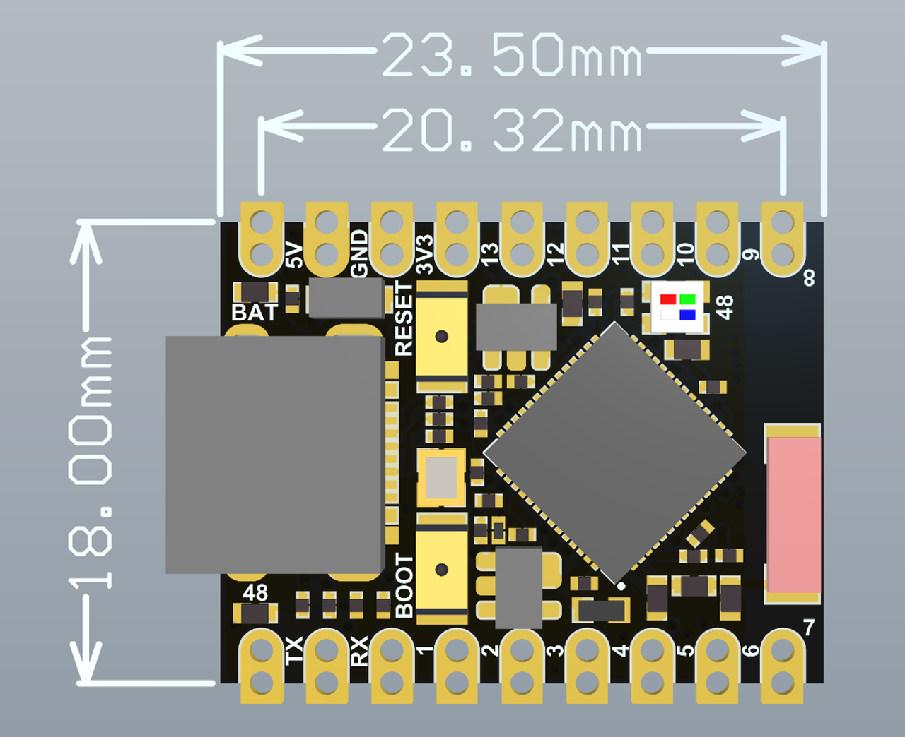
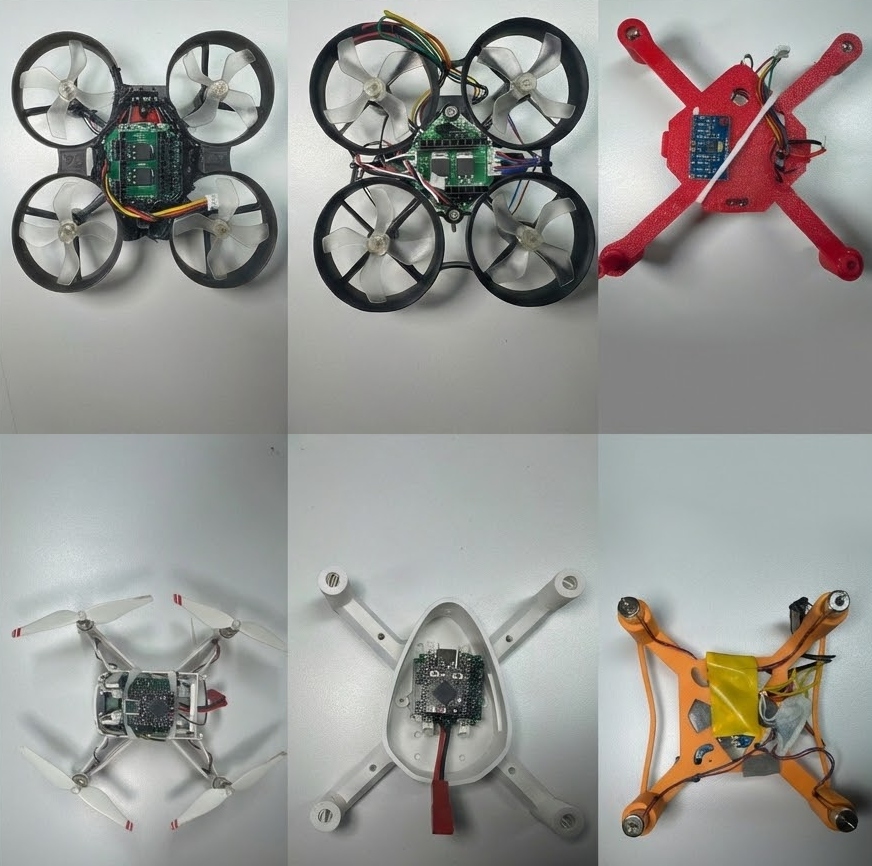

# Open32drone

    

    <strong>全部开源 · 软硬件协同</strong> 
    <strong>个人及教育用途完全免费</strong>

  <strong>
    <a href="./README_zh_CN.md">简体中文</a> &nbsp;|&nbsp;
    <a href="./README.md">English</a>
  </strong>

**Open32drone** 是一个基于 **ESP32-S3** 的开源微型无人机平台，为科研教育与算法验证设计。

本项目基于开源项目 [Flix](https://github.com/okalachev/flix/tree/master) 进行二次开发，保留了其轻量化的代码架构，并在此基础上引入了光流与 ToF 传感器，实现无人机室内环境下的定点与定高飞行。Open32drone 支持 MAVLink 协议与 ROS 接入，旨在为开发者提供一个低成本、高可扩展性的微型飞行器实验平台，适用于无人机控制理论学习、集群算法验证及室内导航研究。

---

## 核心特性

### 1. 计算核心：ESP32-S3
项目采用乐鑫 **ESP32-S3** 系列芯片作为主控制器：
* **双核高主频**：240MHz 处理速度，轻松应对姿态解算与数据通讯。
* **扩展能力**：支持 ESP-DL 指令集，为边缘端轻量级视觉处理提供算力支持。

### 2. 导航感知
集成 **光流 + ToF** 二合一传感器模组，实现无 GPS 环境下的稳定悬停：
* **室内定点**：基于光流数据监测水平位移，实现精确的水平位置保持。
* **厘米级定高**：利用 ToF 传感器精准测量离地高度，不受地面颜色或环境光干扰。

### 3. 通信生态
* **QGC 支持**：原生支持 MAVLink 协议，可直接连接 QGroundControl 进行可视化调参、任务规划和实时数据监控。
* **MAVROS 集成**：通过 Wi-Fi (UDP) 建立 MAVROS 连接。用户可将其作为 ROS 节点，利用 Python/C++ 编写上位机程序，进行高层控制、SLAM 建图或多机协同实验。

### 4. 低成本与易复现
* **通用模块化设计**：核心元器件均为市场通用模块，易于采购。
* **开源硬件**：提供完整的 PCB 工程文件，支持立创商城直接打样。
* **文档支持**：提供详细的组装指南、环境配置教程及预编译固件。

---

## 硬件架构与选型 

为了平衡复现难度与系统可维护性，硬件设计采用 **底座+模块** 的模块化架构。

| 实物展示 | 核心组件 | 核心参数 | 关键特性 / 资源 |
| :---: | :--- | :--- | :--- |
|  | **电路底板** | 嘉立创 EDA | 仅作母板，板载 4 路 MOS 驱动。提供完整 **[PCB 工程文件](https://oshwhub.com/fanchewang/open32drone)**。 |
|  | **主控模块** | ESP32-S3 | 双核 240MHz，支持 **ESP-DL** 与无线 MAVROS 连接。 |
|  | **机架结构** | 75/85mm | 推荐市售成品带圈机架，仓库亦提供 **STL 3D 打印模型**。 |
|  | **动力电机** | 8520 有刷 | 轴径 **1.0mm**，比 720 电机具有更大的载荷余量。 |
|  | **螺旋桨** | 76mm (2/3叶) | 高升力效率，是实现光流精准定点悬停的核心。 |

### 核心细节说明:

* **电路底板 (PCB)**: 
    * **设计理念**：采用“底座”化设计，用户只需焊接 4 个 MOS 管和排母即可。
    * **开源支持**：提供完整的嘉立创 EDA 工程，支持在**立创商城直接下单打样**。
    * **扩展接口**：预留了 MPU9250 (9 轴)、稳压模块以及**串口光流 + ToF 模块**的专用插槽。
* **动力系统匹配**: 
    * **轴径警告**：请务必确认 8520 电机轴径为 **1.0mm**，否则 76mm 桨叶无法安装。
    * **推重比**：在 3.7V 下单发推力约 40g-50g。建议整机起飞重量控制在 **60g-80g** 之间，以获得最佳飞行性能。

---

## DIY案例

    

---

## 开发计划

Open32drone 致力于构建一个微型化的空地协同机器人生态，未来的开发计划主要包含以下三个方向：

### 1. 边缘感知与视觉智能
计划集成轻量化图传模块，拓展视觉感知能力：

* **端侧识别**：实现二维码导航、色块追踪、人脸跟随以及简单的手势控制。
* **视觉辅助导航**：结合图传特征点提取，进一步增强光流定点的鲁棒性，甚至实现初级的视觉里程计（VO）。

### 2. 集群控制与协同演化
利用 ESP32 的无线通信能力，从单体控制向多机协同扩展：

* **分布式通讯协同**：构建去中心化的集群网络，实现无人机之间的位置共享与状态同步。
* **低成本集群算法验证**：降低集群算法的硬件门槛，支持实验室以低成本部署 3-10 架规模的微型无人机编队，用于验证协同搜索、编队飞行等算法。

### 3. 全自主室内导航
在极小的尺度内实现感知、规划与控制的闭环：

* **微型 SLAM**：探索基于多传感器融合（ToF + 光流 + 视觉）的微型化 SLAM 方案。
* **动态避障**：利用多向激光测距传感器，实现室内复杂环境下的全向避障与自主路径规划。
---

## 开发路线

### 阶段 1：基础稳飞 (已达成)
- [x] 基于 ESP32-S3 的姿态控制算法优化。
- [x] 集成光流 TOF 一体化传感器，实现室内精准定点、定高。
- [x] 兼容 MAVLink 协议与 QGC 地面站。
- [x] 兼容 Sbus 遥控器。
- [x] 支持 MAVROS 控制无人机。

### 阶段 2：视觉与交互 (进行中)
- [ ] **图传集成**：适配 ESP32-S3 图传或外置廉价图传模块，实现低延迟图传。
- [ ] **视觉任务**：基于 ESP-WHO 实现基础的物体识别与目标追踪。
- [ ] **仿真器**：开发仿真环境，支持代码先仿真、后实飞。

### 阶段 3：集群与生态 (未来规划)
- [ ] **Swarm**：发布去中心化集群方案，支持 3-10 台规模的协同飞行。

---

## 常见问题

* **推重比**：8520 电机配合 76mm 桨叶在 3.7V 下可提供单发约 40g-50g 的推力，建议整机起飞重量控制在 **60g-80g**。
* **电机轴径**：务必确认 8520 电机的轴径为 **1.0mm**，否则 76mm 桨叶无法安装。
* **模块引脚**：市面上的 MPU9250 模块引脚定义可能不同，焊接前请务必核对 `VCC/GND/SCL/SDA` 的顺序。
* **焊接建议**：先焊接底盘上的 MOS 管、电阻等贴片元件，最后焊接排母，避免排母遮挡焊接位。

---

## 参与贡献

Open32drone 是一个开放的开源项目，我们欢迎社区开发者参与项目的维护与改进：

* **代码贡献**：修复 Bug 或提交新的功能模块。
* **文档维护**：帮助翻译文档或编写更详尽的教程。
* **应用展示**：展示你使用 Open32drone 完成的科研项目或创意作品。

---

## 作者与致谢

### 核心贡献者
* **西北工业大学 无人系统技术研究院**
* **西安沙盘科技有限公司 OSRBOT**

<table>
  <tr>
    <td align="center">
      
    </td>
    <td align="center">
      
       
    </td>
  </tr>
</table>

### 致谢
特别感谢以下优秀的开源项目为本项目提供了灵感与基础：
* [**Flix**](https://github.com/okalachev/flix) by Oleg Kalachev

---

## 许可证

本项目采用 **[Apache License 2.0](https://www.apache.org/licenses/LICENSE-2.0)** 协议进行许可。

