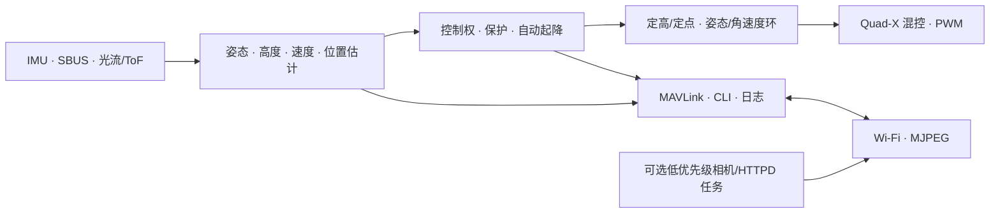

# Open32Drone Minimal

    

  <strong>
    <a href="./README_zh_CN.md">简体中文</a> &nbsp;|&nbsp;
    <a href="./README.md">English</a>
  </strong>

**Open32Drone** 是一个基于 **ESP32\-S3** 的开源微型无人机平台，为科研教育、嵌入式飞控开发与机器人算法验证设计。

本项目基于开源项目 [Flix](https://github.com/okalachev/flix/tree/master) 进行二次开发，保留了其轻量化的代码架构，在此基础上引入了光流传感器，实现无人机在室内环境下的定点与定高飞行。Open32drone支持MAVLink协议与ROS接入，旨在为开发者提供一个低成本、高可扩展性的微型飞行器实验平台，适用于无人机控制理论学习、集群算法验证及室内导航研究。

---

## 核心功能

### 计算核心：ESP32\-S3

项目采用**ESP32\-S3**系列芯片作为主控制器：

- **双核高主频**：240MHz的处理速度，满足实时姿态解算与通信需求。

- **扩展能力**：支持 ESP\-DL 指令集，为边缘端轻量级视觉处理提供算力支持。

### 导航感知：光流TOF二合一传感器

集成 TF-0850 串口光流/ToF 一体化传感器，在无 GPS 和外部定位条件下建立低空相对闭环：

- **室内定点**：基于高度缩放、角速度时延补偿、异常值抑制和门控积分估计水平运动，实现位置保持。

- **室内定高**：利用 ToF 相对高度和滤波垂直速度构成定高闭环。

### 通信生态：MAVLink & ROS & 图传

- **QGC 支持**：原生支持 MAVLink v2，可连接 **QGroundControl** 进行参数读写、状态监控、解锁与外部控制调试。

- **ROS 2 / MAVROS 集成**：提供 IMU/里程计/ToF/电池接口、`/cmd_vel`、`/goal_pose`、原始 RC、TF、RViz2、生命周期命令以及拆桨和受监督飞行测试。多机通过飞机 IP、MAVLink System ID、本机 UDP 端口、ROS 命名空间和 TF 前缀隔离。

- **有界后台服务**：可选 MJPEG 图传运行在独立的低优先级 core-0 HTTP 任务中，只允许一个观看端，不进入 300 Hz 飞控循环；当前将其作为实验功能使用。

### 低成本与易复现

- **通用模块化设计**：核心元器件均为市场通用模块，易于采购。

- **开源硬件**：提供自主设计的 PCB 工程文件和模块化装配方案，支持直接打样和二次设计。

- **文档支持**：提供从底板焊接、整机装配到固件配置、校准和分级试飞的完整教程。

---

## 开发计划

**Open32Drone** 致力于构建一个微型化的空地协同机器人生态，未来的开发计划包括：

### 边缘感知与视觉智能

利用板载 OV3660 与当前 QVGA MJPEG 图传继续拓展视觉感知能力：

- **端侧识别**：实现二维码导航、色块追踪、人脸跟随以及简单的手势控制。

- **视觉辅助导航**：结合图传特征点提取，进一步增强光流定点的鲁棒性，甚至实现初级的视觉里程计（VO）。

### 集群控制与协同演化

利用 ESP32 的无线通信能力，从单体控制向多机协同扩展：

- **分布式通讯协同**：构建去中心化的集群网络，实现无人机之间的位置共享与状态同步。

- **低成本集群算法验证**：降低集群算法的硬件门槛，支持实验室以低成本部署 3\-10 架规模的微型无人机编队，用于验证协同搜索、编队飞行等算法。

### 全自主室内导航 

在极小的尺度内实现感知、规划与控制的闭环：

- **微型 SLAM**：探索基于多传感器融合（ToF \+ 光流 \+ 视觉）的微型化 SLAM 方案。

- **动态避障**：利用多向激光测距传感器，实现室内复杂环境下的全向避障与自主路径规划。

---

## 硬件概览

为了平衡复现难度与系统可维护性，硬件设计采用 **底座+模块** 的模块化架构。

| 实物展示 | 核心组件 | 核心参数 | 关键特性 / 资源 |
| :---: | :--- | :--- | :--- |
|     | **电路底板** | 嘉立创 EDA | 仅作母板，板载 4 路 MOS 驱动。提供完整 **[PCB 工程文件](https://oshwhub.com/fanchewang/open32drone)**,只需焊接 4 个 MOS 管和几个接插件，即可完成底板制作。 |
|  | **主控模块** | SeeedStudio XIAO ESP32S3 Sense | 双核 240 MHz、PSRAM；执行 300 Hz 飞控，图传作为可选后台服务运行。 |
|  | **机架结构** | 75/85mm | 推荐市售成品带圈机架，仓库亦提供 **STL 3D 打印模型**。 |
|  | **动力电机** | 8520 有刷空心杯电机 (8.5mmx20mm) | 轴径 **1.0mm**，比 720 电机具有更大的载荷余量。 |
|  | **螺旋桨** | 76mm | 高升力效率，是实现光流精准定点悬停的核心。 |

---

## 固件结构

固件以固定 300 Hz 的主循环组织飞行关键链路。每个节拍依次完成传感器采集、状态估计、控制目标选择、定高/定点与姿态稳定、电机输出；CLI、MAVLink 和 OTA 验证分别限频至 100、150 和 50 Hz。可选图传由低优先级后台任务承载，不参与控制调度。

| 层次 | 主要文件 | 职责 |
| --- | --- | --- |
| 入口与调度 | `firmware.ino`、`time.ino` | 初始化、单调时间、主循环顺序和任务优先级 |
| 传感器输入 | `imu_backend.h`、`imu.ino`、`rc.ino`、`flow.ino` | 编译期 IMU 后端、SBUS 和 TF-0850 光流/ToF 数据包 |
| 状态估计 | `estimate.ino` | 姿态、ToF 高度/垂直速度、光流水平速度和相对位置 |
| 飞行控制 | `control.ino`、`control_*.ino` | 共享控制状态，以及模式/控制权、Offboard、自动起降、定高、定点和姿态稳定各专用模块 |
| 安全与电源 | `safety.ino`、`power.ino` | 解锁预检、失联下降、持续翻覆停桨、电压测量和有界悬停推力前馈 |
| 执行输出 | `motors.ino` | Quad-X 电机映射与 10 kHz、10 bit PWM |
| 通信与配套 | `mavlink.ino`、`wifi.ino`、`camera.ino`、`ota.ino` | MAVLink、AP/STA 网络、可选 MJPEG 和仅地面 A/B OTA |
| 诊断与记录 | `cli.ino`、`log.ino` | 本地串口诊断、25 Hz RAM 飞行日志和循环性能采样 |
| 配置与基础库 | `parameters.ino`、`*.h` | 参数校验/NVS，以及 PID、滤波、四元数和向量工具 |

完整初始化顺序、主循环和文件职责见[教程中的飞控代码架构](tutorial_zh_CN.md#2-飞控代码架构)。

---

## 引脚定义

| 外设 | GPIO | 说明 |
|---|---:|---|
| I2C SDA | 2 | 编译期选择的 IMU |
| I2C SCL | 43 | 编译期选择的 IMU，400 kHz |
| 光流 RX | 8 | ESP32 `Serial1` RX，接光流 TX |
| 光流 TX | 7 | ESP32 `Serial1` TX，接光流 RX |
| SBUS RX | 44 | ESP32 `Serial2` RX |
| SBUS TX | 9 | ESP32 `Serial2` TX |
| LED | 21 | 板载 NEOPIXEL |
| 电池电压 | 1 / A0 | `VBAT_SW × 0.5` 分压输入 |
| MOTOR 0 | 4 | 左后 |
| MOTOR 1 | 3 | 右后 |
| MOTOR 2 | 6 | 右前 |
| MOTOR 3 | 5 | 左前 |

---

## 快速开始

1. 安装 Arduino IDE 2.x。
2. 安装 ESP32 Arduino Core 3.3.6。
3. 打开 `firmware/firmware.ino`。
4. 选择 `XIAO_ESP32S3`，启用 OPI PSRAM，并使用 `default_8MB` A/B 应用分区和 DIO Flash。
5. 确认 `FlixPeriph 1.10.4`、`MAVLink 2.0.25` 和 SBUS 依赖可被 Arduino IDE 识别；标准构建使用 MPU6500/MPU9250 后端，ICM20948 和 MPU6050 仅作为单独编译配置。
6. 编译并烧录。
7. 打开 115200 bps 串口监视器，输入 `help` 查看命令。
8. 首次使用连接 Wi-Fi `open32drone`（密码 `12345678`）；MAVLink UDP 端口为 `14550`。需要路由器组网时再显式配置 STA，连接失败 8 s 后固件会开启恢复 AP。可选视频流地址为 `http://<飞机地址>/stream`。

完整的全栈教程参见：

[Open32Drone：从 0 到稳飞](./tutorial_zh_CN.md)

---

## 文档

| 文档内容 | English | 简体中文 |
| --- | --- | --- |
| 项目总览 | [README](README.md) | [项目说明](README_zh_CN.md) |
| 制作、使用与开发 | [Full Tutorial](tutorial.md) | [完整教程](tutorial_zh_CN.md) |
| 固件架构 | [Firmware Architecture](docs/FIRMWARE_ARCHITECTURE.md) | [固件架构](docs/FIRMWARE_ARCHITECTURE.zh-CN.md) |
| ROS 2 与自动飞行 | [ROS 2 & Automatic Flight](docs/AUTOMATIC_FLIGHT_AND_ROS2.md) | [ROS 2 配套软件与自动飞行](docs/AUTOMATIC_FLIGHT_AND_ROS2.zh-CN.md) |

---

## 常见问题

**推重比：** 8520电机配合76mm桨叶在3\.7V下可提供单发约40g\-50g的推力，整机起飞重量应该控制在60g\-80g。

**电机轴径：** 务必确认 8520 电机的轴径为**1\.0mm**，否则 76mm 桨叶将无法安装。

**模块引脚定义：** 淘宝上MPU9250模块引脚定义可能略有不同，焊接前请对比核对VCC/GND/SCL/SDA的顺序。

**焊接顺序：** 先焊接底盘上的MOS管、电阻等贴片元件，最后焊接排母，这样可以避免排母挡住焊接位。

**备用件：** 空心杯电机属于易损耗品，建议初次采购时额外准备1\-2个备份。

**编译环境：** 推荐使用 Arduino IDE 2\.x 或 PlatformIO。首次编译前需安装 ESP32\-S3 开发板支持包，详见教程文档中的环境搭建章节。

**光流模块：** 当前固件使用 115200 bps 串口光流/ToF 一体模块，解析 0xDF 帧头的 19 字节数据包。购买或替换模块时应核对通信协议；地面纹理、反射率、照度和高度都会影响光流/ToF 的有效性。

**首飞检查：** 拆桨后通过串口 CLI 的 `imu`、`flow` 和 `rc` 命令核对惯性、光流/ToF 与遥控输入，再执行低输出电机顺序和转向检查。完成这些地面检查后，方可安装桨叶并在开阔区域进行受监督的 STAB 首飞。

---

## 参与贡献

Open32Drone 是一个开放的开源项目，我们欢迎社区开发者参与项目的维护与改进：

* **代码贡献**：修复 Bug 或提交新的功能模块。
* **文档维护**：帮助翻译文档或编写更详尽的教程。
* **应用展示**：展示你使用 Open32Drone 完成的科研项目或创意作品。

---

## 作者与致谢

### 核心贡献者
* **西北工业大学 无人系统技术研究院**
* **西安沙盘科技有限公司 OSRBOT**

<table>
  <tr>
    <td align="center">
      
    </td>
    <td align="center">
      
       
    </td>
  </tr>
</table>

### 致谢
特别感谢以下优秀的开源项目为本项目提供了灵感与基础：
* [**Flix**](https://github.com/okalachev/flix) by Oleg Kalachev

---

## 许可证

本项目采用 **[Apache License 2.0](https://www.apache.org/licenses/LICENSE-2.0)** 协议进行许可。

