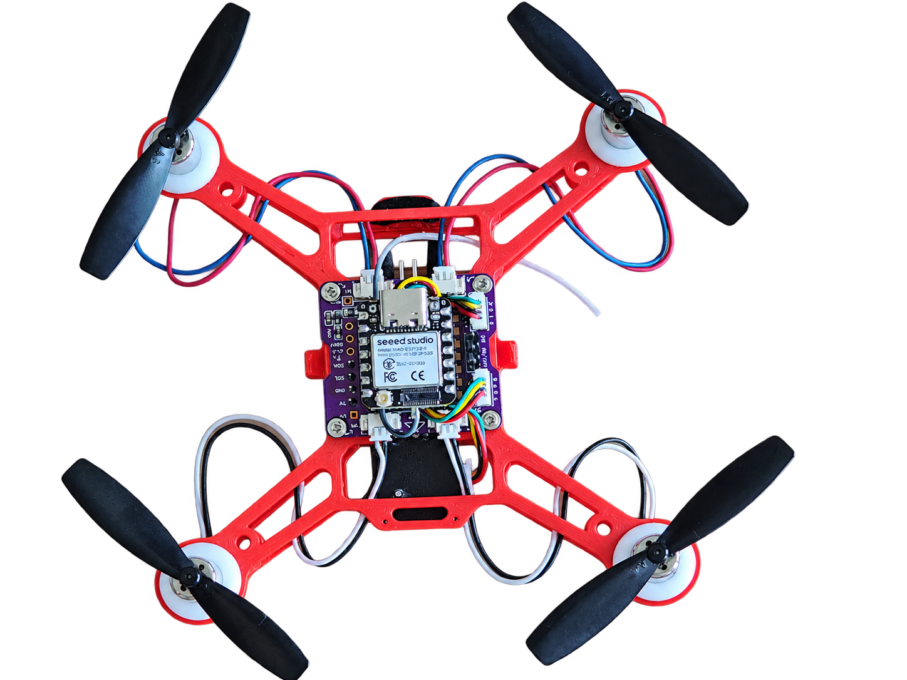
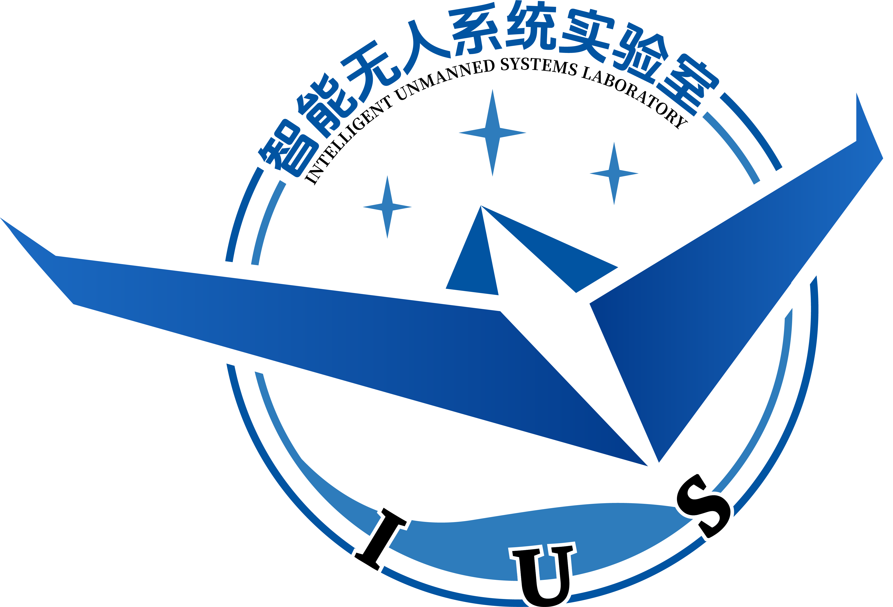
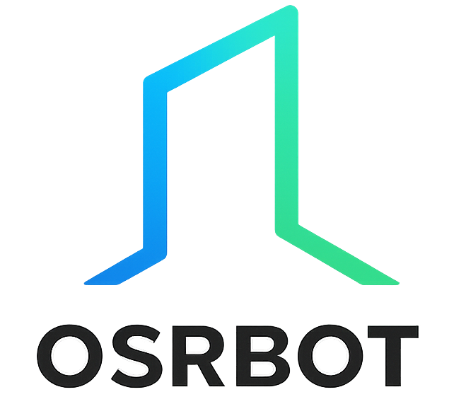

# Open32Drone

    

  <strong>
    <a href="./README_zh_CN.md">简体中文</a> &nbsp;|&nbsp;
    <a href="./README.md">English</a>
  </strong>

**Open32Drone** 是一个基于 **ESP32-S3** 的开源微型无人机平台，面向机器人教学、嵌入式开发与飞行控制研究。

项目受 [Flix](https://github.com/okalachev/flix/tree/master) 启发，使用较为精简的代码架构，并加入光流传感器，支持室内定点与定高飞行。

Open32Drone 支持 MAVLink 协议与 ROS 接入，让开发者可以用较低成本搭建和扩展自己的微型飞行器，用于学习飞行控制、验证集群算法或研究室内导航。

---

## 核心功能

### ESP32-S3 飞行控制

- **小型化、模块化硬件**：以 Seeed Studio XIAO ESP32-S3 为主控，搭配四个 8520 空心杯电机和 1S 电池。
- **便于学习的飞控代码**：提供姿态估计、姿态稳定、定高和定点控制代码支持。
- **配套调试功能**：支持传感器校准、控制参数调整、参数保存和飞行日志，方便调试和测试算法。

### 光流与 ToF 室内飞行

飞机通过 IMU 和 TF-0850 光流/ToF 模块获取飞行数据，支持以下功能：

- **姿态稳定**：利用陀螺仪与加速度计估计飞机姿态，并控制机体保持稳定。
- **定高与定点**：利用向下测距和光流，在低空飞行中保持相对高度与水平位置。
- **自动起降**：通过 Android 应用或 ROS 2 接口发起自动起飞和降落。

### 遥控方式

| 控制方式 | 支持功能 |
| --- | --- |
| **Android 应用** | 手机通过 Wi-Fi 连接飞机，查看飞行状态和电量，可一键起飞、降落，应用内包含虚拟摇杆。 |
| **SBUS 遥控器** | 可使用实体遥控器摇杆控制飞机、切换飞行模式，并执行紧急停机。 |
| **ROS 2 / MAVROS** | 通过无人机驱动可在电脑端读取 IMU、里程计、高度和电池数据，支持速度指令、位置目标及起降服务操控。 |

### 开源硬件

- **3D 打印机架**：提供机架模型与 MakerWorld 打印资源。
- **开源 PCB 工程**：飞控底板负责供电、电机驱动和模块连接，工程可在嘉立创开源硬件平台获取。
- **模块化装配**：主控、IMU、光流/ToF、电机与电池分别安装，便于检查、替换和修改。
- **USB 与 OTA 更新**：首次通过 USB 刷写固件，后续可在飞机停机时通过 Android 应用升级。

---

## 学习与开发

完成组装和首飞后，可以结合源码和教程继续学习：

- **硬件与嵌入式开发**：了解电路连接、传感器接口、电机输出和固件主循环。
- **反馈控制**：学习姿态、定高与定点控制，结合日志观察参数调整带来的变化。
- **ROS 2 编程**：读取遥测数据，将运动指令组合成可重复的飞行实验。
- **仿真与强化学习**：运行独立的数值控制和残差 PPO 练习，也可为另行准备的场景接入 Isaac 适配器。

---

## 后续开发方向

后续计划基于现有飞控和 ROS 2 接口，尝试多机协同、环境感知与自主飞行：

- **多机协同与集群编队**：探索多机通信、状态共享与协同控制，开展编队飞行和协同任务实验。
- **SLAM 与室内导航**：结合机载传感器与 ROS 2 计算端，探索视觉惯性定位、环境建图与室内导航。
- **自动避障与路径规划**：扩展环境感知能力，探索障碍物检测、局部路径规划与自主绕行。

这些功能还在规划中，欢迎参与相关开发和实验。

---

## 文档与项目资源

采购组装、固件刷写、校准首飞、调参与排查、ROS 2 控制和源码编译的步骤，都可以在教程站找到。

| 资源 | 入口 |
| --- | --- |
| 源码与协作 | [GitHub 公开仓库](https://github.com/npu-ius-lab/open32drone) |
| 制作与开发教程 | [Open32Drone 教程站](https://npu-ius-lab.github.io/open32drone/) |
| PCB 设计 | [嘉立创开源硬件](https://oshwhub.com/fanchewang/open32drone) |
| 机架打印 | [MakerWorld](https://makerworld.com.cn/zh/models/2922108-open32drone-wu-ren-ji-8520kong-xin-bei-ji-jia-ros2#profileId-3425842) |

---

## 参与贡献

欢迎一起维护和改进 Open32Drone：

* **代码贡献**：修复 Bug 或提交新的功能模块。
* **文档维护**：帮助翻译文档或编写更详尽的教程。
* **应用展示**：展示你使用 Open32Drone 完成的科研项目或创意作品。

---

## 作者与致谢

### 核心贡献者
* **西北工业大学 无人系统技术研究院**
* **西安沙盘科技有限公司 OSRBOT**

<table>
  <tr>
    <td align="center">
      
    </td>
    <td align="center">
      
       
    </td>
  </tr>
</table>

### 致谢
特别感谢以下优秀的开源项目为本项目提供了灵感与基础：
* [**Flix**](https://github.com/okalachev/flix) by Oleg Kalachev

---

## 许可证

本项目自有代码与文档默认采用 **[Apache License 2.0](https://www.apache.org/licenses/LICENSE-2.0)**。测试方法或其他组件另附许可证时，遵循各自的许可条款。

完整条款见 [LICENSE](./LICENSE)，适用范围见 [LICENSE.txt](./LICENSE.txt)。第三方代码、依赖、硬件设计和媒体素材保留原有许可，来源及例外见[第三方声明](./docs/project/third-party.zh-CN.md)。

