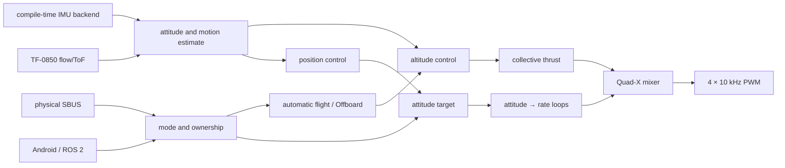

# Firmware Architecture

[English](FIRMWARE_ARCHITECTURE.md) · [简体中文](FIRMWARE_ARCHITECTURE.zh-CN.md)

This document explains how Open32Drone Minimal organizes sensing, estimation, control, and motor output into one traceable onboard chain. See the [full tutorial](../tutorial.md) for assembly, flashing, calibration, and first flight, and [ROS 2 Companion Software and Automatic Flight](AUTOMATIC_FLIGHT_AND_ROS2.md) for ROS interfaces.

## Overall Data Flow



Sensors describe aircraft state, modes and automatic flight select targets, stabilization converts targets into torque and collective thrust, and the mixer generates four motor commands. Android and ROS 2 provide requests and setpoints; they do not duplicate the flight controller offboard.

## 300 Hz Main Loop

`firmware.ino` uses `waitForControlLoopTick()` to fix the control cadence:

```text
wait for 300 Hz tick
  → IMU, SBUS, and TF-0850 inputs
  → attitude, height, horizontal velocity, and relative-position estimates
  → modes, ownership, automatic flight, and Offboard
  → altitude, position, attitude, and rate control
  → Quad-X mixing and motor output
  → rate-limited CLI / MAVLink / OTA
  → voltage, LED, logs, and parameter synchronization
```

RC, flow, estimation, control, and motors run every control tick. CLI runs at 100 Hz, MAVLink at 150 Hz, and pending OTA boot validation at 50 Hz. The performance profiler samples main-path stages once every 16 cycles without creating another control task.

The optional camera runs in a low-priority core-0 HTTP task, bounded to QVGA, 10 FPS, and one viewer. Camera initialization or stream loss cannot acquire control and does not enter the 300 Hz loop.

## File Responsibilities

| File | Responsibility |
|---|---|
| `firmware.ino`, `time.ino` | Initialization, fixed cadence, main loop, and performance stages |
| `imu_backend.h`, `imu.ino` | Compile-time IMU selection, acquisition, frame rotation, filtering, and gyro calibration |
| `flow.ino` | TF-0850 packets, ToF/flow sequences, and health |
| `estimate.ino` | Quaternion attitude, relative height/vertical speed, horizontal velocity, and integrated position |
| `control.ino` | Shared control state and top-level pipeline |
| `control_modes.ino` | Three pilot modes, actuator ownership, and manual takeover |
| `control_offboard.ino` | Offboard targets, warmup, gates, and timeout |
| `control_auto_flight.ino` | Takeoff, hold, descent, touchdown, and handover |
| `control_altitude.ino` | Height target, hover feedforward, and vertical feedback |
| `control_position.ino` | Optical-flow position/velocity cascade and bounded fallback |
| `control_stabilization.ino` | Attitude loop, rate PID, and mixer |
| `safety.ino`, `power.ino` | Arm checks, link-loss descent, minimum tip-over stop, voltage, and thrust compensation |
| `mavlink.ino`, `wifi.ino` | Telemetry, control contract, parameter protocol, and AP/STA networking |
| `camera.ino`, `ota.ino` | Optional MJPEG and ground-only A/B OTA |
| `log.ino`, `cli.ino` | RAM flight log, local diagnostics, and performance checks |

## State Estimation

The default IMU backend supports MPU6500/MPU9250; ICM20948 and MPU6050 are separate compile configurations. Attitude updates every control tick, with gravity-direction correction gated by flight and motion conditions.

TF-0850 supplies integrated flow and ToF with independent sequences. Height consumes each new ToF sample once, and horizontal estimation consumes each new flow sample once, so a lower-rate integrated measurement is never reused at 300 Hz. Horizontal velocity uses ToF for metric scaling and compensates:

- fixed timing offset between the flow integration window and IMU;
- Roll/Pitch rotation in the camera field of view;
- the sensor's roughly 24 mm forward offset from the yaw center;
- ground bias, spikes, and excessive innovations.

Integrated position is a low-altitude relative control state, not external truth, and has no GPS or magnetometer heading constraint.

## Progressive Control

```text
STAB:     attitude target → attitude loop → rate loop → mixer
ALT_HOLD: STAB + ToF height/vertical-speed feedback
POS_HOLD: ALT_HOLD + optical-flow position/velocity outer loop
```

`AUTO` denotes ownership for automatic flight or validated Offboard control, not a fourth pilot mode. Position control depends on a valid height scale. When flow is unavailable, horizontal control uses a bounded fallback inside the position-mode attitude envelope; when ToF is unavailable, the system does not continue a scale-unobservable horizontal loop.

Normal ownership priority is physical-RC emergency disarm, latched link-loss protection, automatic flight or Offboard, explicit physical-RC takeover, then the Android/ROS manual-control lease. An occasional SBUS frame cannot steal ownership.

## Safety, Parameters, and Maintenance

Minimal retains arm checks, link-loss descent, physical-RC emergency disarm, and a sustained-attitude threshold for minimum tip-over motor stop. It contains no complex collision classifier or direct MAVLink motor control.

`parameters.ino` registers and validates parameters. Only an explicit local `p` write, ground `PARAM_SET`, accelerometer/RC calibration, or AP/STA configuration updates NVS. Runtime gyro bias, flow ground bias, integrators, and flight targets do not overwrite parameters automatically.

QGC is limited to standard parameter access while disarmed. A/B OTA accepts only the app image and requires a disarmed, landed vehicle with automatic flight and Offboard stopped.

## Recommended Reading Order

1. `setup()` and `loop()` in `firmware.ino`;
2. `control()` in `control.ino`;
3. `control_modes.ino` and `control_auto_flight.ino`;
4. `control_altitude.ino` and `control_position.ino`;
5. `control_stabilization.ino`;
6. `estimate.ino`, `flow.ino`, and `imu.ino`;
7. `mavlink.ino`, `safety.ino`, and `parameters.ino`.

A successful build proves only that the source is buildable. Flight-critical changes still progress through contract tests, propeller-off checks, restrained low-power tests, and controlled low-altitude flight.
