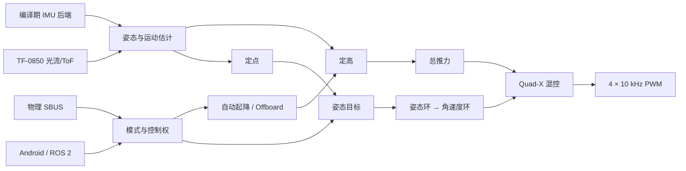

# 固件架构

[English](FIRMWARE_ARCHITECTURE.md) · [简体中文](FIRMWARE_ARCHITECTURE.zh-CN.md)

本文解释 Open32Drone Minimal 固件如何把传感器、状态估计、控制和电机输出组织成一条可追踪的机载链路。装配、烧录、校准和首飞流程见[完整教程](../tutorial_zh_CN.md)；ROS 2 接口见[ROS 2 配套软件与自动飞行](AUTOMATIC_FLIGHT_AND_ROS2.zh-CN.md)。

## 总体数据流



传感器描述飞机状态，模式与自动飞行选择目标，稳定环把目标转换为力矩和总推力，混控再生成四路电机命令。Android 和 ROS 2 只提供请求与设定值，不在机外重复实现飞控。

## 300 Hz 主循环

`firmware.ino` 使用 `waitForControlLoopTick()` 固定控制节拍：

```text
等待 300 Hz 节拍
  → IMU、SBUS、TF-0850 输入
  → 姿态、高度、水平速度与相对位置估计
  → 模式、控制权、自动飞行与 Offboard
  → 定高、定点、姿态和角速度控制
  → Quad-X 混控与电机输出
  → 限频 CLI / MAVLink / OTA
  → 电压、LED、日志和参数同步
```

RC、光流、估计、控制和电机每个控制节拍运行。CLI 为 100 Hz，MAVLink 为 150 Hz，待确认 OTA 启动检查为 50 Hz。性能分析器每 16 圈采样一次主路径各阶段耗时，不创建另一条控制任务。

可选摄像头在低优先级 core-0 HTTP 任务中运行，限制为 QVGA、10 FPS 和一个观看端。相机初始化或断流不取得控制权，也不进入 300 Hz 主循环。

## 文件职责

| 文件 | 职责 |
|---|---|
| `firmware.ino`、`time.ino` | 初始化、固定节拍、主循环与性能阶段 |
| `imu_backend.h`、`imu.ino` | 编译期 IMU 选择、采集、坐标旋转、滤波与陀螺校准 |
| `flow.ino` | TF-0850 数据包、ToF/光流序列和健康状态 |
| `estimate.ino` | 四元数姿态、相对高度/垂直速度、水平速度与积分位置 |
| `control.ino` | 共享控制状态和顶层控制流水线 |
| `control_modes.ino` | 三种飞手模式、执行器控制权和人工接管 |
| `control_offboard.ino` | Offboard 目标、预热、门控和超时 |
| `control_auto_flight.ino` | 自动起飞、保持、下降、接地和交接 |
| `control_altitude.ino` | 高度目标、悬停前馈和垂直反馈 |
| `control_position.ino` | 光流位置/速度串级控制与有界回退 |
| `control_stabilization.ino` | 姿态环、角速度 PID 和混控 |
| `safety.ino`、`power.ino` | 解锁预检、失联下降、最小翻覆停桨、电压与推力补偿 |
| `mavlink.ino`、`wifi.ino` | 遥测、控制契约、参数协议和 AP/STA 网络 |
| `camera.ino`、`ota.ino` | 可选 MJPEG 和仅地面 A/B OTA |
| `log.ino`、`cli.ino` | RAM 飞行日志、本地诊断与性能检查 |

## 状态估计

默认 IMU 后端适配 MPU6500/MPU9250；ICM20948 和 MPU6050 是单独的编译配置。姿态估计在每个控制节拍更新，重力方向修正受飞行状态与运动条件门控。

TF-0850 以独立序列号提供积分光流和 ToF。高度估计只消费新的 ToF 样本，水平估计只消费新的光流样本，因此较低频率的积分测量不会被 300 Hz 主循环重复积分。水平速度使用 ToF 高度进行尺度换算，并补偿：

- 光流积分窗与 IMU 之间的固定时间偏移；
- Roll/Pitch 旋转产生的视场运动；
- 传感器相对偏航中心约 24 mm 的前向安装偏移；
- 地面偏置、尖峰与创新异常。

积分位置是低空相对控制状态，不是外部真值，也没有 GPS 或磁航向长期约束。

## 递进控制

```text
STAB:     姿态目标 → 姿态环 → 角速度环 → 混控
ALT_HOLD: STAB + ToF 高度/垂直速度反馈
POS_HOLD: ALT_HOLD + 光流位置/速度外环
```

`AUTO` 仅表示自动起降或经过验证的 Offboard 控制权，不是飞手第四种模式。定点依赖有效高度尺度；光流不可用时水平控制采用定点姿态范围内的有界回退，ToF 不可用时不会继续运行缺少尺度的水平闭环。

正常控制优先级为：物理 RC 紧急上锁、已触发的失联保护、自动飞行或 Offboard、物理 RC 明确接管、Android/ROS 手动控制租约。偶发 SBUS 帧不能抢占控制权。

## 安全、参数与维护

Minimal 保留解锁预检、通信失联下降、物理 RC 紧急上锁和持续姿态门限的最小翻覆停桨。它不包含复杂碰撞分类器或直接 MAVLink 电机控制。

参数由 `parameters.ino` 注册并验证。只有明确的本地 `p` 写入、地面 `PARAM_SET`、加速度计/遥控校准和 AP/STA 配置会更新 NVS；运行时陀螺零偏、光流地面偏置、积分器和飞行目标不会自动覆盖参数。

QGC 只用于上锁状态下的标准参数读取与修改。A/B OTA 只接受 app 镜像，并要求飞机上锁、落地且自动飞行与 Offboard 已停止。

## 推荐源码阅读顺序

1. `firmware.ino` 的 `setup()` 和 `loop()`；
2. `control.ino` 的 `control()`；
3. `control_modes.ino` 与 `control_auto_flight.ino`；
4. `control_altitude.ino` 与 `control_position.ino`；
5. `control_stabilization.ino`；
6. `estimate.ino`、`flow.ino` 和 `imu.ino`；
7. `mavlink.ino`、`safety.ino` 与 `parameters.ino`。

编译通过只能证明源码可构建。飞行关键修改仍应依次完成契约测试、拆桨检查、低功率约束测试和受控低空飞行。
