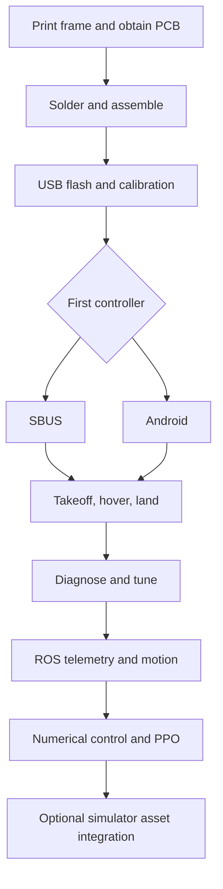

# 02 · Plan your build

The aim is a reproducible aircraft, not just a successful takeoff. Complete the
hardware and first-flight stages before adding ROS or simulation.

## What you will build

1. **Hardware:** print the frame, obtain the matching PCB, solder components,
   mount the XIAO, IMU and flow/ToF module, and identify every motor and propeller.
2. **Firmware:** distinguish a complete USB image from an OTA application;
   calibrate this IMU, battery input and, when present, the SBUS transmitter.
3. **First flight:** use either calibrated SBUS or the Android app. A receiver
   is not required for Android. Observe takeoff, hold, movement and landing.
4. **Diagnosis:** distinguish vibration, slow oscillation, range jumps and drift;
   preserve a short log and change one variable at a time.
5. **ROS:** read telemetry, request takeoff/landing, then command velocity and
   local position. Confirm Offboard activation before expecting movement.
6. **Learning:** run the numerical hover exercise, compare PD with residual PPO,
   and only then prepare an optional Isaac asset. Complete URDF/USD scenes,
   Gazebo flight integration and real-aircraft learned control are not bundled.

## Learning route

## Preparation

You need basic soldering, multimeter and battery-handling skills. For software,
you should be able to change directories and run terminal commands. Python,
vectors and PID concepts help with later chapters but are not prerequisites
for the first flight.

Use a textured, evenly lit indoor floor and a clear operating area. Keep
propellers off during soldering, flashing, calibration and motor identification.
Install them only after the four motor positions and directions are verified.

Continue to [hardware assembly](03-hardware.en.md).
