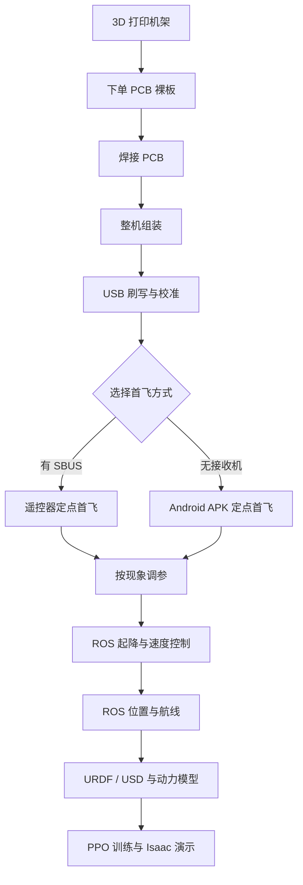

# 02 · 制作目标

这套项目将建立一条能够自己制造、维护、扩展和复现实验的无人机开发链。完成全部章节后，你将知道飞机怎样从数字文件变成真实硬件、为什么能够稳定飞行、问题出现在哪一层，以及怎样把一个控制想法从电脑送进仿真和真机接口。

## 最终能完成什么

### 做出一架真实可飞的飞机

你会打印机架，使用与硬件版本匹配的生产文件下单 PCB 裸板，按照 BOM 和位号图完成器件、连接器、供电小板与 IMU 的焊接，随后安装光流/ToF、XIAO、四个电机和电池。你会建立清楚的机头、电机编号和桨叶方向，并把每一步做成可以检查和复现的装配记录。

### 理解并刷入固件

你会区分第一次 USB 完整刷写和以后使用的应用镜像，完成 IMU、遥控器和电池电压校准，并用拆桨电机测试确认四路输出。完成后可以在两种入口中任选一种起飞：

- 有 SBUS 接收机和遥控器时，使用实体摇杆与三段模式；
- 没有接收机时，手机直接连接飞机热点，使用配套 Android APK 自动起飞和降落。

### 根据飞行现象调参

你会把“飞得不好”拆成可观察的现象：快速抖动、缓慢摆动、定高上下跳、水平漂移、换电后下沉等。教程会给出对应的机械、传感器和控制参数检查顺序，并坚持每次只改一个变量。

### 用 ROS 控制运动

你会在 ROS 2 中看到 IMU、距离、电池和里程计，调用自动起降命令，发送机体系速度和局部位置目标。随后把基本动作组合成前进、横移、转向、方形航线，并用 rosbag 保存一次实验。

### 建立仿真与强化学习流程

你会理解 link、joint、质量和碰撞结构，使用 81 g 粗动力模型运行 CPU 悬停练习，
再训练 PPO 残差策略。具备自备的兼容 USD 场景后，可尝试 Isaac 展示；完整场景和
Gazebo 飞行集成不随仓库提供。先完成数值练习，不把示例视频当作现成安装包。

## 推荐学习路线

第一次制作建议完整走完打印、下单、焊接和装机过程。已有可飞样机的开发者可以从 ROS 章节开始；强化学习不要求先精通所有飞控公式，但需要理解坐标、速度、位置目标和闭环控制，因此建议先完成 ROS 的方形航线。

## 开始前需要的基础

硬件部分需要基本的焊接、万用表和锂电池使用经验。软件部分需要能够在终端中切换目录并运行命令。ROS 与强化学习章节会逐条给出命令，不要求预先会写复杂节点；读者如果了解 Python、向量和 PID，会更容易理解背后的原理。

真实飞行请使用有纹理、光照均匀的室内地面，周围至少留出 2 m 空间。焊接、刷写、校准和电机测试阶段均不安装桨叶；只有四路电机位置与转向确认后，才进入装桨首飞。

下一章从机架文件和 PCB 生产资料开始，把数字设计变成一架完整飞机。
