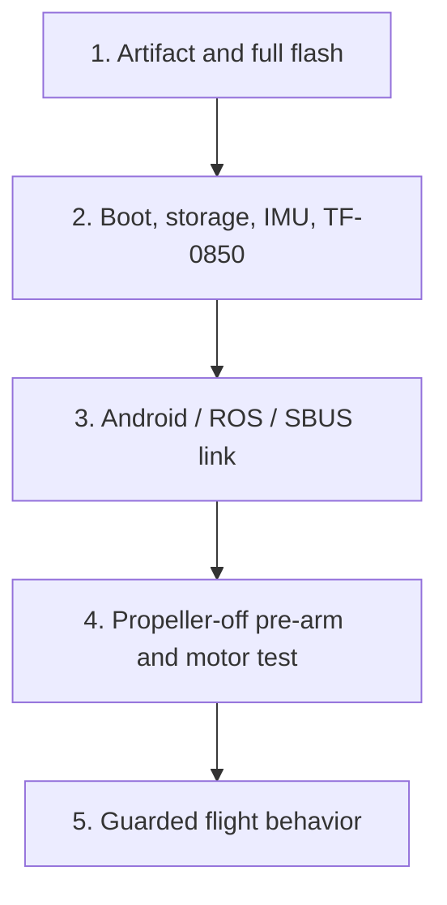

# 05 · Tuning and troubleshooting

## Tune from the inside out

The control layers are angular rate → attitude → vertical/velocity → horizontal
position. Establish a mechanically sound, calibrated aircraft first. Use the
same `0.65 m → hover 5 s → land` maneuver and compare one changed parameter.

| Layer | Parameter | Default |
|---|---|---:|
| Roll/pitch rate | `CTL_R_RATE_P`, `CTL_P_RATE_P` | 0.05 |
| Roll/pitch rate | corresponding `RATE_I` / `RATE_D` | 0.20 / 0.001 |
| Roll/pitch angle | `CTL_R_P`, `CTL_P_P` | 4.47 |
| Altitude | `ALT_P`, `ALT_I`, `ALT_D` | 0.747 / 0.10 / 0.20 |
| Hover feed-forward | `ALT_HOVER` | 0.49 |
| Vertical speed | `ALT_VEL_MAX` | 0.45 m/s |
| Position | `POS_HOLD_P` | 0.85 |
| Horizontal velocity | `POS_VEL_P_X/Y`, `POS_VEL_I_X/Y` | 0.35 / 0.04 |
| Stick horizontal speed | `POS_STICK_V` | 0.70 m/s |

After excluding vibration, high-frequency rate oscillation may justify a small
rate-P reduction (for example 0.050 → 0.045 on one axis). A slow outer-loop sway
may instead justify an angle-P reduction (4.47 → 4.02). These are diagnostic
comparisons, not automatic fixes. Restore the old value if response worsens.
Check ToF continuity before changing altitude gains, and floor texture and flow
freshness before changing position gains. Never tune around motor saturation.

Read `p` first; write one parameter with `p NAME VALUE`, wait one second and
read it back. Keep old/new values and the observed effect. Download `log dump`
while disarmed and compare attitude/height targets, measurements, motor output,
`voltage`, `hoverFF` and `voltComp`. The reusable analyzer is:

```bash
python3 software/simulation/course/analyze_log.py \
  --csv /path/to/flight.csv --output output/my-flight-analysis
```

Diagnose Open32Drone from the lowest failed layer upward. Do not compensate for
a hardware, calibration, or firmware failure by adding client retries or
changing several control parameters at once.

## The five evidence layers



A result at one layer proves only that layer. A successful build does not prove
a flash; a topic list does not prove an FCU link; a takeoff does not prove
stable hold or safe landing.

## Collect a minimal evidence bundle

With the aircraft disarmed and propellers removed, capture:

```text
sys
time
perf reset
# keep one workload active for 10-20 seconds, then run: perf
imu
flow
alt
rc
wifi
ota
p
log
```

For a flight issue, run `log dump` only after the aircraft is safely disarmed.
Record the firmware filename and SHA-256, whether the flash was complete or OTA,
the airframe, battery state, floor texture, lighting, launch height, control
source, and the exact visible symptom. Change one variable per A/B comparison.

## Boot and pre-arm failures

### No serial output, or the LED only flashes once

1. Confirm that a complete merged image was written at offset `0x0`, not an
   app-only OTA image.
2. Use the correct ESP32-S3 USB port and 115200 baud serial monitor.
3. Perform a complete erase and USB flash once.
4. Inspect the boot log for partition, reset-loop, or brownout messages.

### GPIO21 keeps blinking after initialization

Run `pw` and compare the reported voltage with a DMM. A filtered value at or
below `3.10 V` for `1.5 s` starts the `2 Hz` warning; it clears only after the
value stays at or above `3.20 V` for `1.0 s`. The blink is an indicator only:
it does not cause landing or disarming. If the board has no divider, set
`PWR_VOLT_PIN=-1`; do not leave an unconnected ADC enabled.

### `motor PWM unavailable`

The four LEDC motor channels did not attach successfully. Do not bypass the
pre-arm gate. Confirm the firmware was built with the pinned Arduino-ESP32 core,
that no camera or other module uses the same LEDC resources, and that motor pins
are `4, 3, 6, 5` in rear-left, rear-right, front-right, front-left order.

### `gyro calibration incomplete`

Cold-boot on a rigid, level surface and do not touch the aircraft for at least
two seconds. If calibration does not complete, use `imu` to read the reason and
standard deviation. Remove vibration, airflow, a moving table, or a damaged
motor. `cg` restarts only gyro calibration; it does not replace `ca`.

### `invalid RC calibration/mapping`

Run `cr` with the receiver powered and follow all eight prompts. Each control
must map to a distinct persistent channel `0..7`. A powered-off receiver is not
required for Android or ROS flight.

### Parameter storage error

If `sys` reports `Parameter storage: ERROR`, arming fails closed. Do not keep
flying with unsaved calibration. Reflash after a full erase and repeat `ca` and
`cr`; if the error returns, investigate flash/NVS hardware or partitioning.

### Loop rate is low or irregular

Do not remove safety checks or disable the flight log based on one `rate`
number. The expected result is near the fixed 300 Hz schedule. Disarm, run
`perf reset`, keep exactly one workload active for 10-20 seconds, then collect
`time` and `perf`. Repeat separately with no client, Android, ROS, and the QGC
parameter page. Compare deadline misses, maximum lateness, p95/p99/max, and the
named stage costs. `imu acquire` is the selected backend's `read()` cost; a
backend may perform family-specific internal transfers. The scheduled idle wait
is deliberately outside `perf`, so its sampled total is execution cost rather
than the 3.33 ms period. Large CLI, MAVLink, or housekeeping maxima point to a
different cause. The 25 Hz log is a RAM ring buffer and must be proven in the
housekeeping stage before it is blamed.

## TF-0850 and calibration

### Android says ToF is not ready while the aircraft is on the floor

The TF-0850 blind zone is below roughly `20 mm`. A fresh blind-zone packet is
valid ground-readiness evidence even though no numeric range can be displayed.
The Android message is diagnostic, not a separate takeoff veto. If the button
is disabled, diagnose MAVLink connection or physical SBUS ownership instead.

Use `flow` and check:

- `TOF UART healthy: 1`;
- packet age below `150 ms`;
- either a numeric distance or `blind-zone: 1`;
- packet counters increasing.

### Accelerometer calibration is rejected

Run `ca` disarmed, remove propellers, place the aircraft on all six requested
faces, and keep it motionless during collection. Calibration is transactional:
any invalid face, excessive noise, gravity magnitude, scale, or residual causes
the complete candidate to be rejected and the previous values to remain active.

### Two identical aircraft do not fly identically

The default controller parameters should remain common across the standard
airframe. Per-aircraft differences should first be handled mechanically and by
`ca`/`cr`, not by hidden trim:

- motor and propeller model/direction;
- bent shafts, loose arms, or unequal motor height;
- IMU rigidness and parallelism to the thrust plane;
- battery position and center of gravity;
- downward module orientation and the standard `24 mm` forward offset;
- calibration surface and vibration.

There is no automatic profile migration or hover-trim learning that silently
rewrites copied controller parameters.

## Android link and control

### `ENETUNREACH (Network is unreachable)`

The phone has no Wi-Fi route to the configured aircraft address, or Android
recreated that route. In direct-AP mode, connect to the aircraft SSID and keep
the address at `192.168.4.1`. In router STA mode, connect the phone to the same
router and enter the DHCP address printed by the firmware `wifi` command under
**Tools > Aircraft address**. Disable VPN, allow local-network access, and test:

```text
http://<aircraft-ip>:8080/api/ota/status
```

The client binds MAVLink, camera, and OTA to the Android Wi-Fi network that
contains the configured address. It closes stale sockets and retries when that
route returns; it never falls back to cellular data.

### Buttons are gray

Check the status banner:

- disconnected: no MAVLink heartbeat;
- physical SBUS priority: release the sticks and wait for the pilot lease to
  become idle, or power off the receiver if Android should be the only owner;
- app in background: return to the foreground; backgrounding stops manual
  control streaming intentionally.

A physical RC is not required for Android control.

### Takeoff works, then lands after several seconds

This usually indicates the phone stopped sending a fresh control stream, the
Wi-Fi route changed, or a stale pre-takeoff zero-throttle packet was used by an
older client. Use a matched APK/firmware set, keep the app foreground, and check
status text for `link loss`. Do not increase failsafe time to hide a broken
link.

## ROS 2 connection and commands

### Topics exist but contain no data

Nodes can create topics before the FCU connects. Check:

```bash
ping -c 3 <aircraft-ip>
ros2 run open32drone_driver control status
ros2 topic echo /open32drone/connected --once
```

Use `192.168.4.1` for the direct aircraft AP. In STA mode, launch with the same
DHCP address: `aircraft_ip:=<aircraft-ip>`.

Close Android and any other controller for this aircraft. Ensure the selected
`local_udp_port` is not bound by another MAVROS process. A stale
`/open32drone/UAS1/state` sample with `connected: false` is not a connection.

### `rqt` reports incompatible QoS

Subscribe to the reliable public bridge topics (`/open32drone/imu/data`,
`/open32drone/odom`, `/open32drone/pose`, `/open32drone/range/downward`) rather
than the MAVROS sensor topics. If warnings
remain, verify that the full `open32drone.launch.py` stack, including
`interface_bridge`, is running.

### `/open32drone/cmd_vel` has no effect

The aircraft must be connected, armed, have fresh pose, and reach Offboard
ACTIVE. Use the `control velocity` helper first and inspect:

```bash
ros2 topic echo /open32drone/offboard/status
ros2 topic echo /open32drone/flight/status
```

Direct `/open32drone/cmd_vel` must be streamed continuously. Physical SBUS movement has
priority. Do not change firmware gains to compensate for an inactive Offboard
state.

## Flight symptoms

### Automatic takeoff does not rise or stops low

Check `alt`, `flow`, and `log dump` for:

- a fresh TF-0850 packet and correct relative ground reference;
- takeoff phase and target height;
- thrust limit versus actual mixed motor saturation;
- valid height updates rather than a frozen or jumping range;
- a battery physically capable of producing thrust.

Use `pw` to compare voltage with a DMM. Voltage is not an automatic low-battery
decision and never inhibits takeoff; it adjusts assisted hover feed-forward
within the symmetric `1/PWR_COMP_MAX..PWR_COMP_MAX` bound. Check `voltage`,
`voltComp`, `hoverFF`, and `altCorrection` in `log dump`. Do not raise
`ALT_TKO_THR` until motor direction, propellers, battery, and range data are
known good.

To calibrate compensation without mixing other variables, fly the same simple
`0.65 m -> hover 5 s -> land` sequence once on a fresh cell and once when that
cell is weaker but still safely flyable. Keep sticks centered and send both log
dumps. Compare the median loaded voltage and hover thrust; keep the fitted
defaults unless repeated evidence justifies changing one compensation parameter.

### A visible second acceleration during takeoff

The current sequence is one continuous target ramp. A distinct second surge is
not a desired phase. Capture `alt`, `flow`, and the flight log; check when ToF
becomes active, whether height jumps, and whether the controller transitions
from thrust-limited bootstrap to closed-loop height correction. Do not add a
second client takeoff command.

### Oscillation also occurs in Stabilize

This points below Position Hold: vibration, loose IMU, propeller/motor damage,
motor saturation, attitude/rate control, or timing. Optical-flow tuning cannot
fix an oscillation that is already present in Stabilize.

### Stabilize and Altitude Hold are smooth, but Position Hold drifts

Inspect the optical-flow layer:

- use a textured, non-reflective floor with stable light;
- avoid very low altitude, sunlight glare, darkness, and repeating patterns;
- verify the module points straight down and its axes match the airframe;
- verify the compiled `24 mm` forward offset matches the actual mount;
- inspect packet age, gaps, integration time, ground bias, and reject reasons.

Slow residual drift and rapid oscillation are different faults. Do not increase
all position gains at once.

### Rotation creates sideways translation

Yaw rotation makes an off-center flow sensor travel in a circle. The standard
firmware compensates a sensor mounted `24 mm` forward of the yaw center. A
different location or sign produces false horizontal velocity during yaw. Fix
the mechanical location or isolate a clearly documented geometry change; do
not use attitude trim to hide it.

### Landing pauses, bounces, or drifts near the floor

Near-ground flow quality and prop wash degrade before touchdown. Confirm that
the ground reference is correct and landing was not cancelled by live throttle.
The landing controller uses a one-way flare and must not climb again after
touchdown commitment. If it does, capture the automatic phase, ToF range,
vertical speed, thrust, and airborne/landed latch before changing descent
parameters.

### Aircraft flips or continues spinning after contact

Use the physical bottom-left emergency-disarm gesture or the Android/ROS
emergency stop immediately. Then disconnect power and inspect motor order,
propeller direction, damaged shafts, loose motors, and IMU mounting. The minimal
firmware does not use a complex collision classifier. Its simple guard disarms
after estimated tilt exceeds `70 degrees` continuously for `250 ms`; a shorter
or smaller disturbance deliberately does not trigger it. Keep explicit
emergency stop available even after this guard is bench- and flight-validated.

## OTA failures

OTA is accepted only while disarmed, landed, motor-inactive, outside automatic
flight and Offboard, and after the running image has passed boot validation.
Upload the app image only; never upload a merged USB image. Check:

```text
http://<aircraft-ip>:8080/api/ota/status
```

If an update fails, retain USB recovery access. A failed transfer should leave
the running slot intact; a new image that fails boot validation should roll
back.

## When to change parameters

Change a parameter only after all lower layers are proven and a repeatable log
shows one specific control deficiency. Record the old value, new value,
airframe, test maneuver, expected effect, and rollback value. Never change PID,
estimator, flow compensation, and takeoff parameters together.
