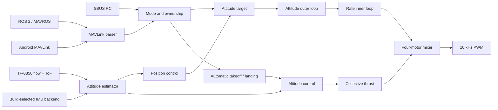
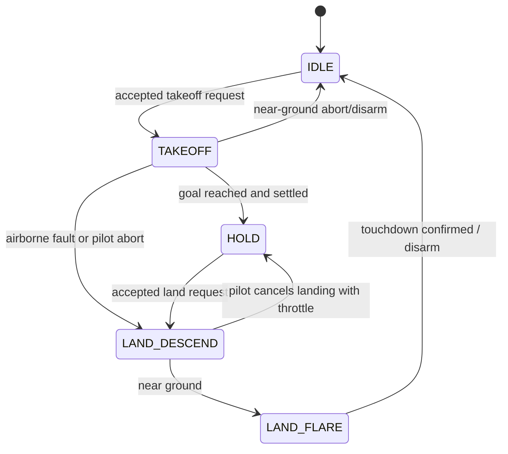

# Source and build

This page is the shortest source-reading path for the current Open32Drone
firmware. It explains where a command enters, how it becomes motor
output, and which file owns each state. It is not a tuning guide; use the
[firmware reference](firmware.md) for parameters and the
[development guide](source-build.md) for builds and validation.

## The five-minute map



The essential rule is simple: sensor code measures, estimator code describes
the aircraft, mode/automatic code chooses targets, stabilization converts
targets into torque, and the mixer converts torque plus collective thrust into
four motor commands.

## Start reading here

Read these functions in order before following individual features:

1. `setup()` and `loop()` in `software/firmware/firmware.ino`;
2. `control()` in `software/firmware/control.ino`;
3. `interpretControls()` in `software/firmware/control_modes.ino`;
4. `updateAutoFlightControl()` in `software/firmware/control_auto_flight.ino`;
5. `updateAltitudeHoldControl()` in `software/firmware/control_altitude.ino`;
6. `updatePositionControlSplit()` in `software/firmware/control_position.ino`;
7. `controlAttitude()`, `controlRates()`, and `controlTorque()` in
   `software/firmware/control_stabilization.ino`.

Arduino builds all `.ino` tabs in the sketch as one program. The files below
are therefore responsibility boundaries for readers; they are not independent
libraries or tasks. Shared control state deliberately remains in
`control.ino`, which sorts before the specialized `control_*.ino` tabs.

## One loop iteration

`loop()` starts on a fixed 300 Hz schedule and keeps the execution order visible:

```text
wait for 300 Hz tick -> readIMU -> update time -> readRC -> readOpticalFlow
        -> estimate attitude/height/horizontal velocity
        -> choose targets and run controllers
        -> write motors
        -> rate-limited serial CLI and MAVLink/OTA service
        -> voltage, flight log, deferred parameter sync
```

This order matters. Controllers use the sensor and estimator values produced
earlier in the same iteration. Parameter writes are deferred until the end and
remain blocked while motors are active.

`beginPerformanceCycle()` and the stage markers only measure this same serial
path; they do not create another task. One loop in sixteen is sampled. The IMU
mounting quaternion is cached until its parameter changes, and the estimator
publishes one shared Euler angle/body-up result for downstream controllers.
CLI runs at 100 Hz, MAVLink at 150 Hz, and OTA boot validation at 50 Hz after
motor output; RC, flow, estimation, control, and motor output still run every
control tick. These choices remove jitter without changing controller equations.

## Firmware file ownership

| File | Owns | Look here when |
|---|---|---|
| `firmware.ino` | setup, main loop, build identity, global flow/ToF observations | startup or execution order is unclear |
| `imu_backend.h`, `imu.ino` | compile-time driver selection, common acquisition, axis rotation, filtering, gyro calibration | raw IMU values or calibration is wrong |
| `flow.ino` | TF-0850 packet parsing and flow/ToF health | range or optical-flow packets are missing |
| `estimate.ino` | attitude, height and horizontal-motion estimates | measurements are valid but estimated state is wrong |
| `control.ino` | shared control state, mode constants, top-level control pipeline | tracing the whole controller |
| `control_modes.ino` | RC mode interpretation, actuator ownership, assisted stick takeoff/landing requests | the selected mode or pilot takeover is wrong |
| `control_offboard.ino` | Offboard setpoint staging, stream warmup, sensor gates and activation | ROS setpoints cannot enter AUTO/Offboard |
| `control_auto_flight.ino` | automatic takeoff/landing phases and handover | one-key takeoff or landing behaves incorrectly |
| `control_altitude.ino` | height target, vertical PID correction and tilt compensation | ALT_HOLD or vertical response is wrong |
| `control_position.ino` | optical-flow position/velocity hold, gates and XY commands | POS_HOLD drifts or refuses to engage |
| `control_stabilization.ino` | attitude loop, angular-rate PID and motor mixer | STAB oscillates or motor corrections have the wrong sign |
| `motors.ino` | pin map, LEDC attachment and PWM output | a motor channel is unavailable or mapped incorrectly |
| `rc.ino` | SBUS input, calibration, deliberate takeover and emergency gesture | physical transmitter behavior is wrong |
| `mavlink.ino` | commands, setpoints, ground parameter management and bounded telemetry serialization | Android/ROS commands, QGC parameter reads, or reported state are wrong |
| `safety.ino` | pre-arm checks, failsafe, disarm and minimal tip-over guard | an action is rejected or must fail closed |
| `parameters.ino` | compiled defaults, validation, explicit NVS load/save | a parameter is rejected, missing or unexpectedly persisted |
| `ota.ino` | ground-only A/B OTA and boot validation | an update or rollback fails |
| `log.ino`, `cli.ino` | flight evidence and serial inspection | diagnosing a repeatable symptom |

## The control layers

### 1. STAB: attitude and rate control

Pilot roll and pitch become target angles. Yaw stick becomes an extra target
angular rate. Throttle is direct collective thrust.

```text
angle error -> attitude P controller -> target angular rate
rate error  -> rate PID controller    -> target torque
thrust + torque                       -> four motor outputs
```

Conceptually, for one axis:

```text
\omega_{target} = K_{att}(\theta_{target}-\theta)
```

```text
\tau = K_P e_\omega + K_I\int e_\omega dt + K_D\frac{de_\omega}{dt}
```

The mixer scales torque corrections together when a motor would exceed its
allowed range, and unwinds the rate integrators while saturated.

### 2. ALT_HOLD: add vertical control

Altitude Hold keeps the same attitude/rate loops. A fresh battery-voltage
sample first applies a bounded factor only to hover feed-forward, then adds the
bounded height correction:

```text
k_V=\operatorname{clamp}\left(1+K_V^s(V_{ref}-V_{bat}),
\frac{1}{k_{max}},k_{max}\right),\qquad
T = k_V T_{hover} + K_P e_h + K_I\int e_h dt - K_D v_z
```

Stale voltage makes `kV=1`. The attitude/rate PID deltas and final four-motor
mixer are intentionally outside this compensation path.

The throttle stick moves the height target outside its center deadband. During
automatic takeoff or landing, the automatic-flight state machine supplies the
height target instead. A short ToF dropout fades the previous correction; it
does not invent a new height measurement.

### 3. POS_HOLD: add horizontal control

Position Hold adds an optical-flow cascade above the same attitude/rate loops:

```text
position error -> desired horizontal velocity
velocity error -> bounded roll/pitch target
roll/pitch target -> attitude loop -> rate loop -> mixer
```

The controller runs only after its flow, height, level, airborne and yaw gates
are valid. Pilot stick input moves the held point as a velocity command rather
than bypassing stabilization. Near the floor, authority is deliberately
reduced because optical-flow velocity becomes noisier. Pilot feed-forward,
position feedback, and Offboard feed-forward are combined and then vector
limited once by `POS_STICK_V`. If the flow gate drops or is still qualifying,
`updateBoundedPositionFallback()` slews toward live pilot roll/pitch (or level)
inside the same `12 deg` envelope; Position Hold never silently falls through
to the wider Stabilize attitude command.

## Mode and actuator ownership

The public modes are `STAB`, `ALT_HOLD`, and `POS_HOLD`. `AUTO` is an internal
ownership state used by automatic takeoff, landing, and validated Offboard
control.

Normal priority is:

1. physical RC emergency-disarm gesture;
2. active failsafe;
3. automatic or validated Offboard owner;
4. deliberate physical RC takeover;
5. Android/ROS manual control lease.

A powered receiver or one noisy SBUS frame cannot silently steal a GCS flight.
A deliberate RC action can take ordinary control, and the RC emergency-disarm
path remains independent even while AUTO or Offboard owns normal setpoints.

## Automatic takeoff and landing



Automatic flight owns vertical motion only. A fresh pilot stream retains
roll, pitch, and yaw authority throughout takeoff and landing. A successful
takeoff hands over to the requested assisted mode; landing releases Offboard,
descends, flares, confirms touchdown, then disarms.

## Android and ROS path

Android and ROS 2 share the same firmware-facing MAVLink contract:

```text
client request / setpoint
  -> UDP 14550
  -> mavlink.ino validates and records it
  -> control_modes / control_offboard / control_auto_flight owns it
  -> normal altitude, position and stabilization loops
  -> motors
```

They do not implement a second flight controller. The clients request mode,
arm, takeoff, land or bounded setpoints; the firmware remains responsible for
pre-arm, sensor gates, timeouts, failsafe and motor output. Android and ROS
must not own UDP `14550` simultaneously.

QGC is a separate, optional ground maintenance tool. It uses the standard
parameter messages in `mavlink.ino` while the aircraft is disarmed; it is not
another supported pilot or Offboard owner.

## Parameters and calibration

Compiled defaults live beside their owning controller and are registered in
`parameters.ino`. NVS stores only explicit valid values. Missing keys use the
compiled defaults, and startup does not silently rewrite a profile.

Keep these concepts separate:

- `ca` measures accelerometer bias/scale; it is not PID tuning.
- automatic gyro calibration estimates stationary gyro bias at boot.
- `cr` measures the actual SBUS center/endpoints and channel mapping.
- PID or estimator parameters change control behavior and require an isolated
  flight issue plus controlled validation.

## Safe modification workflow

For a first contribution:

1. reproduce one symptom and save its log;
2. identify the lowest owner file in the table above;
3. change one behavior or one parameter family;
4. add or update a host contract that fails before the fix;
5. run host tests and the pinned firmware build;
6. only with separate authorization, perform propeller-off and guarded-flight
   validation.

Do not combine PID, estimator, TF-0850 geometry, automatic flight, Android and
ROS changes in one experiment. Do not move logic across owner files while also
changing it. A structural refactor should be reviewable as exact function-body
movement plus comments/tests.

## What a passing build proves

A clean diff, host tests and a successful compile prove source consistency and
buildability. They do not prove that a binary was flashed, that a motor order
is correct on a board, or that an aircraft flies safely. Continue with the
evidence ladder in [Development](source-build.md) and the physical procedure in
[Getting started](../guide/04-firmware-flight.en.md).

## Pinned firmware toolchain

| Dependency | Version |
|---|---|
| Arduino-ESP32 | `3.3.6` |
| FlixPeriph (IMU and SBUS) | `1.10.4` |
| MAVLink Arduino library | `2.0.25` |
| Board | `esp32:esp32:XIAO_ESP32S3` |
| Options | `PSRAM=opi,PartitionScheme=default_8MB,FlashMode=dio` |

Install once:

```bash
arduino-cli core install esp32:esp32@3.3.6 \
  --additional-urls https://espressif.github.io/arduino-esp32/package_esp32_index.json
arduino-cli lib install "FlixPeriph@1.10.4" "MAVLink@2.0.25"
```

Compile the standard MPU6500/MPU9250 profile into a disposable directory:

```bash
arduino-cli compile \
  --clean \
  --fqbn 'esp32:esp32:XIAO_ESP32S3:PSRAM=opi,PartitionScheme=default_8MB,FlashMode=dio' \
  --output-dir /private/tmp/open32drone-build \
  firmware
```

The IMU backend is selected at build time. Alternate profiles keep the same
estimator/control interface but need their own hardware validation:

```bash
arduino-cli compile --clean \
  --fqbn 'esp32:esp32:XIAO_ESP32S3:PSRAM=opi,PartitionScheme=default_8MB,FlashMode=dio' \
  --build-property 'compiler.cpp.extra_flags=-DOPEN32DRONE_IMU_BACKEND=OPEN32DRONE_IMU_ICM20948' \
  --output-dir /private/tmp/open32drone-icm20948 firmware

arduino-cli compile --clean \
  --fqbn 'esp32:esp32:XIAO_ESP32S3:PSRAM=opi,PartitionScheme=default_8MB,FlashMode=dio' \
  --build-property 'compiler.cpp.extra_flags=-DOPEN32DRONE_IMU_BACKEND=OPEN32DRONE_IMU_MPU6050' \
  --output-dir /private/tmp/open32drone-mpu6050 firmware
```

Do not compile multiple backend profiles concurrently against one Arduino
cache. A clean sequential build avoids reusing objects compiled with another
backend macro. CI compiles the default and both alternate profiles this way;
only the default profile currently carries standard-airframe flight evidence.

The two relevant artifacts are different:

- `firmware.ino.merged.bin`: complete USB image, written at `0x0`;
- `firmware.ino.bin`: application image for A/B OTA only.

Never send a merged image to the OTA endpoint. Never write an app-only image at
`0x0` and call it a complete flash.

## USB flash

For a first board, partition migration, or full reset:

```bash
python3 -m esptool --chip esp32s3 erase-flash
python3 -m esptool --chip esp32s3 --baud 921600 \
  write-flash 0x0 /private/tmp/open32drone-build/firmware.ino.merged.bin
```

After a complete erase, run `ca`; run `cr` if SBUS is used. Wi-Fi credentials
also return to the compiled defaults.

## Android build

```bash
cd software/android
./gradlew --no-daemon testDebugUnitTest lintDebug assembleDebug
```

Debug APK:

```text
software/android/app/build/outputs/apk/debug/app-debug.apk
```

The Android application starts at version `0.1` (`versionCode 1`) and is paired
with Open32Drone firmware from the same source revision. The application must retain direct
aircraft-Wi-Fi route binding, selected-aircraft packet isolation,
stale-socket recovery, atomic takeoff, live takeoff/landing stick authority,
physical-SBUS priority, and an independent emergency stop. Its optional MJPEG
preview runs below control-thread priority and is not a control source.

## ROS 2 build

```bash
mkdir -p ~/osdrone_ws/src
cp -a software/ros2 ~/osdrone_ws/src/open32drone_driver
cd ~/osdrone_ws
rosdep install --from-paths src --ignore-src -r -y
colcon build --symlink-install
source install/setup.bash
```

The ROS package manifest uses `0.1.0`; use it with firmware and Android clients
from the same source revision.

For a workspace that should follow repository edits directly, use a symlink
instead of the copy command above when creating a new workspace:

```bash
mkdir -p ~/osdrone_ws/src
ln -s /path/to/open32drone/software/ros2 ~/osdrone_ws/src/open32drone_driver
```

Keep the development loop small: edit nodes under
`software/ros2/open32drone_driver/`, register an entry point in `setup.py`, update
`launch/` only when a launch argument changes, then rebuild this package:

```bash
cd ~/osdrone_ws
colcon build --symlink-install --packages-select open32drone_driver
source install/setup.bash
```

After starting the ROS stack described in section 3 of the ROS guide, run
`ros2 run open32drone_driver bench_test --duration 5` without propellers from a
second terminal. Normal applications use the published `cmd_vel`, odometry,
command topic, and services; do not replicate firmware arming, takeoff, or
landing state machines in another node. See [ROS 2 control](../guide/06-ros.en.md) for the
interface and first-flight sequence. Update firmware, Android, and contract
tests together only when the shared MAVLink fields or lifecycle contract
change.

## Host validation

Run from the repository root:

```bash
python3 -m compileall -q software/ros2
python3 -m unittest discover -s software/tests -p 'test_*.py' -v
git diff --check
```

Android validation:

```bash
cd software/android
./gradlew --no-daemon testDebugUnitTest lintDebug assembleDebug
```

The contracts cover:

- hardware pins, motor attachment, modes, pre-arm and failsafe gates;
- transactional gyro/accelerometer/RC calibration and NVS behavior;
- TF-0850 parsing, flow/ToF gates, compiled mounting offset, and parameters;
- supported MAVLink commands, telemetry, voltage input, and A/B OTA;
- fixed-rate scheduling, deadline accounting, build-selectable IMU profiles,
  bounded parameter streaming, and serialized periodic telemetry;
- Android command, stick, route, selected-aircraft isolation, camera priority,
  reconnect, and version contracts;
- ROS control math, ownership, topics, TF, and OTA upload validation;
- minimal repository shape and bilingual document links.

Tests are safeguards, not physical-flight proof.

## Hardware validation ladder

| Level | Procedure | What may be claimed |
|---|---|---|
| Source | contracts, unit tests, software/firmware/APK/ROS builds | source and build contract only |
| USB/boot | hash, flash log, boot ID, parameters | that artifact runs on that MCU |
| Propeller-off bench | IMU, ToF, RC/MAVLink, motor order, emergency stop | interfaces and gates on that device |
| Guarded hover | one takeoff, hover, landing, log | behavior on that airframe/setup |
| Repeated flight | batteries, airframes, operators, environments | reproducibility only within measured conditions |

Keep these evidence levels separate in reviews and release notes.

## Packaging contract

Public firmware builds must not embed a developer's home path through compiler
assertion strings. Add both build properties to the standard command:

```bash
--build-property "compiler.c.extra_flags=-ffile-prefix-map=${HOME}=/build"
--build-property "compiler.cpp.extra_flags=-ffile-prefix-map=${HOME}=/build"
```

These are compiler path mappings, not control parameter changes. Inspect both
application and merged binaries for personal paths/credentials after rebuilding.
Check licenses before redistribution. A new binary needs its own device checks.

Copy approved deliverables into `output/` with deterministic names:

```text
Open32Drone-minimal-app.bin
Open32Drone-minimal-merged.bin
Open32Drone-Controller-0.1.apk
Open32Drone-ROS2-minimal.tar.gz
Open32Drone-minimal-BUILD_INFO.md
SHA256SUMS
```

`BUILD_INFO` must record:

- source commit and tree/dirty state;
- tool and dependency versions;
- exact build commands;
- source hashes and artifact hashes;
- validation actually performed;
- validation explicitly not performed.

Generate SHA-256 after the final copy and verify it from `output/`. Firmware,
APK, and ROS archives in one delivery must come from the same source revision.
Updating a tracked package, committing, pushing, tagging, or publishing a
hosting-platform release are separate authorized operations.

## OTA development boundary

OTA listens on HTTP `8080`, requires the app-image SHA-256 header, and writes
only the inactive partition. It must remain rejected while armed, airborne,
motor-active, automatic, Offboard, or pending validation. The new slot is marked
valid only after storage, IMU, gyro, loop, TF-0850, and Wi-Fi remain healthy for
the boot-validation interval; otherwise rollback remains available.

## Review checklist

- Scope matches one current issue.
- No unrelated tuning or automatic parameter rewrite was added.
- Firmware/client ownership and timeout behavior are explicit.
- English and Chinese operator docs both changed when behavior changed.
- Protocol changes update firmware, Android, ROS 2, and tests together.
- No QGC flight-control dependency, mission, direct motor, or complex collision
  surface returned; the optional camera remains background-only and optional
  QGC access remains ground parameters only.
- `git diff --check`, relevant unit tests, and builds pass.
- Control contracts read all `control*.ino` owner modules, not only the shared
  `control.ino` tab.
- Hardware claims name the exact artifact, device, and test level.
- Local deliverables are in `output/`; disposable build directories are removed.
