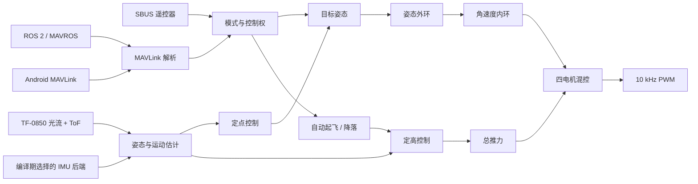
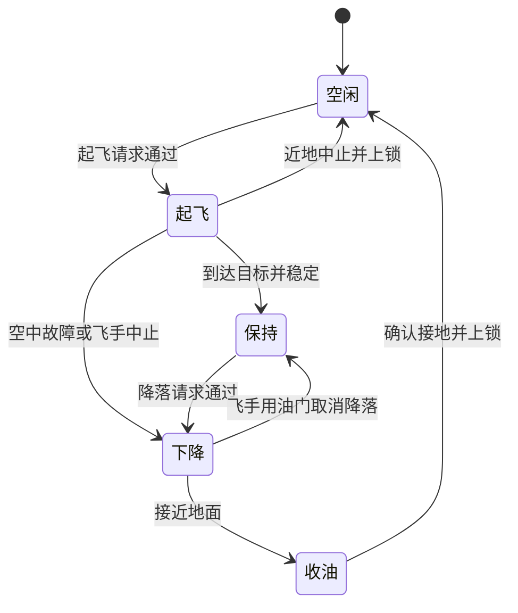

# 源码与编译

本文是阅读当前 Open32Drone 固件源码的最短路径，说明一条控制命令从哪里
进入、怎样变成电机输出，以及每类状态由哪个文件负责。它不是调参教程；参数请看
[固件参考](firmware.zh-CN.md)，构建与验证请看
[开发指南](source-build.zh-CN.md)。

## 五分钟看懂全局



核心原则很简单：传感器负责测量，估计器描述飞机当前状态，模式/自动飞行选择目标，
稳定环把目标变成力矩，混控再把力矩和总推力变成四路电机命令。

## 从这里开始读

第一次看源码，按下面顺序读函数：

1. `software/firmware/firmware.ino` 的 `setup()` 和 `loop()`；
2. `software/firmware/control.ino` 的 `control()`；
3. `software/firmware/control_modes.ino` 的 `interpretControls()`；
4. `software/firmware/control_auto_flight.ino` 的 `updateAutoFlightControl()`；
5. `software/firmware/control_altitude.ino` 的 `updateAltitudeHoldControl()`；
6. `software/firmware/control_position.ino` 的 `updatePositionControlSplit()`；
7. `software/firmware/control_stabilization.ino` 的 `controlAttitude()`、
   `controlRates()` 和 `controlTorque()`。

Arduino 会把同一个草图内的所有 `.ino` 页签编译为一个程序。下面的文件划分是给读者
看的职责边界，不是独立库或独立任务。共享控制状态有意留在 `control.ino`；按文件名
排序时，它也位于各个 `control_*.ino` 专用模块之前。

## 一次主循环做了什么

`loop()` 先按固定 300 Hz 节拍启动，再把执行顺序直接写在代码里：

```text
等待 300 Hz 节拍 -> 读取 IMU -> 更新时间 -> 读取 RC -> 读取光流/ToF
         -> 估计姿态、高度、水平速度
         -> 选择目标并运行控制器
         -> 输出电机
         -> 限频处理串口命令、MAVLink 和 OTA 服务
         -> 读取电压、记录飞行日志、延迟同步参数
```

这个顺序有意义：控制器使用本轮前面刚更新的传感器和估计结果；参数写入被放在末尾，
而且电机运行时仍然禁止写入。

`beginPerformanceCycle()` 和各阶段标记只测量这条串行路径，不会创建第二个任务；每
16 轮抽样一次。IMU 安装四元数只在参数变化时更新缓存，估计器每轮只发布一份共享的
欧拉角/机体向上结果给后续控制器。电机输出之后，CLI 以 100 Hz、MAVLink 以
150 Hz、OTA 启动验收以 50 Hz 服务；RC、光流、估计、控制和电机仍每个控制节拍运行。
这些优化减少时序抖动，不改变控制方程。

## 固件文件职责

| 文件 | 负责内容 | 出现什么问题时先看 |
|---|---|---|
| `firmware.ino` | 初始化、主循环、构建标识、全局光流/ToF 观测 | 启动或执行顺序不清楚 |
| `imu_backend.h`、`imu.ino` | 编译期驱动选择、通用采集、坐标旋转、滤波、陀螺校准 | IMU 原始值或校准异常 |
| `flow.ino` | TF-0850 数据包解析、光流/ToF 健康状态 | 测距或光流数据包缺失 |
| `estimate.ino` | 姿态、高度和水平运动估计 | 传感器值正常但估计状态错误 |
| `control.ino` | 共享控制状态、模式常量、顶层控制流水线 | 要追踪整个控制链 |
| `control_modes.ino` | RC 模式解释、执行器控制权、摇杆辅助起降请求 | 模式选择或人工接管异常 |
| `control_offboard.ino` | Offboard 设定值暂存、预热、传感器门和激活 | ROS 设定值无法进入 AUTO/Offboard |
| `control_auto_flight.ino` | 自动起降阶段和交接 | 一键起飞或降落异常 |
| `control_altitude.ino` | 高度目标、垂直 PID 修正、倾斜补偿 | 定高或垂直响应异常 |
| `control_position.ino` | 光流位置/速度控制、门限和 XY 命令 | 定点漂移或无法介入 |
| `control_stabilization.ino` | 姿态环、角速度 PID、四电机混控 | 姿态模式抖动或修正方向错误 |
| `motors.ino` | 引脚映射、LEDC attach 和 PWM 输出 | 电机通道不可用或映射错误 |
| `rc.ino` | SBUS、校准、明确接管、紧急手势 | 物理遥控器行为异常 |
| `mavlink.ino` | 命令、设定值、地面参数管理和有界遥测序列化 | Android/ROS 命令、QGC 参数读取或状态异常 |
| `safety.ino` | 解锁预检、失联、上锁、最小翻覆保护 | 操作被拒绝或应该安全关闭 |
| `parameters.ino` | 编译默认值、验证、明确的 NVS 读写 | 参数被拒绝、缺失或异常保留 |
| `ota.ino` | 仅地面 A/B OTA 和启动验证 | 更新或回滚失败 |
| `log.ino`、`cli.ino` | 飞行证据和串口检查 | 分析可复现问题 |

## 三层控制

### 1. STAB：姿态与角速度控制

横滚、俯仰摇杆变成目标角度；偏航摇杆变成额外目标角速度；油门直接作为总推力。

```text
角度误差 -> 姿态 P 控制器 -> 目标角速度
角速度误差 -> 角速度 PID   -> 目标力矩
总推力 + 力矩               -> 四路电机输出
```

单轴可以近似理解为：

```text
\omega_{target} = K_{att}(\theta_{target}-\theta)
```

```text
\tau = K_P e_\omega + K_I\int e_\omega dt + K_D\frac{de_\omega}{dt}
```

如果某路电机即将超出允许范围，混控会按同一比例缩小力矩修正，并在饱和时回退角速度
积分，避免积分继续堆积。

### 2. ALT_HOLD：增加垂直控制

定高继续使用相同的姿态环和角速度环。新鲜电压样本只对悬停前馈施加有界倍率，再叠加
有限的高度修正：

```text
k_V=\operatorname{clamp}\left(1+K_V^s(V_{ref}-V_{bat}),
\frac{1}{k_{max}},k_{max}\right),\qquad
T = k_V T_{hover} + K_P e_h + K_I\int e_h dt - K_D v_z
```

电压超时时 `kV=1`；姿态/角速度 PID 增量和最终四电机混控刻意保持在补偿路径之外。

油门离开中位死区后移动高度目标。自动起飞或降落期间，高度目标由自动飞行状态机提供。
ToF 短时丢失时只会逐渐衰减上一次修正，不会凭空生成新的高度测量。

### 3. POS_HOLD：增加水平控制

定点在同一套姿态环和角速度环上方再增加光流串级控制：

```text
位置误差 -> 期望水平速度
速度误差 -> 有边界的横滚/俯仰目标
横滚/俯仰目标 -> 姿态环 -> 角速度环 -> 混控
```

只有光流、高度、水平程度、离地状态和偏航门都有效时，定点才运行。摇杆输入会以速度
命令移动当前保持点，而不是绕开稳定环。靠近地面时光流速度噪声更大，因此水平控制权
会主动减小。飞手前馈、位置反馈和 Offboard 前馈合并后，只由 `POS_STICK_V` 对最终
二维向量统一限幅。光流门关闭或仍在确认时，`updateBoundedPositionFallback()` 会在
相同的 `12°` 范围内平滑跟随飞手横滚/俯仰（没有实时飞手则回水平），不会悄悄掉入
姿态模式更大的姿态命令范围。

## 模式与执行器控制权

对外模式只有 `STAB`、`ALT_HOLD` 和 `POS_HOLD`。`AUTO` 是自动起飞、降落和经过
验证的 Offboard 控制使用的内部控制权状态。

正常优先级为：

1. 物理 RC 紧急上锁手势；
2. 已触发的失联保护；
3. 自动飞行或已验证的 Offboard 控制者；
4. 物理 RC 的明确人工接管；
5. Android/ROS 手动控制租约。

仅仅给接收机上电或偶发一帧噪声，不能抢走地面站控制权。明确的 RC 操作可以接管普通
控制；即使 AUTO 或 Offboard 正在控制普通设定值，RC 紧急上锁仍然保持独立有效。

## 自动起飞与降落



自动飞行只接管垂直运动。只要飞手数据新鲜，起飞和降落全程仍可实时控制横滚、俯仰和
偏航。起飞成功后交接到请求的辅助模式；降落会先释放 Offboard，然后下降、近地收油、
确认接地并上锁。

## Android 与 ROS 的命令路径

Android 和 ROS 2 使用同一套面向固件的 MAVLink 契约：

```text
客户端请求 / 设定值
  -> UDP 14550
  -> mavlink.ino 验证并记录
  -> control_modes / control_offboard / control_auto_flight 接管
  -> 正常定高、定点和稳定环
  -> 电机
```

客户端内部没有第二套飞控。客户端只请求模式、解锁、起飞、降落或有边界的设定值；预检、
传感器门、超时、失联和电机输出仍由固件负责。Android 与 ROS 不能同时占用 UDP
`14550`。

QGC 是可选的地面维护工具，只能在上锁时使用 `mavlink.ino` 的标准参数消息；它不是
另一个受支持的飞行或 Offboard 控制者。

## 参数与校准

编译默认值放在对应控制器附近，并由 `parameters.ino` 统一注册。NVS 只保存明确写入且
通过验证的值；缺失键使用编译默认值，启动时不会偷偷改写参数配置。

必须区分下面几件事：

- `ca` 测量加速度计偏置和比例，它不是 PID 调参；
- 自动陀螺校准在开机静止时估计陀螺零偏；
- `cr` 测量实际 SBUS 中点、端点和通道映射；
- PID 或估计器参数会改变控制行为，必须有独立问题和受控验证。

## 安全修改流程

第一次改代码，按下面做：

1. 复现一个问题并保存日志；
2. 按上表找到最底层的职责文件；
3. 一次只改一个行为或一组同类参数；
4. 增加或修改一条能在修复前失败的主机契约；
5. 运行主机测试和固定工具链固件编译；
6. 只有获得单独授权后，才进行拆桨和受控飞行验证。

一次实验不能同时改 PID、估计器、TF-0850 几何、自动飞行、Android 和 ROS。搬动
代码职责时也不能顺便改逻辑。纯结构重构应当能被审查为“函数体原样移动 + 注释/测试”。

## 编译通过能说明什么

差异干净、主机测试通过、固件编译成功，只能证明源码一致且可构建；不能证明固件已经
刷入、真机电机顺序正确或飞机能够安全飞行。下一步继续遵守
[开发指南](source-build.zh-CN.md)中的证据阶梯，并按
[快速开始](../guide/04-firmware-flight.md)完成物理验收。

## 固定固件工具链

| 依赖 | 版本 |
|---|---|
| Arduino-ESP32 | `3.3.6` |
| FlixPeriph（IMU 与 SBUS） | `1.10.4` |
| MAVLink Arduino 库 | `2.0.25` |
| 板卡 | `esp32:esp32:XIAO_ESP32S3` |
| 选项 | `PSRAM=opi,PartitionScheme=default_8MB,FlashMode=dio` |

一次性安装：

```bash
arduino-cli core install esp32:esp32@3.3.6 \
  --additional-urls https://espressif.github.io/arduino-esp32/package_esp32_index.json
arduino-cli lib install "FlixPeriph@1.10.4" "MAVLink@2.0.25"
```

把标准 MPU6500/MPU9250 配置编译到可随时删除的目录：

```bash
arduino-cli compile \
  --clean \
  --fqbn 'esp32:esp32:XIAO_ESP32S3:PSRAM=opi,PartitionScheme=default_8MB,FlashMode=dio' \
  --output-dir /private/tmp/open32drone-build \
  firmware
```

IMU 后端在编译时选择。替代配置保持相同的估计/控制接口，但必须分别完成硬件验证：

```bash
arduino-cli compile --clean \
  --fqbn 'esp32:esp32:XIAO_ESP32S3:PSRAM=opi,PartitionScheme=default_8MB,FlashMode=dio' \
  --build-property 'compiler.cpp.extra_flags=-DOPEN32DRONE_IMU_BACKEND=OPEN32DRONE_IMU_ICM20948' \
  --output-dir /private/tmp/open32drone-icm20948 firmware

arduino-cli compile --clean \
  --fqbn 'esp32:esp32:XIAO_ESP32S3:PSRAM=opi,PartitionScheme=default_8MB,FlashMode=dio' \
  --build-property 'compiler.cpp.extra_flags=-DOPEN32DRONE_IMU_BACKEND=OPEN32DRONE_IMU_MPU6050' \
  --output-dir /private/tmp/open32drone-mpu6050 firmware
```

不要让多个后端同时共用一个 Arduino 编译缓存；顺序执行并使用 `--clean`，避免复用由
另一个宏配置编译的对象。CI 会按此方法编译默认配置和两种替代配置；当前只有默认配置
具有标准机架飞行证据。

两个固件产物用途不同：

- `firmware.ino.merged.bin`：完整 USB 镜像，在 `0x0` 写入；
- `firmware.ino.bin`：只用于 A/B OTA 的应用镜像。

禁止把 merged 镜像交给 OTA；也不能把 app 镜像写入 `0x0` 后称为完整刷写。

## USB 刷写

新板、分区迁移或完整恢复：

```bash
python3 -m esptool --chip esp32s3 erase-flash
python3 -m esptool --chip esp32s3 --baud 921600 \
  write-flash 0x0 /private/tmp/open32drone-build/firmware.ino.merged.bin
```

整片擦除后必须执行 `ca`；使用 SBUS 时再执行 `cr`。Wi-Fi 凭据也会恢复编译默认值。

## Android 构建

```bash
cd software/android
./gradlew --no-daemon testDebugUnitTest lintDebug assembleDebug
```

调试 APK：

```text
software/android/app/build/outputs/apk/debug/app-debug.apk
```

Android 应用从 `0.1`（`versionCode 1`）起步，与同一源码版本的 Open32Drone 固件配套。客户端
必须保留飞机 Wi-Fi 直连路由绑定、选中飞机报文隔离、旧 socket 恢复、原子一键
起飞、起降中实时摇杆控制、物理 SBUS 优先和独立急停。可选 MJPEG 预览线程的
优先级低于控制线程，且永远不是控制源。

## ROS 2 构建

```bash
mkdir -p ~/osdrone_ws/src
cp -a software/ros2 ~/osdrone_ws/src/open32drone_driver
cd ~/osdrone_ws
rosdep install --from-paths src --ignore-src -r -y
colcon build --symlink-install
source install/setup.bash
```

ROS 包清单使用 `0.1.0`，应与同一源码版本的固件和 Android 客户端配套。

需要持续把仓库修改直接用于 ROS 工作空间时，新建工作空间后可用符号链接代替前面的
复制命令：

```bash
mkdir -p ~/osdrone_ws/src
ln -s /path/to/open32drone/software/ros2 ~/osdrone_ws/src/open32drone_driver
```

最小开发流程保持为：在 `software/ros2/open32drone_driver/` 修改节点，在 `setup.py` 注册入口，
需要时修改 `launch/`，然后只重建当前包：

```bash
cd ~/osdrone_ws
colcon build --symlink-install --packages-select open32drone_driver
source install/setup.bash
```

按 ROS 指南第 3 节启动控制栈后，再在另一个终端拆桨运行
`ros2 run open32drone_driver bench_test --duration 5`。普通应用只使用已发布的
`cmd_vel`、里程计、命令话题和服务；不要在另一个节点里复制固件的解锁、起飞和降落
状态机。接口和首次起降流程见 [ROS 2 控制](../guide/06-ros.md)。只有共享 MAVLink 字段或
生命周期契约改变时，才同步修改固件、Android 和契约测试。

## 主机验证

在仓库根目录执行：

```bash
python3 -m compileall -q software/ros2
python3 -m unittest discover -s software/tests -p 'test_*.py' -v
git diff --check
```

Android 验证：

```bash
cd software/android
./gradlew --no-daemon testDebugUnitTest lintDebug assembleDebug
```

契约覆盖：

- 硬件引脚、电机 attach、模式、预检和失联门限；
- 事务式陀螺/加速度计/RC 校准和 NVS；
- TF-0850 解析、光流/ToF 门、编译安装偏置和参数；
- 支持的 MAVLink、遥测、电压输入和 A/B OTA；
- 固定频率调度、截止时间统计、可选 IMU 编译配置、有界参数流和分散发送的周期遥测；
- Android 命令、摇杆、路由、选中飞机隔离、图传优先级、重连和版本；
- ROS 控制数学、控制权、话题、TF 和 OTA 上传验证；
- 最小仓库结构和中英文文档链接。

测试是防回归手段，不是真机飞行证据。

## 硬件验证阶梯

| 层级 | 操作 | 允许结论 |
|---|---|---|
| 源码 | 契约、单测、固件/APK/ROS 构建 | 仅源码和构建契约 |
| USB/启动 | 哈希、刷写日志、构建 ID、参数 | 该产物在该 MCU 运行 |
| 拆桨台架 | IMU、ToF、RC/MAVLink、电机顺序、急停 | 该设备的接口和门限 |
| 受控悬停 | 一次起飞、悬停、降落、日志 | 该机架和条件下的行为 |
| 重复飞行 | 多电池、多机、多操作员、多环境 | 只在已测条件内的可复现性 |

评审和发布说明中必须把这些证据层级分开。

## 打包约定

公开固件不应通过编译器断言字符串嵌入开发者主目录。标准构建命令增加以下两项：

```bash
--build-property "compiler.c.extra_flags=-ffile-prefix-map=${HOME}=/build"
--build-property "compiler.cpp.extra_flags=-ffile-prefix-map=${HOME}=/build"
```

它们只映射编译路径，不修改控制参数。重编译后检查 app 和 merged 镜像中的个人路径、
凭据及适用许可证；新二进制需单独做设备验证。

把获准交付的文件复制到 `output/`，使用固定名称：

```text
Open32Drone-minimal-app.bin
Open32Drone-minimal-merged.bin
Open32Drone-Controller-0.1.apk
Open32Drone-ROS2-minimal.tar.gz
Open32Drone-minimal-BUILD_INFO.md
SHA256SUMS
```

`BUILD_INFO` 必须记录：

- 源码提交、工作树和 dirty 状态；
- 工具与依赖版本；
- 完整构建命令；
- 源码哈希和产物哈希；
- 实际完成的验证；
- 明确未完成的验证。

最终复制完成后在 `output/` 生成并复核 SHA-256。同一交付中的固件、APK 和 ROS 包
必须来自相同源码版本。更新仓库内套件、提交、推送、打 Tag 或发布托管平台 Release
都是需要单独授权的操作。

## OTA 开发边界

OTA 监听 HTTP `8080`，要求 app 镜像 SHA-256，只写非活动分区。解锁、离地、电机
运行、自动飞行、Offboard 或待验证状态下必须拒绝。新分区只有在存储、IMU、陀螺、
循环、TF-0850 和 Wi-Fi 在启动验证期内持续健康后才标记有效，否则必须可回滚。

## 评审清单

- 范围只对应一个当前问题；
- 没有夹带无关调参或自动参数覆盖；
- 固件/客户端控制权和超时行为清楚；
- 行为变化时中英文用户文档同时更新；
- 协议变化同步修改固件、Android、ROS 2 和测试；
- 没有重新引入 QGC 飞行控制依赖、任务、直接电机或复杂碰撞接口；可选相机保持
  后台服务，可选 QGC 仍只允许地面参数访问；
- `git diff --check`、相关单测和构建通过；
- 控制契约读取全部 `control*.ino` 职责模块，而不是只检查共享的 `control.ino`；
- 硬件结论写清产物、设备和测试层级；
- 本地交付物在 `output/`，可重建临时目录已删除。
