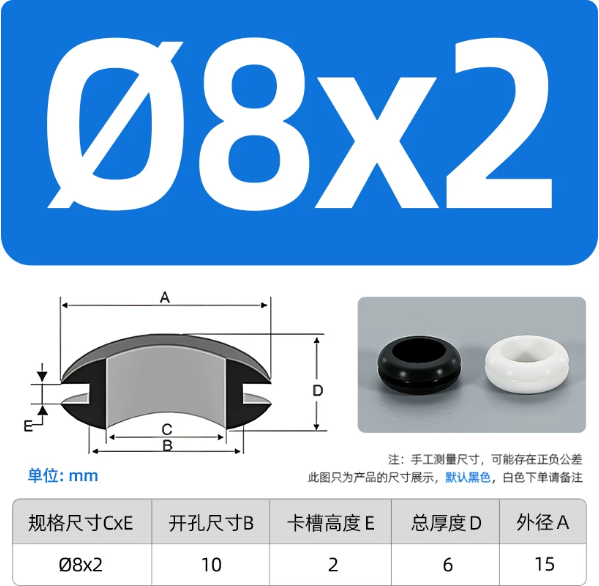

# Open32Drone airframe and purchasing specification

[English](README.md) · [简体中文](README.zh-CN.md)

This directory contains the print/CAD files for the standard Open32Drone
airframe and the mechanical-parts specification for one aircraft. Use
[Getting started](../docs/guide/04-firmware-flight.en.md) for the complete electronics,
flashing, calibration, and first-flight procedure.

For CAD part grouping, sensor frames, mass allocation, and Gazebo/Isaac
asset preparation, follow [URDF / USD model export](../docs/guide/07-rl.en.md).
It describes the expected asset structure. A ready-to-run URDF/USD scene and
Gazebo flight integration are not included in this download.

## Airframe files

- [MakerWorld frame printing](https://makerworld.com.cn/zh/models/2922108-open32drone-wu-ren-ji-8520kong-xin-bei-ji-jia-ros2#profileId-3425842): open the print profile in Bambu Studio. The listed profile uses 0.2 mm layers, 6 walls and 25% infill; check the material and printer before slicing.
- [JLC Open Hardware PCB project](https://oshwhub.com/fanchewang/open32drone): open or clone the design and select the matching revision. PCB resources are not duplicated here; the mechanical BOM below is not an electronic BOM.

Resource licenses are listed separately in [third-party notices](../docs/project/third-party.md).

| File | Purpose | Units and scale check |
|---|---|---|
| [`3d-model/open32drone-frame.3mf`](3d-model/open32drone-frame.3mf) | Preferred print project with the airframe components laid out | The 3MF declares millimetres. The main-frame mesh is approximately `103.3 × 103.3 mm`; do not rescale it on import. |
| [`3d-model/open32drone-frame.stp`](3d-model/open32drone-frame.stp) | Mechanical editing and CAD interchange | This AP214 STEP file stores length in centimetres. A compliant CAD tool converts it automatically; still verify the approximately `103.3 mm` main-frame dimension after import. |

The 3MF contains Bambu Studio print settings, with account metadata removed.
STEP header paths are normalized; neither change alters model geometry.
Before printing, check nozzle,
material, layer height, support, and wall settings for the actual printer. A
slicer opening the file does not prove that its settings suit every printer or
material.

Verify the retained files with:

```bash
cd hardware
shasum -a 256 -c SHA256SUMS
```

## Mechanical BOM for one aircraft

For modules, cables, battery accessories and shopping links, use the [single-aircraft shopping list](../docs/guide/03-hardware.en.md#purchasing). The table below specifies mechanical dimensions; it is not the full PCB electronic BOM.

| Part | Specification | Quantity | Purchasing/assembly requirement |
|---|---|---:|---|
| Printed airframe set | Geometry in the 3MF/STEP files above | 1 set | Print without scaling; the assembled frame must not be twisted. |
| Mounting screw | `1 × 4 × 4 mm` | 10 | Follow the shopping list; installed screws must not bend the PCB or protrude through the frame. |
| 8520 brushed motor | `8 × 20 mm`, `1 mm` shaft, MX1.25 connector, wire at least `100 mm` long | 4 | All four motors must have matching electrical/mechanical specifications, straight shafts, and strain-free wiring. |
| Motor-retaining rubber grommet | `C × E = Ø8 × 2 mm`; panel opening `B=10 mm`; groove `E=2 mm`; total thickness `D=6 mm`; outside diameter `A=15 mm` | 4 | Recommended purchase: `2` black and `2` white. Keep one repeatable colour layout to identify the nose or motor positions. |
| Propeller | Purchasing specification: `60 mm` | 4 | Use one matched set: `2` CW and `2` CCW, all of one diameter. |

Grommet dimension reference:



Colour is only an assembly aid. If the supplier states that colours use
different materials or hardness, use four grommets of the same material and
hardness and mark orientation another way.

## Assembly constraints

1. Seat all four grommets fully in the frame at the same height; no lip may be
   rolled under or left floating.
2. Keep all four motor shafts parallel. A motor must not rock in its grommet or
   be squeezed into a tilted position.
3. Leave strain relief in every motor wire, fully seat the MX1.25 connector,
   and keep wiring outside every propeller disc.
4. Tighten a PWA screw only until its part is seated. Stripped plastic, a bent
   PCB, or a protruding screw is an assembly failure.
5. Both 60 and 65 mm are supported, but do not mix them on one aircraft. After changing diameter, repeat the
   propeller-off motor checks and a guarded first flight, and record the actual
   propeller size in the test evidence.
6. Do not install propellers before the motor-order and direction checks in
   Getting started have passed.
