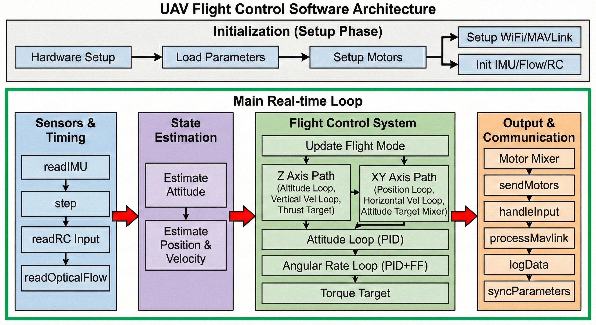

# Open32Drone User Guide

This document aims to provide developers with a detailed guide for software deployment, configuration, connection, and parameter tuning for the Open32Drone.

## 1. Hardware Preparation & Connection

**Basic Equipment Requirements:**
* **1 ESP32-S3 Development Board**
* **1 Computer**
* **1 USB Type-C Data Cable**
    > **Note**: Some USB cables are for charging only and cannot transmit data. If you do not have a USB cable or are unsure if your cable supports data transmission, please ensure you use a verified Type-C data cable.

Connect the development board to the computer via the USB Type-C data cable.

## 2. Software Environment & Deployment

### 2.1 Arduino IDE Installation & Configuration

**Step 1. Download and Install Arduino IDE**
* Download and install the latest version of the [Arduino IDE](https://www.arduino.cc/en/software) for your operating system.

**Step 2. Launch Arduino Application**

**Step 3. Add ESP32 Board Package**
1.  Navigate to `File` > `Preferences`.
2.  In the "Additional Boards Manager URLs" field, enter the following link:
    `https://raw.githubusercontent.com/espressif/arduino-esp32/gh-pages/package_esp32_index.json`

**Step 4. Install ESP32 Platform**
1.  Navigate to `Tools` > `Board` > `Boards Manager...`.
2.  Enter the keyword `esp32` in the search box.
3.  Select the latest version of `esp32` and click Install.

**Step 5. Select Development Board**
* Navigate to `Tools` > `Board` > `ESP32 Arduino` and select **`ESP32S3 Dev Module`**.
* *(Tip: The board list is long; you may need to scroll to the bottom to find it.)*

**Step 6. Select Port**
* Navigate to `Tools` > `Port` and select the serial port name corresponding to the connected ESP32S3SuperMini.
* *(Usually COM3 or higher; COM1 and COM2 are typically reserved for hardware serial ports.)*

**Step 7. Install Dependency Libraries**
Please follow these steps to search for and install the libraries in the Library Manager:
1.  Open Library Manager: Navigate to `Tools` > `Manage Libraries`.
2.  Enter the following library names in the search box and install them:
    * `ArduinoJson`
    * `Bolder Flight Systems` series (`MPU9250`, `PWM`, `SBUS`)
    * `FlixPeriph`
    * `ICM20948_WE`
    * `MAVLink`

### 2.2 Code Configuration
Before flashing the firmware, please check the network configuration in `software/wifi.ino`.

Open `software/wifi.ino` and locate the following section:

``` cpp
#define WIFI_AP_MODE 0                // 0: Router Mode (STA), 1: Hotspot Mode (AP)
#define WIFI_AP_SSID "osdrone"        // WiFi Name for Hotspot Mode
#define WIFI_AP_PASSWORD "12345678"   // Password for Hotspot Mode
#define WIFI_SSID "your_router_ssid"  // Router WiFi Name (for STA Mode)
#define WIFI_PASSWORD "your_password" // Router Password (for STA Mode)
```

> **Note: Only supports 2.4GHz WiFi.**

### 2.3 Compilation & Flashing

1. **Select Board**: `ESP32S3 Dev Module`
2. **Key Parameter Settings** (in the Tools menu):
* `USB CDC On Boot`: **Enabled** (Otherwise serial printing will not work)
* `Upload Speed`: **115200** (Do not select too high for stability)
* `Flash Mode`: QIO 80MHz


3. Click the **Upload** button.
* *Note: If "Connecting..." times out, press and hold the BOOT button on the board, press the RST button, then release both and try again.*


## 3. Connecting Ground Station (QGroundControl)

Open32Drone uses the MAVLink communication protocol and natively supports QGroundControl (QGC).

1. **Connect Computer/Phone to Network**:
* If using AP mode, connect to the drone's WiFi (`osdrone` by default).
* If using STA mode, ensure the computer and the drone are on the same local network.


2. **Open QGroundControl**:
3. **Create New Connection (Comm Links)**:
* Name: `Open32Drone`
* Type: `UDP`
* Port: `14550` (Default port)
* Server Address: Leave blank (listen locally) or enter the drone's IP. QGC usually automatically discovers UDP broadcasts.


4. Click **Connect**. Once connected successfully, you should see the drone's attitude indicator moving.

## 4. Sensor Calibration

Calibration must be performed before the first flight. This can be done via Serial CLI commands:

1. Open the Serial Monitor (Baud rate 115200).
2. Enter `help` to view the command list.
3. **Accelerometer Calibration**: Enter `ca` (Calibrate Accel).
* Follow the prompts to place the drone flat, on its side, etc.


4. **RC Calibration**: Enter `cr` (Calibrate RC).
* Follow the prompts to move all sticks to their maximum/minimum positions.


## 5. Flight Operation Guide

### 5.1 Arming & Disarming

* **Arm**: Throttle lowest + Yaw (Rudder) rightmost, hold for more than 1 second.
* **Disarm**: Throttle lowest + Yaw (Rudder) leftmost, hold for more than 1 second.
> **Note**: If using "Click to Arm" in the MAVLink ground station, ensure the throttle stick is at the lowest position, otherwise it will be rejected.


### 5.2 Flight Mode Description

Flight modes are switched via RC Channel 5 (or 6, depending on remote mapping):

* **Stabilize Mode (STAB)**: Maintains attitude balance only. No altitude hold, no position hold. Suitable for outdoor environments without optical flow or for emergency takeover.
* **Altitude Hold Mode (ALT_HOLD)**: Automatically controls throttle to maintain altitude. Locks current altitude when the throttle stick is centered.
* **Position Hold Mode (POS_HOLD)**: Combined with optical flow sensors, hovers when sticks are released.
* **Prerequisite**: Ground texture must be rich and lighting sufficient. Altitude between 0.3m - 6.0m.


### 5.3 Safety Mechanisms (Failsafe)

`safety.ino` contains failsafe logic. Please ensure you understand it:

* **RC Signal Loss Protection**: When RC signal loss is detected for more than 1 second (`RC_LOSS_TIMEOUT`):
* The drone will automatically switch to `AUTO` mode (or a degraded mode).
* Executes **Descend** logic: Gradually reduces throttle over 10 seconds until stopped.


* **Tilt Protection**: If the tilt angle is too large (over approx. 80 degrees), attitude estimation may fail. It is recommended to manually disarm immediately.
* **Low Battery Protection**: The current firmware relies mainly on MAVLink sending voltage data. The pilot must monitor the voltage display on QGC and land in time.

## 6. Common CLI Commands Cheatsheet

Enter `help` in the Serial Monitor to view all commands. Here are the commonly used ones:

* `sys` - Display system info (CPU model, temperature, heap memory, IP address)
* `imu` - Print IMU raw data and attitude (Check if gyroscope is normal)
* `rc` - Display input values for each RC channel (Check remote mapping)
* `mot` - Display current motor output PWM values
* `mfr` / `mfl` / `mrr` / `mrl` - Test the four motors individually (**Note: Please remove propellers first!**)
* `flow` - Display optical flow sensor data (X/Y velocity and altitude)
* `reset` - Reset attitude estimation (Zeroing)
* `p <name> <value>` - Modify parameters online (e.g., `p ROLL_P 6.5`)

## 7. Debugging & Tuning (PID Tuning)

Open32Drone provides a powerful **Debug Vector** feature. You can view waveforms in real-time in QGC's "Analyze Tools" -> "Mavlink Inspector" or "Widgets" -> "Plot".

### 7.1 Modify Debug Mode

Search for the `DEBUG_MODE` parameter in QGC's "Parameters" page and modify its value to observe different data:

| Mode ID | Function Description | Observation Content (X / Y / Z) |
| --- | --- | --- |
| **0** | Default | Velocity X / Integrated Vel X / Target Pitch Angle |
| **1** | Attitude Loop | Target Angle / Actual Angle / Given Pitch |
| **2** | Rate PID Loop | P Term / I Term / D Term (Roll Axis) |
| **3** | Velocity Loop | Target Velocity / Actual Velocity / Integrated Velocity |
| **4** | Optical Flow Raw | FlowX / FlowY / Altitude |
| **5** | Kalman Bias | Roll Bias / Pitch Bias / 0 |
| **6** | Attitude Estimate (Est Roll) | Accel Angle / Fused Angle / Gyro Rate |
| **7** | Altitude Estimate (Est Z) | Sensor Alt / Fused Alt / Vertical Accel |
| **8** | Velocity Estimate (Est Vel) | Flow Measured Vel / Fused Vel / Error |
| **9** | Attitude Echo (ATT) | Roll / Pitch / Yaw (deg) |
| **10** | Position Echo (POS) | Pos X / Pos Y / Pos Z (m) |
| **11** | Velocity Echo (VEL) | Vel X / Vel Y / Vel Z (m/s) |

### 7.2 Recommended Tuning Steps

1. **Inner Loop (Angular Rate Loop)**:
* Set `DEBUG_MODE` to `2` and observe the waveform.
* Tune **P** first: Make the drone respond quickly to stick inputs without overshooting.
* Then tune **D**: Eliminate oscillations.
* Finally add a little **I**: Eliminate steady-state error.


2. **Outer Loop (Angle Loop)**:
* Set `DEBUG_MODE` to `1` and observe the waveform.
* Observe `ATT_CHK` and ensure `Actual` (Y) closely follows `Target` (X).


3. **Position Loop (Flow Hold)**:
* Enter Position Hold Mode (POS_HOLD).
* Set `DEBUG_MODE` to `3` and observe the waveform.
* If the drone circles in place ("Toilet Bowl Effect"), it is usually due to compass interference or incorrect optical flow orientation.
* If the drone oscillates here, lower `POS_HOLD_P` or increase `POS_HOLD_D`.


## 8. Control Principle Overview

Open32Drone adopts a classic **Cascade PID Control Architecture**:

1. **Position Loop**: Input Target Position -> Output Target Velocity (Body Frame).
2. **Velocity Loop**: Input Target Velocity -> Output Target Attitude Angle (Roll/Pitch).
3. **Angle Loop**: Input Target Angle (Quaternion/Euler) -> Output Target Angular Rate.
4. **Angular Rate Loop**: Input Target Angular Rate -> Output Motor Torque.
5. **Mixer**: Distributes Torque and Thrust to the 4 motors.

**State Estimation**:

* Uses **Complementary Filter** or **Kalman Filter** to fuse Gyroscope (High Frequency) and Accelerometer (Low Frequency) to obtain Attitude.
* Uses **Optical Flow** and ToF ranging fused with Inertial Navigation to obtain horizontal position and velocity.

## 9. System Architecture & Operating Principle

<p align="center">

</p>

Open32Drone's firmware logic is primarily designed as a single-threaded polling architecture, simulating real-time system scheduling. The system is divided into two main phases: Initialization and Main Loop.

### 9.1 Initialization Phase

Executed in the `setup()` function after system power-up:

1. **Hardware Setup**: Basic hardware config, including LEDs, Brownout voltage, and system clock.
2. **Load Parameters**: Load PID parameters and calibration data from non-volatile storage (Preferences/EEPROM).
3. **Setup Motors**: Initialize PWM generator (LEDC), ensuring motors are locked before flight.
4. **Parallel Init**:
* **Comms**: Start WiFi protocol stack and MAVLink service.
* **Sensors**: Initialize IMU (MPU6050/ICM), Optical Flow module, and RC receiver.


### 9.2 Main Real-time Loop

The system enters the `loop()` function, cycling continuously at a frequency of approximately 500Hz-1kHz, strictly following data flow:

#### A. Sensors & Timing

* **readIMU**: Read Gyroscope (Angular Velocity) and Accelerometer (Specific Force).
* **step**: Timing control, calculates loop time difference `dt`.
* **readRC**: Get pilot stick commands.
* **readOpticalFlow**: Read horizontal displacement pixels and ToF altitude from the optical flow sensor.

#### B. State Estimation

Located in `estimate.ino`:

* **Estimate Attitude**: Fuses Gyro and Accel via Complementary/Kalman filters to calculate Roll, Pitch, and Yaw angles.
* **Estimate Position & Velocity**: Converts optical flow data to the physical coordinate system, combines with accelerometer data, and estimates current horizontal position (XY), vertical altitude (Z), and 3-axis velocity.

#### C. Flight Control System

Located in `control.ino`, employing a **Cascade Control** strategy:

1. **Update Flight Mode**: Determines current control logic based on RC signals (e.g., whether to lock altitude/position).
2. **Trajectory Generator**:
* **Z Axis Path**: Altitude hold logic. Calculates `Target Altitude -> Target Vertical Vel -> Target Thrust`.
* **XY Axis Path**: Position hold logic. Calculates `Target Position -> Target Horizontal Vel -> Target Tilt Angle`.


3. **Attitude Stabilization Loop**:
* **Attitude Loop**: P Controller. Converts `Target Angle` to `Target Angular Rate`.
* **Angular Rate Loop**: PID + Feedforward Controller. Converts `Target Angular Rate` to `Target Torque`. This is the lowest level of flight stabilization.


#### D. Output & Communication

* **Motor Mixer**: Based on airframe geometry (X-type Quadcopter), mixes Total Thrust and 3-axis Torque to calculate independent output values for 4 motors.
* **sendMotors**: Drives hardware to generate PWM waveforms.
* **Communication**:
* **handleInput/processMavlink**: Parses ground station commands.
* **logData**: Records blackbox logs.
* **syncParameters**: Checks for parameter synchronization requests.


## 10. Source Code Structure

To help developers quickly locate functional modules:

* `flix_548.ino`: Project entry point, contains `setup()` and `loop()`, handles module initialization and scheduling.
* `control.ino`: Core flight control logic (PID, Mixer, Flight Mode State Machine).
* `estimate.ino`: State estimation (Attitude solution, Altitude fusion, Optical flow velocity fusion, Kalman filter).
* `kalman_angle.h`: Kalman filter class specifically for attitude estimation.
* `mavlink.ino`: MAVLink protocol handling, responsible for communication with QGroundControl.
* `cli.ino`: Serial Command Line Interface, handles commands like `help`, `p`, `cal`.
* `wifi.ino`: WiFi connection management (AP/STA mode switching).
* `flow.ino`: Optical flow sensor driver and data reading.
* `imu.ino`: IMU sensor (MPU6050/ICM, etc.) driver and data reading.
* `motors.ino`: Motor PWM driver (ESP32 LEDC).
* `rc.ino`: Remote control signal processing (PPM/SBUS/UDP Virtual Stick).
* `safety.ino`: Failsafe and safety check logic.
* `parameters.ino`: Parameter storage and management (Based on ESP32 Preferences).

## 11. FAQ & Troubleshooting

* **Q: Unable to Arm drone**
* **A**: Check `rc` commands. Confirm if the Yaw channel is reversed and if the throttle minimum value is calibrated to 0.
* **A**: Check if IMU initialization passed (use `imu` command to check status).


* **Q: Drone drifts wildly in Position Hold ("Toilet Bowl Effect")**
* **A**: Check the installation orientation of the optical flow module. Default code assumes the Optical Flow Y-axis points forward.
* **A**: Run the `flow` command and move the drone back and forth by hand to confirm if optical flow data produces positive changes.
* **A**: Check if ground texture is too uniform (e.g., solid color floor) or lighting is too dim.


* **Q: Altitude Hold fluctuates up and down**
* **A**: Check if the Range Sensor (ToF) data is accurate.
* **A**: Excessive airframe vibration. Try lowering `ALT_P` or `ALT_VEL_P`, and check propeller dynamic balance.


* **Q: Cannot connect to Wi-Fi**
* **A**: Confirm `WIFI_AP_MODE` setting in `wifi.ino`. If in AP mode, the computer must connect to `osdrone`; if in STA mode, check the IP address printed on the serial port.
