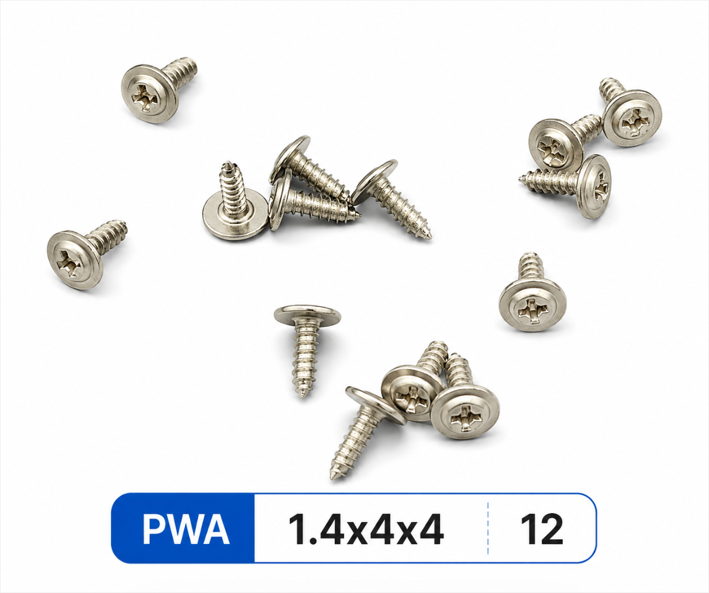
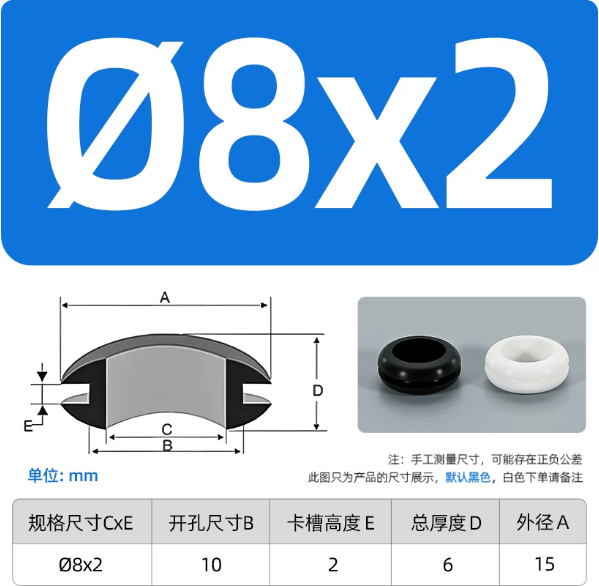

# Open32Drone 机架与采购规格

[English](README.md) · [简体中文](README.zh-CN.md)

本目录保存标准 Open32Drone 机架的打印/CAD 文件和一台飞机所需的机械件规格。
完整电子件、刷写、校准和首飞流程仍以
[快速开始](../docs/GETTING_STARTED.zh-CN.md)为准。

CAD 零件分组、传感器坐标、质量分配和 Gazebo/Isaac 模型准备，见
[URDF / USD 模型导出](../docs/SIMULATION_MODEL.zh-CN.md)。该指南确定导出结构，
并记录本地机械模型修正版及 MuJoCo 检查；电机、虚拟传感器和飞行闭环仍需后续接入。

## 机架文件

| 文件 | 用途 | 单位与检查 |
|---|---|---|
| [`3d-model/open32drone-frame.3mf`](3d-model/open32drone-frame.3mf) | 推荐的打印工程文件，包含已排版的机架组件 | 3MF 明确使用毫米；主机架网格外形约 `103.3 × 103.3 mm`，导入后不要缩放 |
| [`3d-model/open32drone-frame.stp`](3d-model/open32drone-frame.stp) | 修改结构和跨 CAD 软件交换 | STEP AP214 文件内部长度单位为厘米；正常 CAD 会自动换算，导入后仍应以约 `103.3 mm` 的主机架外形复核比例 |

3MF 带有 Bambu Studio 工程元数据。打印前仍应核对本机喷嘴、材料、层高、支撑和
壁厚设置；切片软件能够打开文件，不等于该打印参数已经适用于所有机器和材料。

使用下列命令核对文件完整性：

```bash
cd hardware
shasum -a 256 -c SHA256SUMS
```

## 一台飞机的机械 BOM

| 零件 | 规格 | 数量 | 采购/装配要求 |
|---|---|---:|---|
| 打印机架组件 | 上述 3MF/STEP 对应结构 | 1 套 | 不缩放打印；装配后机架无扭曲 |
| PWA 自攻螺丝 | 供应商标注 `1.4 × 4 × 4 mm` | 12 | 按图示规格采购；更换头径或长度前先检查孔位、压板和电路板间隙 |
| 8520 空心杯电机 | `8 × 20 mm`，轴径 `1 mm`，MX1.25 端子，线长至少 `100 mm` | 4 | 四个电机电气/机械规格一致，转轴无弯曲，线材无拉力 |
| 电机固定橡胶圈 | `C × E = Ø8 × 2 mm`；开孔 `B=10 mm`；卡槽 `E=2 mm`；总厚 `D=6 mm`；外径 `A=15 mm` | 4 | 建议 `2` 黑、`2` 白，固定一种颜色布局，便于辨认机头或电机位置 |
| 桨叶 | 支持 `60 mm` 和 `65 mm`，桨孔匹配 `1 mm` 电机轴 | 4 | 两种直径均可选；一架飞机只能使用同一直径的一套桨，配对安装 `2` 个 CW 和 `2` 个 CCW，不能混装 60/65 mm |

螺丝和橡胶圈的采购参考图：





颜色只用于装配识别；如果供应商声明不同颜色具有不同硬度或材料，必须改用四个相同
材料/硬度的橡胶圈，再通过其他标记区分方向。

## 装配约束

1. 四个橡胶圈必须完全卡入机架，安装高度一致，不能一侧卷边或悬空。
2. 四个电机轴必须互相平行；电机插入橡胶圈后不能明显晃动或被挤压倾斜。
3. 电机线要留有活动余量，MX1.25 插头插到底，线材不能进入桨盘范围。
4. PWA 螺丝只拧到部件贴合；塑料滑牙、压弯电路板或螺丝穿出均属于装配失败。
5. 60 mm 和 65 mm 均为支持规格，但同一架飞机不能混用。更换直径后重新做拆桨电机检查和受控首飞，
   并在测试记录中注明实际桨叶尺寸。
6. 在快速开始的电机顺序和方向检查完成以前不要安装桨叶。
