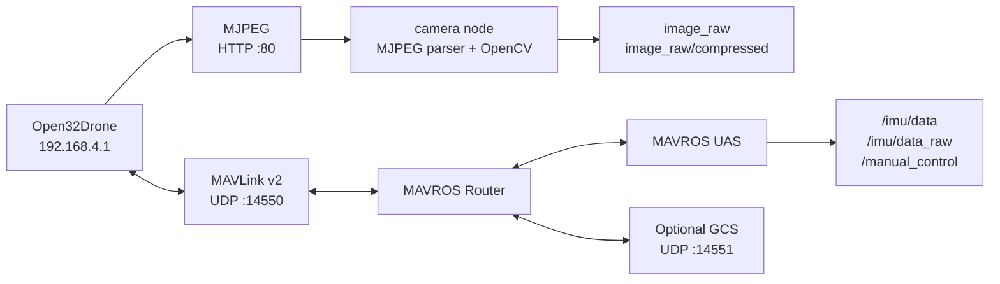

# Open32Drone ROS 2 Companion

[**English**](README.md) · [简体中文](README.zh-CN.md) · [Back to firmware README](../README.md)

`open32drone_driver` bridges the Open32Drone firmware to ROS 2. It receives the controller's MJPEG stream, publishes ROS image topics, and launches a MAVROS Router/UAS pair for MAVLink telemetry and manual-control interfaces.

> [!NOTE]
> ROS connectivity is a companion interface, not a substitute for onboard safety. Keep radio control and a direct disarm/recovery path available during testing.

## Data path



## Features

| Component | Function |
| --- | --- |
| `camera` executable | Pulls multipart MJPEG, decodes JPEG with OpenCV, publishes raw and compressed images |
| `open32drone_mavros.launch.py` | Starts MAVROS Router and UAS components for UDP MAVLink v2 |
| `open32drone.launch.py` | Starts both camera and MAVROS components |

## Requirements

- ROS 2 with `colcon`
- `mavros` and `rclcpp_components`
- `rclpy`, `sensor_msgs`
- Python OpenCV and NumPy
- Computer connected to the controller's Wi-Fi AP, or equivalent routing to `192.168.4.1`

Example package installation:

```bash
sudo apt install \
  ros-$ROS_DISTRO-mavros \
  ros-$ROS_DISTRO-rclcpp-components \
  python3-opencv python3-numpy
```

## Build

Place the package in a ROS 2 workspace `src/` directory, then run:

```bash
cd ~/open32drone_ws
colcon build --packages-select open32drone_driver
source install/setup.bash
```

## Run

### Camera only

```bash
ros2 run open32drone_driver camera
```

### MAVROS only

```bash
ros2 launch open32drone_driver open32drone_mavros.launch.py
```

### Camera and MAVROS

```bash
ros2 launch open32drone_driver open32drone.launch.py
```

Override the camera URL when required:

```bash
ros2 launch open32drone_driver open32drone.launch.py \
  camera_url:=http://192.168.4.1/stream
```

## Interfaces

### Published camera topics

| Topic | Type | Encoding / behavior |
| --- | --- | --- |
| `image_raw` | `sensor_msgs/msg/Image` | BGR8 decoded image |
| `image_raw/compressed` | `sensor_msgs/msg/CompressedImage` | Original JPEG payload |

### MAVROS remappings

| Public topic | Purpose |
| --- | --- |
| `/imu/data` | Filtered IMU/attitude data |
| `/imu/data_raw` | Raw IMU data |
| `/manual_control` | Manual-control input, configured at 20 Hz |

### Camera parameters

| Parameter | Default | Description |
| --- | --- | --- |
| `url` | `http://192.168.4.1/stream` | MJPEG endpoint |
| `fps` | `0.0` | Publish-rate limit; `0` follows the stream |
| `frame_id` | `camera` | ROS frame ID |
| `publish_compressed` | `true` | Publish original JPEG topic |
| `reconnect_delay` | `2.0 s` | Delay before reconnecting after a stream error |

## Network defaults

| Item | Default |
| --- | --- |
| Controller AP | `open32drone` |
| AP password | `12345678` |
| Controller address | `192.168.4.1` |
| MJPEG endpoint | `http://192.168.4.1/stream` |
| MAVLink FCU route | `udp://:14550@192.168.4.1:14550` |
| Optional GCS listener | `udp://0.0.0.0:14551@` |
| MAVLink target IDs | system `1`, component `1` |

Change the default AP credentials before using the vehicle outside a controlled lab network.

## Verification

```bash
ros2 topic list
ros2 topic hz /imu/data
ros2 topic hz /image_raw
ros2 topic echo /imu/data --once
```

This repository has completed Python syntax checks for the package. A full `colcon build`, live MAVROS connection, camera-stream test, and end-to-end command acceptance require a ROS 2 host and powered hardware and must be reported separately.
