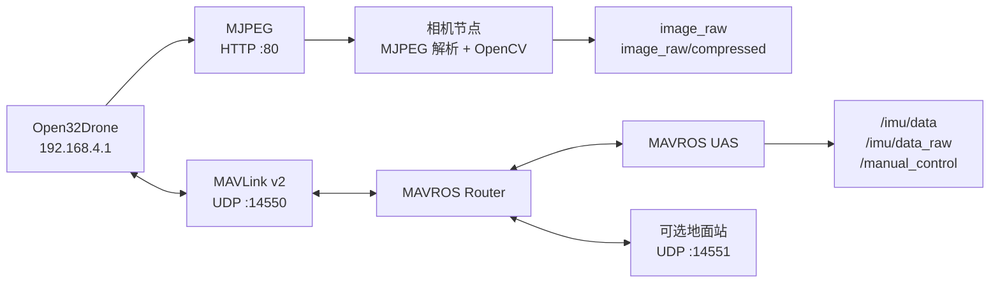

# Open32Drone ROS 2 配套软件

[English](README.md) · [**简体中文**](README.zh-CN.md) · [返回固件说明](../README.zh-CN.md)

`open32drone_driver` 用于连接 Open32Drone 固件和 ROS 2。它接收飞控 MJPEG 图传并发布 ROS 图像话题，同时启动 MAVROS Router/UAS 组件，提供 MAVLink 遥测和手动控制接口。

> [!NOTE]
> ROS 通信只是配套接口，不能替代飞控本身的安全机制。测试期间必须保留遥控器和直接解除锁定/人工接管路径。

## 数据链路



## 功能

| 组件 | 功能 |
| --- | --- |
| `camera` 可执行程序 | 拉取 multipart MJPEG，通过 OpenCV 解码并发布原始/压缩图像 |
| `open32drone_mavros.launch.py` | 启动 MAVROS Router 和 UAS，连接 UDP MAVLink v2 |
| `open32drone.launch.py` | 同时启动相机和 MAVROS |

## 环境依赖

- ROS 2 和 `colcon`
- `mavros`、`rclcpp_components`
- `rclpy`、`sensor_msgs`
- Python OpenCV 和 NumPy
- 电脑连接飞控 Wi-Fi AP，或者能够路由到 `192.168.4.1`

依赖安装示例：

```bash
sudo apt install \
  ros-$ROS_DISTRO-mavros \
  ros-$ROS_DISTRO-rclcpp-components \
  python3-opencv python3-numpy
```

## 构建

把本包放入 ROS 2 工作区的 `src/` 目录，然后执行：

```bash
cd ~/open32drone_ws
colcon build --packages-select open32drone_driver
source install/setup.bash
```

## 运行

### 仅图传

```bash
ros2 run open32drone_driver camera
```

### 仅 MAVROS

```bash
ros2 launch open32drone_driver open32drone_mavros.launch.py
```

### 图传和 MAVROS

```bash
ros2 launch open32drone_driver open32drone.launch.py
```

需要时可覆盖相机地址：

```bash
ros2 launch open32drone_driver open32drone.launch.py \
  camera_url:=http://192.168.4.1/stream
```

## 接口

### 相机发布话题

| 话题 | 类型 | 编码 / 行为 |
| --- | --- | --- |
| `image_raw` | `sensor_msgs/msg/Image` | BGR8 解码图像 |
| `image_raw/compressed` | `sensor_msgs/msg/CompressedImage` | 原始 JPEG 数据 |

### MAVROS 重映射

| 公共话题 | 用途 |
| --- | --- |
| `/imu/data` | 滤波后的 IMU/姿态数据 |
| `/imu/data_raw` | 原始 IMU 数据 |
| `/manual_control` | 手动控制输入，配置为 20 Hz |

### 相机参数

| 参数 | 默认值 | 说明 |
| --- | --- | --- |
| `url` | `http://192.168.4.1/stream` | MJPEG 地址 |
| `fps` | `0.0` | 发布限频；`0` 表示跟随视频流 |
| `frame_id` | `camera` | ROS 坐标系 ID |
| `publish_compressed` | `true` | 是否发布原始 JPEG 话题 |
| `reconnect_delay` | `2.0 s` | 视频流错误后的重连等待时间 |

## 默认网络参数

| 项目 | 默认值 |
| --- | --- |
| 飞控 AP | `open32drone` |
| AP 密码 | `12345678` |
| 飞控地址 | `192.168.4.1` |
| MJPEG 地址 | `http://192.168.4.1/stream` |
| MAVLink FCU 路由 | `udp://:14550@192.168.4.1:14550` |
| 可选地面站监听 | `udp://0.0.0.0:14551@` |
| MAVLink 目标 ID | system `1`、component `1` |

在实验室受控网络之外使用时，应先修改默认 AP 凭据。

## 验证

```bash
ros2 topic list
ros2 topic hz /imu/data
ros2 topic hz /image_raw
ros2 topic echo /imu/data --once
```

当前仓库已经完成 ROS 2 Python 文件语法检查。完整 `colcon build`、真实 MAVROS 连接、图传测试和端到端控制验收需要 ROS 2 主机与上电硬件，必须另行记录。
