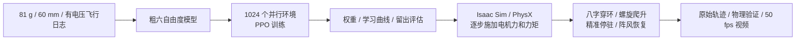

# Open32Drone 强化学习流程演示

这个案例展示 81 g 四旋翼从粗动力模型、PPO 训练、留出工况评估，到 Isaac Sim 原生物理验证和录像的完整流程。训练目标是沿给定轨迹飞行，并在电压变化、风扰和有限的模型误差下减少位置偏差。

策略采用 **PPO 残差控制**：神经网络输出三轴加速度修正量，几何 PD 控制器把目标加速度转换为四个电机命令，再由带响应延迟的电机模型产生推力和反扭矩。基础控制器承担姿态稳定。案例不宣称神经网络独立从零学会全部飞控。

## 流程与文件



| 文件 | 职责 |
| --- | --- |
| `model.json` | SI 单位物理初值和证据边界 |
| `dynamics.py` | 四电机延迟模型、六自由度积分、控制器、观测和网络 |
| `train.py` | PPO 训练、权重、源码快照和逐轮指标 |
| `evaluate.py` | 同种子基础 PD / PPO 对照 |
| `physics_checks.py` | 重力、平衡悬停、力矩符号、响应延迟、四元数和饱和分配检查 |
| `showcase.py` | 连续参考轨迹、风扰、环的几何定义及保守净空检查 |
| `preflight.py` | 同赛道快速数值预检 |
| `native_isaac.py` | Isaac 原生 PhysX 受力飞行和 RTX 录像 |

源码位于本目录。每次训练使用新的输出目录，并保存配置、权重、原始指标、结果说明与 SHA-256；失败候选和正式展示分开保留，避免用剪辑结果代替完整评估。

## 模型初值与依据

| 参数 | 当前值 / 处理 | 依据 |
| --- | --- | --- |
| 起飞质量、桨直径 | 0.081 kg、0.060 m | 用户确认；历史对照重量及桨叶相同 |
| 电池 | 18350、标称 1300 mAh、25 g | 用户提供；本演示不进行容量或续航识别 |
| 电机 | 8520、1 mm 轴 | 用户提供 |
| 平均悬停推力 | 每电机 0.198585 N，约 20.25 gf | 81 g 近水平稳态平衡计算 |
| 单电机满命令推力 | 0.41895 N @ 参考电压 3.46 V | 由约 47.4% 悬停命令线性外推；不是实测最大推力。3.46 V 是少量恢复样本的近似参考，不是完整悬停窗口测量均值 |
| 电压作用 | 最大力随电压比线性缩放 | 粗工程假设；没有拟合完整电压—PWM—推力曲面 |
| 电机时间常数 | 40 ms | 工程初值，未由日志识别 |
| 反扭矩力臂 | 0.006 m | 工程初值，未实测 |
| 惯量 | `[6.8e-5, 7.3e-5, 1.23e-4] kg m²` | 机械模型聚合后的粗估计 |
| 线性阻力 | 加速度 `−0.25 v` | 工程初值 |
| 最高转速 | 用户提供 50,000 rpm，约 5235.99 rad/s | `rpm × 2π / 60`；尚不作为已测得的带桨转速 |

动力学标定只使用带有效电压字段、版本和工况标记的日志。缺少电压或来源不完整的早期记录只能作为定性线索，不参与本案例数值拟合。

## 训练任务

- 35 维观测包括目标位置/速度误差、姿态矩阵、角速度、参考速度/加速度、上次动作、误差积分、估计电机力和电压。
- 3 维动作是有界加速度残差，各轴范围 `±4 m/s²`。输入来自仿真真值和电机内部状态；未实现光流、ToF、IMU 噪声与时延的完整估计器闭环，也不使用摄像头视觉策略。
- 控制频率 50 Hz，物理步长 5 ms。每轮收集 64 步、1024 个环境；PPO 每轮更新 4 个 epoch、8 个 minibatch，折扣 0.99、GAE 0.95、clip 0.2。
- 在随机多频轨迹中训练，展示赛道独立定义。动作追随任务指定的参考轨迹；没有训练自主规划、环检测或避障。
- 25% 训练环境为平静标称工况，25% 为恒定扰动，50% 每 2.5 秒改变扰动；推力增益、惯量、质量、电压和响应延迟做有界随机化。具体范围保存在每次训练 `config.json`，是工程假设。
- 评估区分正常工况和扩大误差的压力工况；不把失败后继续积分产生的巨大误差称为仍在飞行。

## 原生物理验证

Isaac 回放复用已修复的飞机 USD 外观，把本演示中的刚体质量与惯量聚合在一个飞行刚体上，保留原碰撞几何。每次物理步施加四电机合成力和力矩，只有初始化时设置飞机位姿。之后飞机的位置、速度和姿态都读取 PhysX 结果；镜头、参考线和轨迹尾迹是显示内容。

环由可视曲线和静态 Capsule 碰撞体组成。最终穿环成绩另用半径 100 mm 的包络球做保守几何检查：环中心半径减去管半径、飞机包络半径和穿越偏心量后仍为正才计入通过。这个包络覆盖粗模型桨尖扫掠范围，并非精确气动间距。最初录像附带 95 mm 的分析结果，最终报告在同一条物理轨迹上重新核验 100 mm 包络，原始结果保留。录像以 50 fps 等间隔采样模拟时间；加速离线计算不改变回放速度。

## 在兼容的 Isaac 工作站上复现

教师环境应固定项目工作目录、Isaac 版本和经过验证的启动脚本。把本目录源文件同步到工作站项目的 `source/rl_demo/`，并用环境实际的启动脚本替换下面的 `ISAAC_RUNNER`：

```bash
export OPEN32DRONE_WORKSPACE=/path/to/open32drone
export ISAAC_RUNNER=/path/to/verified-isaac-runner.sh
cd "$OPEN32DRONE_WORKSPACE"
"$ISAAC_RUNNER" source/rl_demo/physics_checks.py --output artifacts/rl-demo/physics-checks.json
"$ISAAC_RUNNER" source/rl_demo/train.py --output output/rl-demo/my-run --iterations 1200 --envs 1024
"$ISAAC_RUNNER" source/rl_demo/evaluate.py --run output/rl-demo/my-run
"$ISAAC_RUNNER" source/rl_demo/preflight.py --run output/rl-demo/my-run
"$ISAAC_RUNNER" source/rl_demo/native_isaac.py --package output/simulation-model/OPEN32DRON_fixed_81g --run output/rl-demo/my-run --output output/rl-demo/my-run/native --seconds 34 --record --visible
```

`--baseline` 使用零残差基础 PD。`--checkpoint` 可指定中间权重。复验旧实验时应运行该实验 `source/` 的快照，避免混用后来修改的动力学。判断执行结果必须读取 JSON 的 `status`、`course_status` 与环通过数，不能只看启动器退出码。

## 后续补齐顺序

流程演示完成后，先补原始含电压日志、对应固件版本和几个不同电量下的稳态悬停片段；再补能够取得的推力/响应测量。随后做传感器噪声、延迟和丢失模拟，再接原飞控软件或硬件在环。真实飞行验收独立进行。当前案例是粗动力模型下的仿真学习能力展示，尚不是可直接上飞机的策略。
