# Open32Drone: Hardware, Flight, ROS 2, and Reinforcement Learning

[简体中文](tutorial_zh_CN.md) · [English](tutorial.md) · [Project overview](README.md)

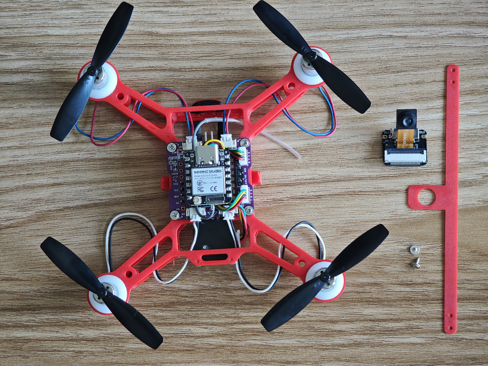

This tutorial follows the complete build: manufacture the hardware, flash and fly it, tune the controller, add ROS control, and explore simulation and learning. It describes the matching Open32Drone Minimal system. Use the release bundle for your first flight; read the development appendices when you need to modify the firmware.

Paths such as `hardware/`, `firmware/`, `ros2/`, `simulation/`, and `releases/minimal/` are relative to the complete source repository. Obtain that repository before running commands; the tutorial alone does not contain the code or binaries. Replace `/path/to/osrdrone` with your checkout path. Run `bash` blocks in a Linux/macOS terminal and `powershell` blocks in Windows PowerShell. Enter device commands from `text` blocks one line at a time in a 115200-baud serial terminal.

## Contents

- [1. Project overview](#chapter-1)
- [2. Goals and learning route](#chapter-2)
- [3. Hardware soldering and assembly](#chapter-3)
- [4. Firmware, calibration, and first flight](#chapter-4)
- [5. Flight tuning](#chapter-5)
- [6. ROS 2 control](#chapter-6)
- [7. Simulation and reinforcement learning](#chapter-7)
- [Appendix A: Source builds and architecture](#development)
- [Appendix B: A/B OTA and maintenance](#maintenance)
- [Appendix C: Diagnostics and experiment records](#diagnostics)

<a id="chapter-1"></a>

## 1. Project overview

### A micro-aircraft you manufacture yourself

Open32Drone is an open-source quadrotor project built from individual parts. Print the frame, order the carrier PCB using the production files, solder the components and connectors, then install the controller, sensors, motors, battery, and propellers. Getting airborne is the first stage. You can then modify the firmware, connect ROS 2, and progress to simulation and reinforcement-learning experiments using the Gazebo/Isaac resources.

The electronics are modular. The purple Open32Drone PCB distributes power, drives four brushed motors, and connects the modules. XIAO ESP32-S3, the IMU, and the optical-flow/ToF sensor are separate parts that you install. Printing, ordering, soldering, inspection, and assembly are therefore central parts of the project.

The reference aircraft uses 8520 coreless motors and a 1S battery for indoor flight. ESP32-S3 runs the flight controller at 300 Hz. The IMU measures attitude-related motion; a downward optical-flow/ToF module provides the measurements used for horizontal position and ground-relative height control.

The original flight-control core came from Oleg Kalachev's Flix. Open32Drone adds the carrier-board pin mapping, four brushed-motor outputs, optical-flow/ToF altitude and position hold, battery-voltage compensation, automatic takeoff and landing, persistent parameters, and Android/ROS 2 interfaces. The repository includes mechanical files, firmware, the mobile client, ROS drivers, simulation models, and learning examples.

### System components

| Layer | Main components | Purpose |
| --- | --- | --- |
| Structure and propulsion | Printed frame, four 8520 motors, four 60/65 mm propellers, rubber motor grommets | Support the parts and generate lift and attitude torque |
| Controller and sensors | Open32Drone PCB, XIAO ESP32-S3, IMU, optical-flow/ToF module | Motor drive, state estimation, and control |
| Power and communication | 1S battery, optional SBUS receiver, Wi-Fi | Supply power and receive pilot or program commands |
| Companion tools and simulation | Android APK, ROS 2, URDF/USD, Gazebo, Isaac Sim, PPO examples | Manual flight, programming, model checks, and learning control |

The carrier PCB connects these layers. XIAO supplies computation and Wi-Fi; the IMU is a separate module soldered in a defined orientation; optical flow and ToF share a downward module connected by a cable. MOSFETs on the carrier drive the motors directly. A camera is optional for streaming and future vision experiments. Position hold and the existing learning examples do not require it.

### The feedback loop

At each flight-control update, IMU, ToF, and optical-flow measurements support estimates of attitude, velocity, and position. The controller combines these estimates with pilot or ROS targets to calculate four motor outputs.

```text
Measurements → State estimation → Attitude/height/position control → Motor mixing → Motion
     ↑                                                                             │
     └────────────────────── New measurements on the next update ──────────────────┘
```

The residual PPO example currently runs in simulation and has not been integrated into the real flight firmware. It follows the same feedback structure: a base geometric controller handles attitude and lift allocation, while the network learns three-axis acceleration corrections for wind, propulsion variation, and model error. This makes it possible to compare both the benefits and the costs of learning across disturbance conditions.

### Reference aircraft

The tutorial uses this configuration throughout:

- Frame outline approximately 103.3 × 103.3 mm.
- Four 8520 motors: 8 × 20 mm, with 1 mm shafts.
- Four 60 mm propellers: two CW and two CCW.
- 18350 1S 1300 mAh battery, measured mass 25 g.
- Approximately 81 g takeoff mass including the battery, with the horizontal center of mass near the body center.
- XIAO ESP32-S3, MPU6500/MPU9250 IMU, and an optical-flow/ToF module.
- Physical SBUS, Android, and ROS 2 control interfaces.

The guide reports manual altitude hold, optical-flow position hold, automatic takeoff/landing, and ROS velocity/position control with this platform, plus a residual-PPO demonstration in Isaac Sim. These interfaces also support sensor replacement, camera algorithms, improved thrust models, and future simulation-to-hardware work.

### Repository map

| Directory | Contents |
| --- | --- |
| `hardware/` | Frame 3MF/STEP, mechanical specifications, and parts information |
| `firmware/` | ESP32-S3 flight-control source |
| `android/` | Mobile controller source |
| `ros2/` | ROS 2 driver, control commands, and RViz configuration |
| `simulation/` | Teaching exercises, dynamics, Gazebo/Isaac, and learning code |
| `releases/minimal/` | Matching full firmware, OTA application, APK, and ROS package |
| `docs/` | Setup, parameters, troubleshooting, and project guides |

The next chapter defines the build route and the outcome of each stage.

<a id="chapter-2"></a>

## 2. Goals and learning route

The project develops a complete aircraft workflow that you can manufacture, maintain, extend, and reproduce. You will learn how digital designs become hardware, how feedback stabilizes flight, how to locate a fault, and how to move a control idea from your computer into simulation and real-aircraft interfaces.

### What you will complete

#### Build a real flying aircraft

Print the frame and order bare PCBs from matching production files. Use the BOM and placement drawings to solder components, connectors, the power module, and the IMU. Install optical flow/ToF, XIAO, motors, and the battery. Establish a consistent nose direction, motor numbering, and propeller orientation, and record each assembly step.

#### Understand and install the firmware

Distinguish the first full USB flash from subsequent application updates. Calibrate the IMU, receiver where fitted, and battery measurement. Check all four outputs with the propellers removed. Then choose physical SBUS sticks and a three-position mode switch, or an Android phone connected directly to the aircraft hotspot for automatic takeoff and landing.

#### Tune from observable symptoms

Separate rapid vibration, slow oscillation, vertical bouncing, horizontal drift, and battery-related sinking. Check the mechanical system, sensors, and control parameters in that order, changing one variable at a time.

#### Program motion with ROS

Read IMU, range, battery, and odometry data. Request takeoff/landing and send body-frame velocity or local position targets. Combine forward, sideways, and turning actions into a square route, then save an experiment with rosbag.

#### Build a simulation and learning workflow

Understand how URDF/USD links, joints, mass, and collision geometry represent the aircraft. Run a CPU hover exercise with the approximate 81 g dynamics model, train a full PPO residual policy, and inspect figure-eight ring flight, spiral climbing, hovering, and gust recovery in Isaac Sim.

### Recommended route

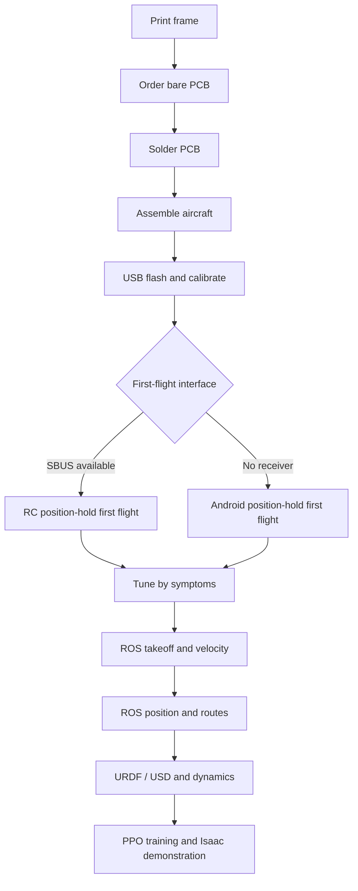
```mermaid
flowchart TD
    A[Print frame] --> B[Order bare PCB]
    B --> C[Solder PCB]
    C --> D[Assemble aircraft]
    D --> E[USB flash and calibrate]
    E --> F{First-flight interface}
    F -->|SBUS available| G[RC position-hold first flight]
    F -->|No receiver| H[Android position-hold first flight]
    G --> I[Tune by symptoms]
    H --> I
    I --> J[ROS takeoff and velocity]
    J --> K[ROS position and routes]
    K --> L[URDF / USD and dynamics]
    L --> M[PPO training and Isaac demonstration]
```

First-time builders should complete the manufacturing and assembly stages. Developers with a working aircraft can start at ROS. Learning experiments do not require mastery of every flight-control equation, but familiarity with coordinates, position, velocity, and feedback helps; complete the ROS square route first.

### Prerequisites

Hardware work requires basic soldering, multimeter, and lithium-battery handling experience. Software work requires navigating directories and running terminal commands. The ROS and learning chapters provide commands step by step; Python, vectors, and PID knowledge help explain their behavior.

Use an evenly lit indoor surface with visible texture and at least 2 m of clearance around the aircraft. Keep propellers off during soldering, flashing, calibration, and motor tests. Fit them only after confirming motor positions and rotation directions.

<a id="chapter-3"></a>

## 3. Hardware soldering and assembly

This chapter turns manufacturing files into a soldered, assembled, and direction-marked aircraft. The sequence is frame printing, PCB ordering, soldering and inspection, then assembly of the separate XIAO, IMU, and optical-flow/ToF modules.

### 3.1 Print the frame and order the PCB

#### Print the frame

Use `hardware/3d-model/open32drone-frame.3mf` as the printing project. Import at 100% scale and check that the main outline is approximately 103.3 × 103.3 mm. Check layer height, wall thickness, supports, and first-layer adhesion for your printer, nozzle, and material. Remove supports after printing. Confirm that all motor seats are undeformed and that PCB mounting holes align without force.

Use `hardware/3d-model/open32drone-frame.stp` for structural changes or CAD inspection. Verify the approximately 103.3 mm outline after STEP import rather than relying on default unit conversion.

#### Order the carrier PCB

Prepare the Gerber/drill production package, electronic BOM, front/back placement drawings, and interface/voltage definitions from the same hardware revision. Follow those files when selecting board thickness, copper weight, finish, solder-mask color, and manufacturing options; do not infer them from photographs.

Inspect the outline, slots, holes, mask, pads, and silkscreen on arrival. Match the physical revision to the BOM and placement drawing. Photos show real structures and work stages but do not replace manufacturing files.

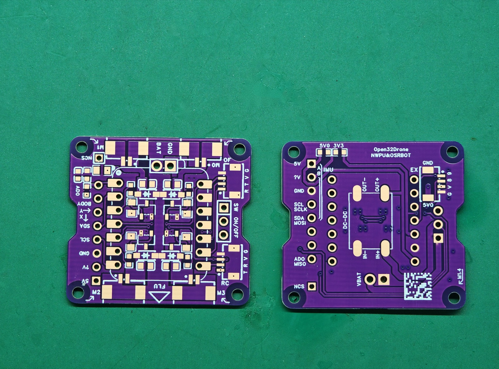

Figure 3-1. The PCB provides power, motor drive, and module connections. XIAO, IMU, and optical flow/ToF are fitted separately.

### 3.2 Prepare parts and tools

| Part | Specification | Quantity |
| --- | --- | ---: |
| Open32Drone carrier PCB | Matching production files, BOM, and placement drawing | 1 |
| XIAO ESP32-S3 | Computation and Wi-Fi | 1 |
| IMU module | MPU6500/MPU9250, attached to the carrier | 1 |
| Optical-flow/ToF module | Downward-facing, with matching cable | 1 |
| Printed frame | Main outline about 103.3 × 103.3 mm | 1 set |
| 8520 motors | 8 × 20 mm, 1 mm shaft, MX1.25 | 4 |
| Rubber motor grommets | Ø8 mm bore, 2 mm groove | 4 |
| Propellers | All 60 mm or all 65 mm; two CW and two CCW | 4 |
| PWA self-tapping screws | 1.4 × 4 × 4 mm | 12 |
| Battery | 1S; reference: 18350 1300 mAh, 25 g | 1 |
| SBUS receiver | Needed only for the physical-RC route | 0 or 1 |
| Camera | Optional streaming or vision extension | 0 or 1 |

Prepare a temperature-controlled iron or heating equipment suitable for the solder paste, fine tweezers, flux, solder wick, magnifier, multimeter, screwdriver, scale, and nonconductive mat. Follow solder and component datasheets for temperature and reflow profiles. A temperature visible in a photo is not a process specification.

### 3.3 Solder the carrier PCB

#### Step 1: Sort by BOM

Separate resistors/capacitors, diodes, MOSFETs, connectors, headers, and modules. Place one group at a time and mark completed groups on the drawing. Identify pin 1, cathodes, and connector openings before fitting polarized parts.

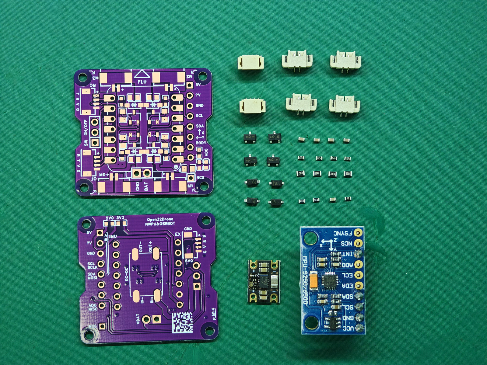

Figure 3-2. PCB, connectors, power module, and IMU before soldering.

#### Step 2: Fit low-profile SMD components first

Clean the pads and apply solder paste or pre-tin evenly. Fit resistors, capacitors, and small-signal parts first, then MOSFETs and diodes, motor connectors and switches, and finally headers, sockets, the power module, and IMU.

Check centering from above and pad contact from the side before heating. Remove bridges with flux and wick rather than repeatedly pushing neighboring components with the iron.

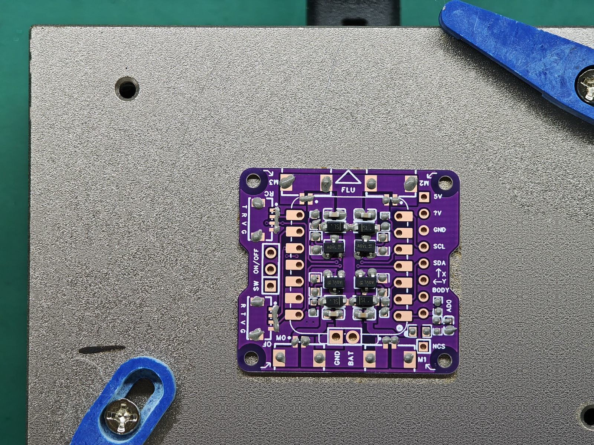

Figure 3-3. Use the board's nose arrow as the orientation reference throughout assembly.

#### Step 3: Reflow or solder individual joints

Keep the board flat on a hot plate and follow the solder's preheat, reflow, and cooling requirements. Watch for component alignment as the solder melts, then let the board cool before moving it. With an iron, tack one pin, recheck orientation, and complete the remaining joints.

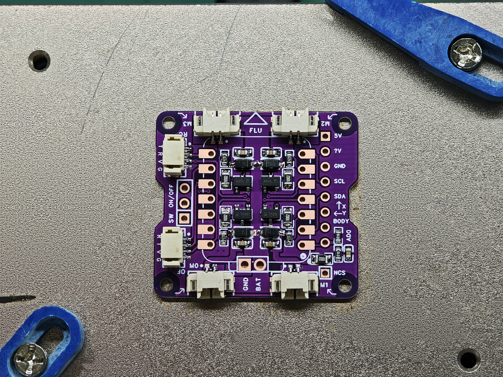

Figure 3-4. Connector openings should match the cable exit directions.

#### Step 4: Inspect the joints

Inspect the power input, four motor drivers, headers, and connectors under magnification. Joints should wet pads and pins fully, without shorts, lifted pins, poor contact, or loose solder balls.

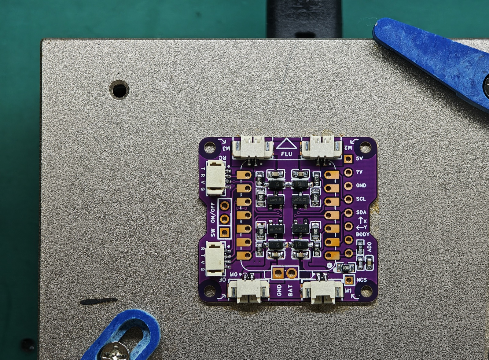

Figure 3-5. Inspect the four motor outputs and central component area carefully.

With power disconnected, check for a short between battery terminals and verify continuity around the switch. Use a current-limited supply or protected 1S battery for initial power-up. Disconnect immediately if there is unexpected heating, odor, or rapidly rising current.

#### Step 5: Fit the power module, sockets, and IMU

Install the rear power module after matching input, output, and ground to the silkscreen. Solder the two XIAO socket rows parallel so that the module inserts without force.

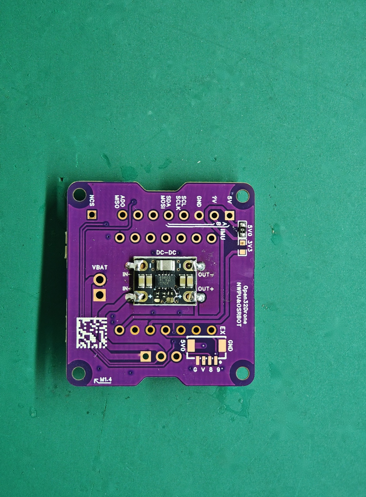

Figure 3-6. Rear power-module placement.

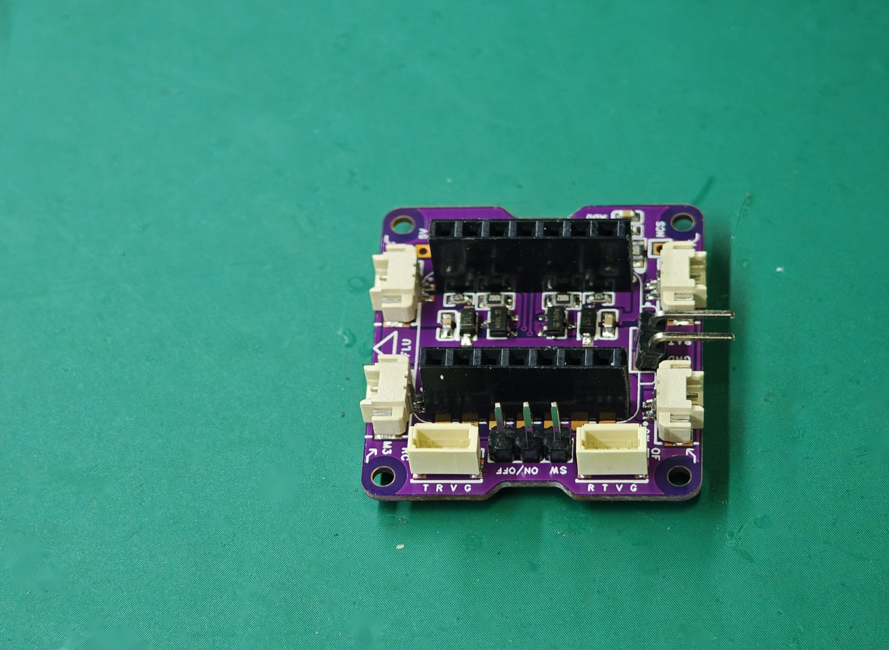

Figure 3-7. Check socket height and alignment from the side.

The IMU is a separate module within the controller-board assembly. Match its axis markings and mount it rigidly; thick soft foam should not allow it to rock. The standard installation rotation is `roll=π`, `pitch=0`, `yaw=π/2`, matching the carrier and illustrated orientation.

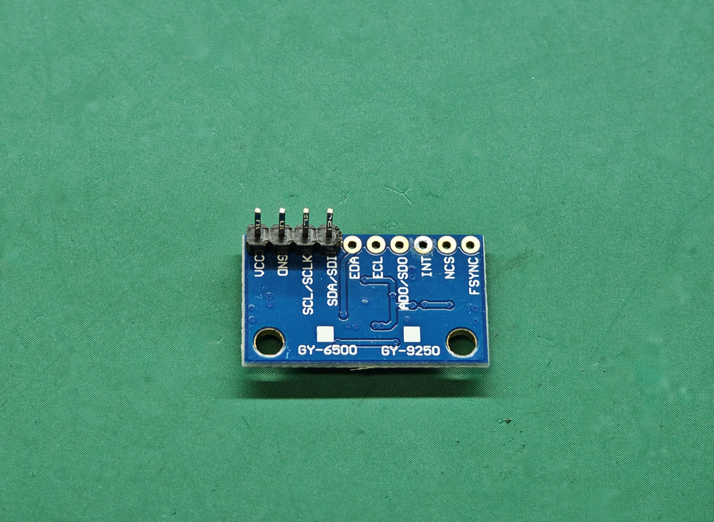

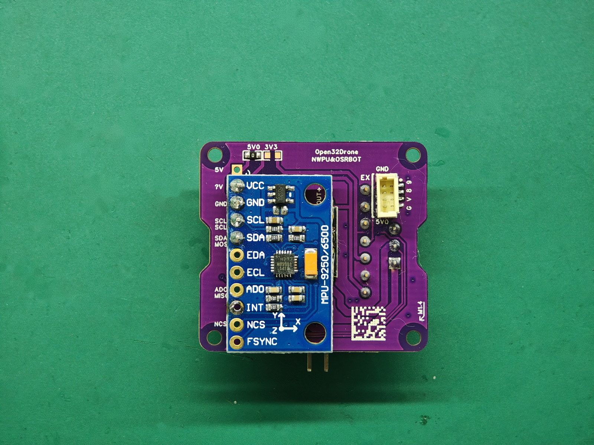

Figure 3-8. IMU module and completed installation.

The board now contains motor drivers, power circuitry, XIAO sockets, and the IMU. Install the cable-connected optical-flow/ToF module with the frame next.

### 3.4 Assemble the frame and sensors

#### Establish orientation and motor numbering

Viewed from above with the nose forward:

```text
                         Nose / +X
                             ↑
             M3 front left             M2 front right

       +Y (left) ←        Body center        → -Y (right)

             M0 rear left              M1 rear right
                             ↓
                         Tail / -X
```

| Position | Motor | GPIO | Propeller-off test | Simulation link |
| --- | --- | ---: | --- | --- |
| Rear left | M0 | 4 | `mrl` | `rotor_0_link` |
| Rear right | M1 | 3 | `mrr` | `rotor_1_link` |
| Front right | M2 | 6 | `mfr` | `rotor_2_link` |
| Front left | M3 | 5 | `mfl` | `rotor_3_link` |

#### Install optical flow/ToF

Turn the frame upside down and fit the module in its front seat. Both optical and ranging windows face the ground and must remain clear of screws, tape, and cables. Keep the module parallel to the four-motor thrust plane. The standard mount is approximately 24 mm ahead of the yaw center; firmware compensates this offset.

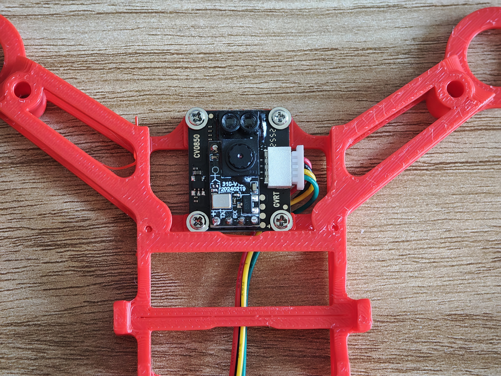

Figure 3-9. The sensor sits near the front, with its cable routed toward the center.

#### Attach the controller board

Return the frame upright, arrange the sensor cable, and align the board's nose arrow with the frame. Start all four screws before gently tightening diagonally. Keep the board flat and avoid trapping wires beneath it.

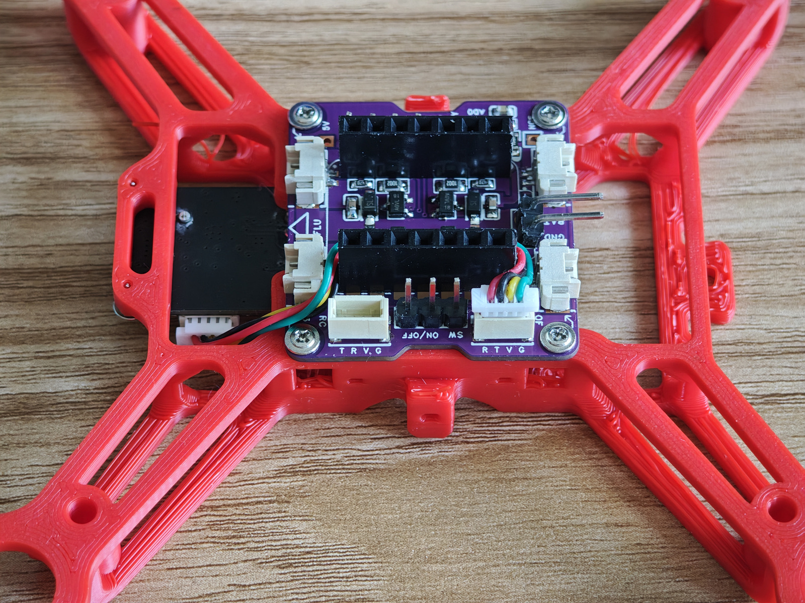

Figure 3-10. Relative placement of the PCB, IMU, and optical-flow/ToF module.

Optical flow/ToF uses UART at 115200 baud: module TX connects to controller RX on GPIO8; module RX connects to controller TX on GPIO7. IMU I²C uses GPIO2 for SDA and GPIO43 for SCL. Follow the silkscreen with the matching harness and hold connector bodies when unplugging.

#### Install XIAO and an optional receiver

Check header pins, then insert XIAO vertically into its sockets. Leave USB-C accessible from outside the frame. Fit an SBUS receiver and its signal/power connections only if using physical RC; Android/ROS operation does not require a receiver.

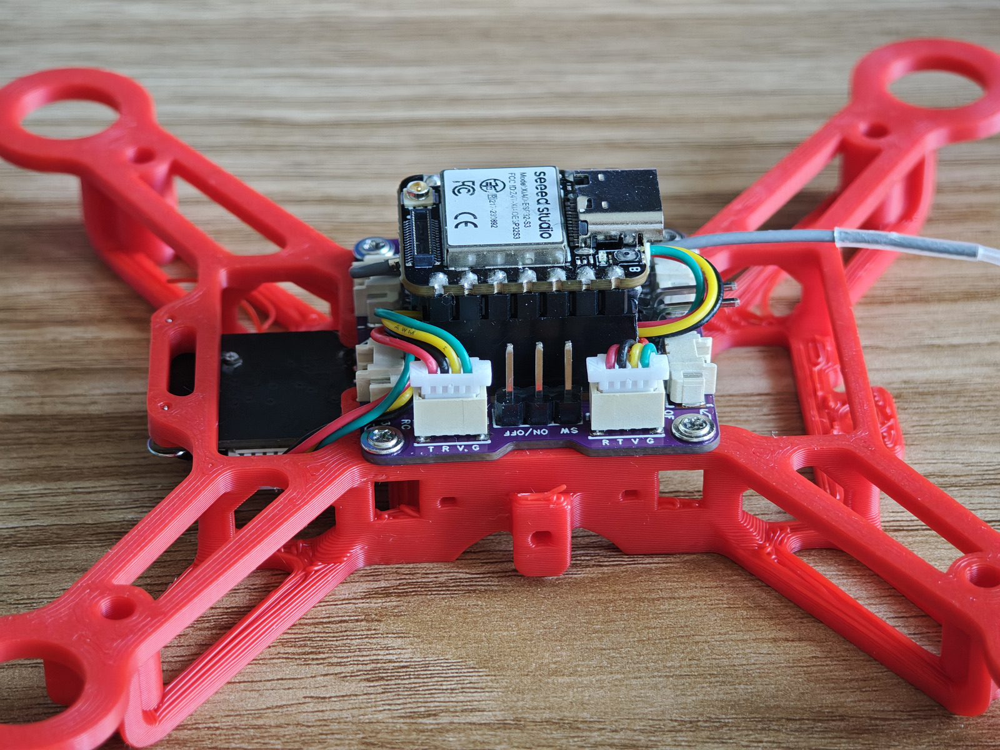

Figure 3-11. XIAO installation.

#### Fit grommets and motors

Seat each Ø8 mm rubber grommet fully in its frame groove. Press the 8520 motor into the grommet from the intended direction. Keep all motors at the same height with parallel shafts. Hold the motor casing; do not press the 1 mm shaft or pull the wires.

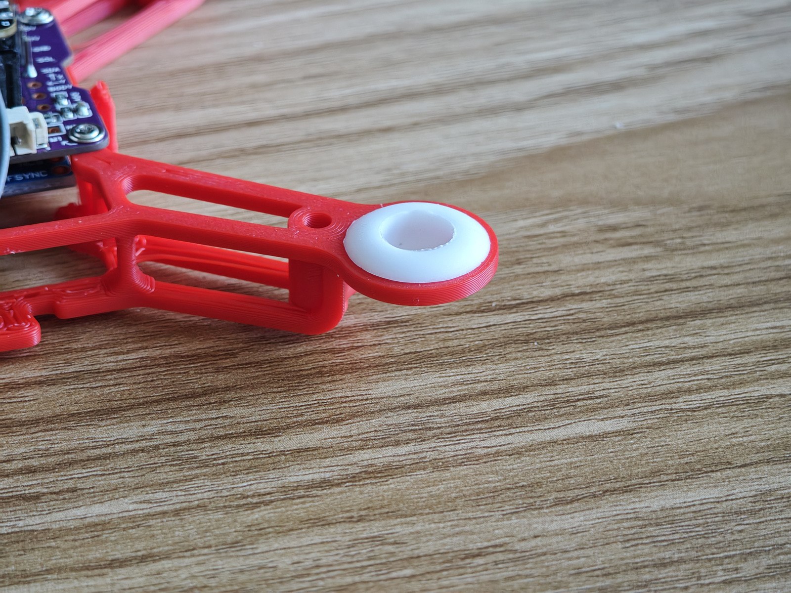

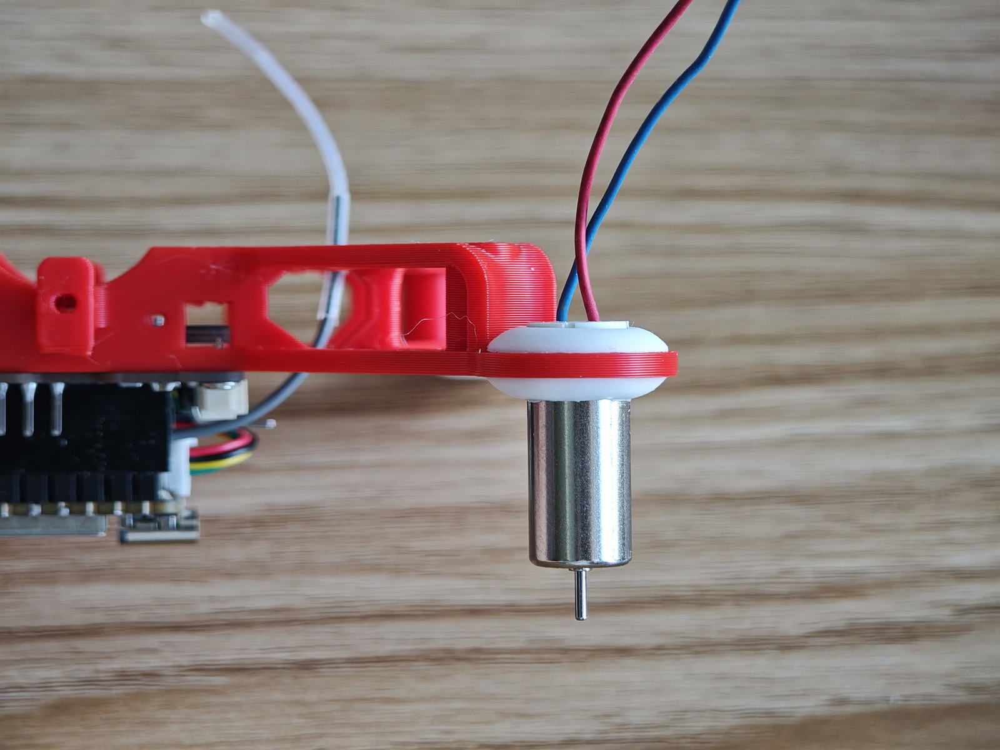

Figure 3-12. Grommets secure motors and provide some vibration isolation.

Route each motor cable along the arm to its M0–M3 connector. Leave slight slack and keep all wires outside propeller discs. Do not fit propellers yet.

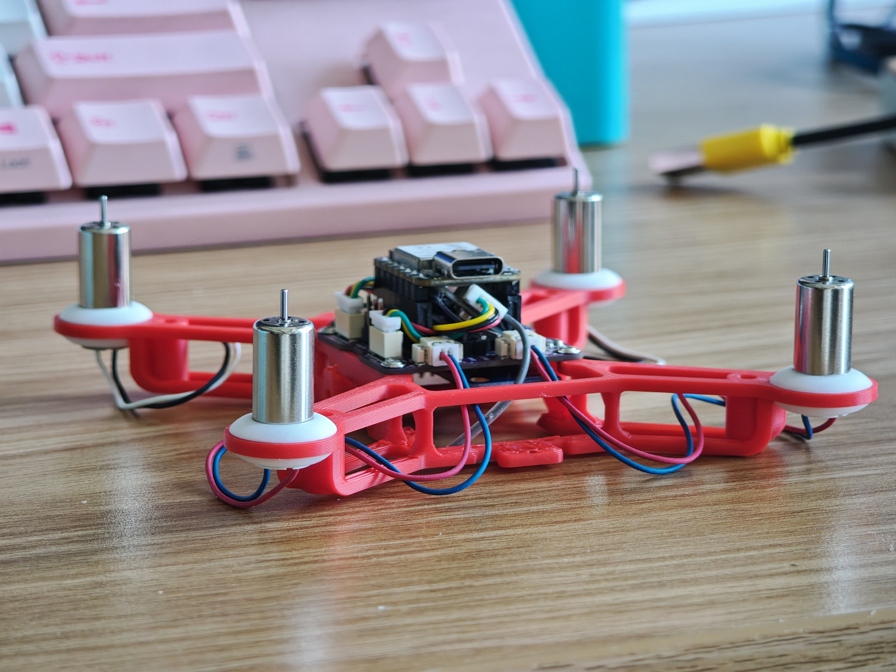

Figure 3-13. Completed motor wiring.

#### Center and secure the battery

The reference 18350 1300 mAh battery weighs 25 g. Secure it centrally so both horizontal center-of-mass axes remain near the geometric center. Keep its cable clear of propellers and sensor windows. Weigh the complete aircraft including battery, propellers, and fitted accessories; the reference value is approximately 81 g.

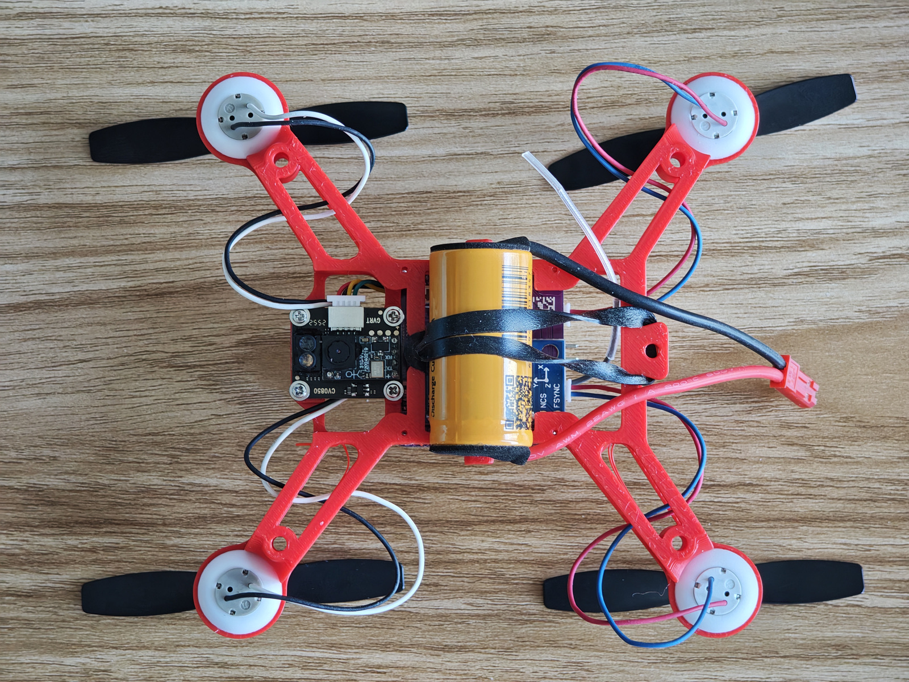

Figure 3-14. Keep the same battery position after each replacement.

Rebalance after adding a camera/bracket or changing battery type. Follow the camera module's lens-orientation and ribbon-cable bend requirements.

### 3.5 Verify motors and fit propellers after Chapter 4 calibration

Keep the aircraft propeller-free while completing [Chapter 4 flashing, calibration, and motor tests](#chapter-4), then return here. With firmware installed, enter:

```text
mrl
mrr
mfr
mfl
```

Each command spins one motor briefly at low output for about one second. Observe direction from above using a small paper strip or slow-motion video. M0 and M2 should share one direction, with M1 and M3 opposite. Label each motor with its number and measured CW/CCW direction.

Match CW propellers to measured CW motors and CCW propellers to CCW motors. All four propellers must have the same diameter. Seat the hubs without rubbing the motor casings.

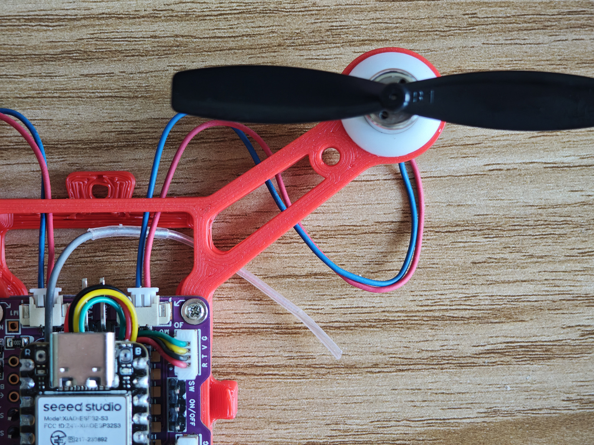

Figure 3-15. Use the measured motor labels for final propeller placement.

Before flight, check board orientation, rigid sensors, parallel motor shafts, centered battery, and wires outside the propeller discs. Chapter 4 starts without propellers; return here only after calibration and output tests.


Figure 3-16. Camera optional; normal position hold uses IMU and downward optical flow/ToF.

<a id="chapter-4"></a>

## 4. Firmware, calibration, and first flight

Keep all four propellers removed. Install the complete firmware on XIAO, calibrate sensors and battery measurement, then choose SBUS or Android for the first position-hold takeoff.

### 4.1 Understand the release bundle

| File in `releases/minimal/` | Purpose |
| --- | --- |
| `Open32Drone-minimal-merged.bin` | First USB installation, including bootloader, partition table, and application |
| `Open32Drone-minimal-app.bin` | A/B OTA after the matching partition layout is installed |
| `Open32Drone-Controller-0.1.apk` | Matching Android controller |

Use the merged image at address `0x0` for a new XIAO, an erased device, or the first installation of this partition layout. The app image cannot replace a complete first installation.

Enter the release directory and verify the downloaded files:

```bash
cd /path/to/osrdrone/releases/minimal
shasum -a 256 -c SHA256SUMS       # macOS
# sha256sum -c SHA256SUMS         # Linux
```

On Windows, run this PowerShell block in the release directory to compare every file with `SHA256SUMS`:

```powershell
Get-Content .\SHA256SUMS | ForEach-Object {
    if ($_ -match '^([0-9a-fA-F]{64})\s+\*?(.+)$') {
        $expectedHash = $Matches[1]
        $releaseFile = $Matches[2].Trim()
        $actualHash = (Get-FileHash -LiteralPath $releaseFile -Algorithm SHA256).Hash
        if ($actualHash -ine $expectedHash) { throw "SHA256 mismatch: $releaseFile" }
        Write-Output "OK: $releaseFile"
    }
}
```

### 4.2 Full USB installation

Install Python 3 and esptool:

```bash
python3 -m pip install --user esptool
```

Connect a USB data cable. On macOS, find the serial port with:

```bash
ls /dev/cu.usb*
```

Windows shows `COMx` in Device Manager; Linux commonly uses `/dev/ttyACM0`. If no port appears, hold `BOOT`, press `RESET`, then release `BOOT` to enter the bootloader.

The following first-installation recovery procedure uses `erase-flash`, which clears NVS parameters, calibration, and network settings. For an already configured device, use the [OTA procedure](#maintenance) to retain its setup. Replace the sample port and run from `releases/minimal/`:

```bash
python3 -m esptool --chip esp32s3 \
  --port /dev/cu.usbmodemXXXX erase-flash

python3 -m esptool --chip esp32s3 \
  --port /dev/cu.usbmodemXXXX --baud 921600 \
  write-flash 0x0 Open32Drone-minimal-merged.bin
```

On Windows, replace `COM5` with the actual port and use `py`:

```powershell
py -m pip install --user esptool
py -m esptool --chip esp32s3 --port COM5 erase-flash
py -m esptool --chip esp32s3 --port COM5 --baud 921600 write-flash 0x0 Open32Drone-minimal-merged.bin
```

Use the Arduino IDE serial monitor at 115200 baud on Windows. Close other applications using the port before flashing. If transfer errors occur, reduce the flashing baud rate to `460800`, then `115200` if necessary. After writing, press RESET. On macOS, a serial terminal can be opened with:

```bash
screen /dev/cu.usbmodemXXXX 115200
```

Keep the aircraft level and untouched on a rigid table during startup. Serial output initializes motor channels, Wi-Fi, IMU, optical flow/ToF, and the gyro, then reports:

```text
Gyro calibration complete
Initializing complete
```

### 4.3 Check sensors

Enter each command separately:

```text
sys
imu
flow
pw
```

`sys` reports firmware identity and the 300 Hz loop; `imu` shows the sensor, sampling, and gyro calibration; `flow` shows optical-flow/ToF packets and height; `pw` shows the ADC and converted battery voltage.

At floor level, ToF may be in its approximately 20 mm near-range blind zone. Raise the aircraft steadily to 20–60 cm: range should change with height. Slow horizontal motion over a textured surface should change optical-flow measurements.

### 4.4 Calibrate this aircraft

#### Six-face accelerometer calibration

Run `ca` after initial assembly, IMU replacement, or a complete erase. Follow the serial prompts through level, nose up, nose down, right side down, left side down, and inverted orientations. Release the aircraft and let it sample motionlessly on a rigid surface at each step.

After `Accelerometer calibration accepted`, return it to level, wait for gyro calibration, and run `imu`. Stationary acceleration magnitude should be close to `9.81 m/s²`.

#### Battery-voltage calibration

Measure the battery terminals with a multimeter (`V_DMM`) and read the firmware voltage using `pw` (`V_FW`). Read the current scale with `p PWR_VOLT_SCALE`, then calculate:

```text
New scale = Old scale × V_DMM ÷ V_FW
```

Replace `YOUR_NEW_VALUE` with the calculated number, write it, wait one second, and check `pw` again:

```text
p PWR_VOLT_SCALE YOUR_NEW_VALUE
```

For an old scale of 2.000, measured voltage 4.10 V, and displayed voltage 4.00 V, the new scale is `2.000 × 4.10 ÷ 4.00 = 2.050`.

#### SBUS calibration for the RC route

With a receiver installed, switch on the transmitter and run `cr`. Complete the eight stick/switch actions requested by the serial prompts, then check `rc`:

| Operation | Expected normalized value |
| --- | --- |
| Roll, pitch, and yaw centered | Near 0 |
| Throttle minimum / maximum | Near 0 / 1 |
| Three-position mode switch | Near 0 / 0.5 / 1 |

Android-only and ROS-only aircraft do not require `cr`.

### 4.5 Test all four motors without propellers

Keep the aircraft disarmed and enter:

```text
mrl
mrr
mfr
mfl
```

The commands address rear-left M0, rear-right M1, front-right M2, and front-left M3, respectively. Enter only the command itself. Each spins one motor for about one second. Record its physical position and CW/CCW direction viewed from above, then fit the matching propeller using Chapter 3.

### 4.6 Choose a takeoff interface

| Available equipment | Route | Preparation |
| --- | --- | --- |
| SBUS receiver and paired transmitter | A: physical RC | Complete `cr` and learn the emergency-stop stick action |
| No receiver, or phone-based operation | B: Android APK | Connect an Android phone to the aircraft Wi-Fi |

Use one control client for the first flight. Stop ROS and other MAVLink clients when using Android; stop the app's control stream when using physical RC.

#### Route A: SBUS transmitter

| Switch position | Mode | Behavior |
| --- | --- | --- |
| Low | STAB | Throttle directly commands thrust; for experienced pilots |
| Middle | ALT_HOLD | Centered throttle holds height |
| High | POS_HOLD | Optical flow holds horizontal position; the guide's first-flight route |

Select high/position-hold mode. Minimum throttle and full-right yaw arm the aircraft; motors idle at approximately 10%. Hold throttle above 62.5% for about 0.2 seconds to trigger assisted takeoff to the default 0.60 m height. Center throttle after climbing and make only small horizontal corrections.

For landing, hold throttle below 5% for about 0.3 seconds. The aircraft descends and stops its motors after touchdown. Raising throttle above 60% cancels descent.

Minimum throttle and full-left yaw held for at least 150 ms trigger emergency motor stop. This immediately removes thrust and causes an airborne aircraft to fall; use it when contact with a person, entanglement, or loss of attitude makes controlled landing infeasible.

#### Route B: Android APK

Copy and install `Open32Drone-Controller-0.1.apk`. Android may require temporary permission for the file manager to install an unknown application.

After a complete erase, the defaults are:

```text
Wi-Fi: open32drone
Password: 12345678
Aircraft address: 192.168.4.1
MAVLink UDP: 14550
```

Stay connected when Android reports no internet. Open Open32Drone Controller and wait for live flight-controller status. Enter a relative height of `0.65`, then hold the one-key takeoff button for approximately 0.60 seconds. The firmware performs arming, climb, and position-hold entry.

The left stick controls vertical motion and yaw; the right controls forward/backward and lateral motion. Begin with 5–10 seconds of small-area hovering, then hold the landing button. If the aircraft moves rapidly toward people or furniture, use landing while that remains possible; use emergency disarm when a controlled landing is no longer feasible.

Android does not require an RC receiver. If buttons become unavailable, check MAVLink heartbeat and ensure the phone is still on `open32drone` rather than another Wi-Fi network or cellular connection.

### 4.7 First-flight sequence

Use a textured, evenly lit surface and at least 2 m clearance. Keep the battery centered and the downward sensor clean. Wait for gyro calibration, then:

1. Take off to 0.60–0.65 m.
2. Center the sticks and observe for five seconds.
3. Make small forward, backward, left, and right movements.
4. Return near the starting area.
5. Land automatically and confirm motor stop after touchdown.

Immediate tipping usually points to motor location, rotation, propellers, or IMU orientation. Stop and return to propeller-off checks. If takeoff is stable but vibration, drift, or height variation remains, use the next chapter.

<a id="chapter-5"></a>

## 5. Flight tuning

Start from the observed symptom. Make the mechanical system, sensors, and power supply consistent before changing control parameters. Change one value, repeat the same short flight, and compare the observation and log.

### 5.1 Check whether the cause is a parameter

| Symptom | Check first |
| --- | --- |
| Tips immediately after takeoff | M0–M3 positions, rotation, CW/CCW propellers, IMU orientation |
| One side consistently weak | Propeller damage, bent shaft, connectors, motor temperature, battery sag |
| Fine, high-frequency vibration | Propellers, shafts, grommets, motor heights, IMU mounting |
| Position hold fails on particular floors | Texture, reflection, lighting, optical window |
| Height measurement jumps | ToF window, tilt, near-range blind zone, cable |
| Balance changes after battery replacement | Battery/accessory positions and actual takeoff mass |

Once mechanically consistent, compare flights with the same battery, floor, and height. A useful standard action is takeoff to 0.65 m, centered-stick hover for five seconds, then landing.

### 5.2 Understand the control layers

```text
Angular-rate loop → Attitude-angle loop → Height/velocity loop → Horizontal-position loop
```

Stabilize inner loops before tuning outer loops. P controls correction strength, I removes persistent bias, and D reduces overshoot associated with rapid change. Usually inspect P, then I, and adjust D only when the evidence calls for it.

List parameters:

```text
p
```

Read or write one parameter:

```text
p CTL_R_P
p CTL_R_P 4.02
```

Make changes while landed and disarmed with motors stopped. Firmware saves to NVS when writing is permitted. Record the old value, wait a second after writing, and read back. Tables below give matching source defaults; an aircraft may retain older NVS values, so `p PARAMETER_NAME` is authoritative for that device.

### 5.3 Attitude vibration and recovery

| Function | Roll | Pitch | Default |
| --- | --- | --- | ---: |
| Angle P | `CTL_R_P` | `CTL_P_P` | 4.47 |
| Rate P | `CTL_R_RATE_P` | `CTL_P_RATE_P` | 0.05 |
| Rate I | `CTL_R_RATE_I` | `CTL_P_RATE_I` | 0.20 |
| Rate D | `CTL_R_RATE_D` | `CTL_P_RATE_D` | 0.001 |

#### High-frequency oscillation

Fix propeller and motor vibration first. If the mechanics are sound, reduce the affected rate P by 5–10%; for example, Roll `0.050 → 0.045`:

```text
p CTL_R_RATE_P 0.045
```

Repeat the same five-second hover. If vibration falls and control remains responsive, apply a similar change to Pitch if needed. Do not change P, I, and D together.

#### Slow oscillation or excessive leveling response

Large, low-frequency swings may originate in angle P. Reduce `CTL_R_P` or `CTL_P_P` by about 10%, such as `4.47 → 4.02`. If recovery becomes sluggish, move back toward the original value in small steps.

#### Persistent tilt

Check balance, weak motors, frame deformation, and accelerometer bias. Center the battery and repeat `ca`. Analyze the I term only after the mechanics and calibration are consistent and the bias remains repeatable.

### 5.4 Height problems

| Parameter | Default | Purpose |
| --- | ---: | --- |
| `ALT_P` | 0.747 | Main height-error correction |
| `ALT_I` | 0.10 | Remove persistent height error |
| `ALT_D` | 0.20 | Use vertical velocity to reduce overshoot |
| `ALT_HOVER` | 0.49 | Nominal hover-thrust feedforward |
| `ALT_VEL_MAX` | 0.45 | Maximum vertical command speed |

For slow vertical oscillation, confirm continuous ToF data, then reduce `ALT_P` by approximately 10%:

```text
p ALT_P 0.67
```

For persistent height offset after otherwise stable takeoff, inspect `ALT_I`. For overshoot followed by reversal near the target, inspect ToF-derived velocity and `ALT_D`.

`ALT_HOVER` represents collective thrust near nominal voltage. The 81 g aircraft with 60 mm propellers uses 0.49 as a reference. If large height corrections are consistently needed despite sound sensors and attitude, estimate average hover motor command from logs and adjust in small increments. Do not use it to conceal battery deterioration or a weak motor.

### 5.5 Horizontal drift and position hold

| Parameter | Default | Purpose |
| --- | ---: | --- |
| `POS_HOLD_P` | 0.85 | Convert position error to velocity target |
| `POS_VEL_P_X/Y` | 0.35 | Horizontal velocity P |
| `POS_VEL_I_X/Y` | 0.04 | Horizontal velocity I |
| `POS_STICK_V` | 0.70 | Maximum horizontal stick speed |

Use `flow` over a clearly textured surface and verify fresh data. Circular position drift during stationary yaw calls for checking the standard 24 mm forward offset and level sensor mounting. Persistent directional drift calls for optical-flow bias, balance, and IMU calibration checks.

If return toward the target is too weak, increase `POS_HOLD_P` slightly. If the aircraft oscillates around it, reduce the gain. Use 5–10% changes with the same height and duration.

### 5.6 Battery and propulsion changes

The reference battery is about 4.2 V when full; available thrust falls during discharge. GPIO1/A0 reads a 100 kΩ / 100 kΩ voltage divider, and assisted altitude/position modes apply bounded feedforward compensation.

Calibrate `PWR_VOLT_SCALE` using `pw` and a multimeter. Compare the same hover with a fresh and lower-charge battery, inspecting `voltage`, `hoverFF`, `voltComp`, and all four outputs. If every motor approaches saturation as voltage drops, check battery resistance, propellers, and motors before raising PID gains.

### 5.7 Compare flights with logs

After disarming, export:

```text
log dump
```

Save the CSV and run the repository analyzer:

```bash
python3 simulation/course/analyze_log.py \
  --csv /path/to/flight.csv \
  --output output/my-flight-analysis
```

Compare commanded and measured Roll/Pitch, ToF and target height, optical-flow velocity and position error, motor outputs and saturation, voltage and compensation, and the timeline around the symptom.

Record the original parameter, new value, repeated action, and observation. Keep a beneficial change and continue incrementally; restore the old value when results worsen. Proceed to ROS after repeatable takeoff, 5–10 seconds of position hold, small translations, and automatic landing.

<a id="chapter-6"></a>

## 6. ROS 2 control

Once basic flight is repeatable, ROS 2 provides programmable access to IMU, range, battery, odometry, takeoff/landing, and movement targets. Start with automatic takeoff/landing, then combine movements into a square.

### 6.1 Prepare the ROS computer

The guide uses Ubuntu 24.04 and ROS 2 Jazzy. Install Desktop using the [official ROS 2 instructions](https://docs.ros.org/en/jazzy/Installation/Ubuntu-Install-Debs.html), then install MAVROS and build tools:

```bash
sudo apt update
sudo apt install ros-jazzy-mavros ros-jazzy-mavros-extras \
  python3-colcon-common-extensions python3-rosdep
sudo ros2 run mavros install_geographiclib_datasets.sh
```

Copy the repository's ROS package into a workspace:

```bash
source /opt/ros/jazzy/setup.bash
mkdir -p ~/osdrone_ws/src
cp -a /path/to/osrdrone/ros2 ~/osdrone_ws/src/open32drone_driver
cd ~/osdrone_ws
rosdep install --from-paths src --ignore-src -r -y
colcon build --symlink-install
source install/setup.bash
```

In each new terminal, source both environments:

```bash
source /opt/ros/jazzy/setup.bash
source ~/osdrone_ws/install/setup.bash
```

### 6.2 Connect the aircraft

Connect the computer directly to `open32drone`. Stop control on the Android phone and close competing clients on the computer, then test:

```bash
ping -c 3 192.168.4.1
```

In the first terminal, start the driver:

```bash
ros2 launch open32drone_driver open32drone.launch.py
```

For an aircraft connected to a router with `sta`, obtain its IP using `wifi` and supply it at launch:

```bash
ros2 launch open32drone_driver open32drone.launch.py \
  aircraft_ip:=192.168.1.42
```

In a second terminal, check status:

```bash
ros2 run open32drone_driver control status
ros2 topic echo /open32drone/connected --once
```

After `connected` becomes `true`, inspect sensors:

```bash
ros2 topic hz /open32drone/imu/data
ros2 topic echo /open32drone/range/downward --once
ros2 topic echo /open32drone/battery --once
ros2 topic echo /open32drone/odom --once
```

### 6.3 Common topics and frames

| Topic | Type | Contents |
| --- | --- | --- |
| `/open32drone/connected` | `std_msgs/Bool` | Flight-controller heartbeat connection |
| `/open32drone/imu/data` | `sensor_msgs/Imu` | Attitude, angular velocity, acceleration |
| `/open32drone/range/downward` | `sensor_msgs/Range` | Downward ToF range |
| `/open32drone/battery` | `sensor_msgs/BatteryState` | Measured battery voltage |
| `/open32drone/odom` | `nav_msgs/Odometry` | Local position and velocity |
| `/open32drone/cmd_vel` | `geometry_msgs/Twist` | Body-frame velocity target |
| `/open32drone/goal_pose` | `geometry_msgs/PoseStamped` | Local-frame position target |

`cmd_vel` uses body axes: x forward, y left, z up. `goal_pose` uses the fixed local `odom` frame, which does not rotate with the current heading. The square examples assume the initial nose aligns with local +X and no yaw changes occur. Odometry is an onboard relative estimate, not external absolute ground truth.

```text
open32drone/odom → open32drone/base_link → open32drone/tof_link
```

### 6.4 First ROS flight

On first connection, remove propellers and run `ros2 run open32drone_driver bench_test --duration 5`. Check connection, sensors, and status. Power off before fitting propellers, then place the aircraft in the flight area and wait for gyro calibration after startup. Run the supervised test:

```bash
ros2 run open32drone_driver flight_test --height 0.65 --hover 5
```

It waits for a live connection, requests takeoff, waits for target height, hovers for five seconds, requests landing, and waits for touchdown/disarm. The terminal reports height, duration, and horizontal movement range.

The same actions can be requested separately:

```bash
ros2 run open32drone_driver control status
ros2 run open32drone_driver control takeoff --height 0.65
ros2 run open32drone_driver control land
```

For immediate motor stop:

```bash
ros2 run open32drone_driver control emergency-stop
```

Emergency stop does not perform a descent; use it only when controlled landing is no longer feasible.

### 6.5 Velocity control

`control velocity` specifies forward, leftward, and upward speed plus an optional yaw rate. It prepares Offboard, streams the target for the requested duration, and sends zero velocity afterward.

After takeoff, move forward at 0.15 m/s for 1.5 seconds:

```bash
ros2 run open32drone_driver control velocity 0.15 0.00 0.00 \
  --duration 1.5
```

Move left:

```bash
ros2 run open32drone_driver control velocity 0.00 0.15 0.00 \
  --duration 1.5
```

Turn left at 0.4 rad/s without translation:

```bash
ros2 run open32drone_driver control velocity 0.00 0.00 0.00 \
  --yaw-rate 0.4 --duration 1.5
```

Negative values reverse direction. For first exercises, keep translation within `±0.15 m/s` and duration at or below 1.5 seconds. Observe whether the aircraft stops after each command.

#### Draw a small square with velocity

After stable takeoff, run forward, left, backward, then right; each nominal edge is about 0.225 m:

```bash
# Forward, left, backward, right; approximately 0.225 m per edge
ros2 run open32drone_driver control velocity  0.15  0.00 0.00 --duration 1.5
ros2 run open32drone_driver control velocity  0.00  0.15 0.00 --duration 1.5
ros2 run open32drone_driver control velocity -0.15  0.00 0.00 --duration 1.5
ros2 run open32drone_driver control velocity  0.00 -0.15 0.00 --duration 1.5
ros2 run open32drone_driver control land
```

Speed sets travel rate and duration sets nominal distance. Re-capturing position between commands produces rounded corners and some closure error.

### 6.6 Position control and waypoints

`control position x y z` specifies an absolute position in `open32drone/odom`. Read odometry after takeoff to identify the ground origin and current height. If the takeoff origin is near `(0, 0, 0)`, request:

```bash
ros2 run open32drone_driver control position 0.25 0.00 0.65
```

This moves 25 cm along local +X while maintaining 65 cm height. Four waypoints form a 25 cm square:

```bash
ros2 run open32drone_driver control position 0.25 0.00 0.65
sleep 3
ros2 run open32drone_driver control position 0.25 0.25 0.65
sleep 3
ros2 run open32drone_driver control position 0.00 0.25 0.65
sleep 3
ros2 run open32drone_driver control position 0.00 0.00 0.65
sleep 3
ros2 run open32drone_driver control land
```

If the local origin is not zero, offset the points by takeoff `x0`, `y0`, and ground `z0`. Keep a new target within 0.8 m horizontally of the current position.

### 6.7 Publish messages directly

Start Offboard before continuously publishing `Twist`:

```bash
ros2 run open32drone_driver control offboard start
```

Publish at least 10 Hz; this terminal example uses 20 Hz:

```bash
ros2 topic pub -r 20 /open32drone/cmd_vel geometry_msgs/msg/Twist \
  "{linear: {x: 0.10, y: 0.0, z: 0.0}, angular: {z: 0.0}}"
```

After `Ctrl+C` stops velocity publication, a still-running ROS Offboard node with valid position feedback captures the current position after its default 0.50-second command timeout and continues sending hold targets. Loss of the entire target stream instead invokes the firmware's separate 0.30-second Offboard timeout. These are different timers. Production programs should explicitly send zero velocity and request landing before exit.

### 6.8 Inspect flight with RViz and rosbag

Enable RViz at launch:

```bash
ros2 launch open32drone_driver open32drone.launch.py use_rviz:=true
```

Record a flight:

```bash
ros2 bag record \
  /open32drone/imu/data \
  /open32drone/range/downward \
  /open32drone/odom \
  /open32drone/battery \
  /open32drone/flight/status \
  /open32drone/offboard/status
```

Replay to compare movement, trajectory, height, and voltage. ROS now connects state, targets, actions, and feedback; the next chapter adds a policy trained through repeated simulated experience.

For multi-aircraft naming, interfaces, and maintenance, see [ROS 2 and automatic flight](docs/AUTOMATIC_FLIGHT_AND_ROS2.md).

<a id="chapter-7"></a>

## 7. Simulation and reinforcement learning

ROS divides flight into state, targets, and actions. Reinforcement learning keeps this feedback structure but learns corrections through many simulated flights with wind, propulsion differences, and model error.

The project uses residual learning. A geometric PD controller handles attitude stabilization and four-motor allocation; PPO outputs three-axis acceleration corrections. This gives actions a clear physical meaning and focuses learning on effects that the base model describes poorly.

### 7.1 Represent the aircraft as a robot model

The URDF/USD model has a rigid body and four rotor joints:

```text
base_link
├── rotor_0_link  — continuous — rear left M0
├── rotor_1_link  — continuous — rear right M1
├── rotor_2_link  — continuous — front right M2
├── rotor_3_link  — continuous — front left M3
├── battery_link — fixed
├── camera_link  — fixed
├── imu_link     — fixed sensor frame
└── flow_tof_link — fixed
    ├── flow_link — fixed optical frame
    └── tof_link  — fixed range frame
```

`base_link` includes the frame, PCB, XIAO, grommets, motor casings, power circuitry, and fixed supports. IMU and optical-flow/ToF frames support sensor references; their physical mass is included in the rigid body. A separate battery link permits mass/position changes. The camera is fixed, and each propeller uses a continuous joint.

| Component | Reference mass |
| --- | ---: |
| Rigid body `base_link` | 54.2547 g |
| Four propellers | Approximately 1.4542 g |
| 18350 battery | 25.0000 g |
| Camera | Approximately 0.2911 g |
| Total | 81.0000 g |

The video combines four Isaac Sim checks: appearance and 81 g configuration, PCB close-up, unpowered free fall, and motion of the four rotor joints.

[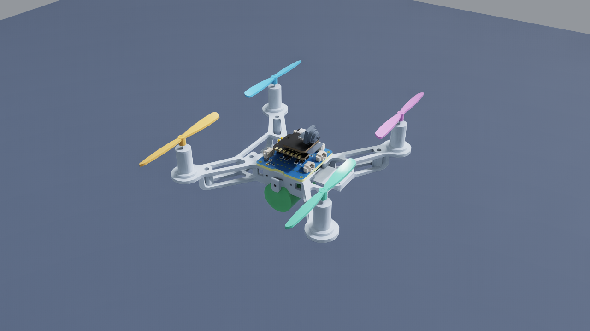](img/videos/model-checks.mp4)

[Open video: robot model and physics checks](img/videos/model-checks.mp4)

### 7.2 Start with an approximate motor model

Motor dimensions and a maximum 50,000 rpm do not establish thrust with a 60 mm propeller. The corresponding angular speed is:

```text
50,000 × 2π ÷ 60 = 5,235.99 rad/s
```

This can inform a joint-speed limit but is not a measured loaded speed or thrust. Begin with hover force:

```text
Average hover thrust per motor
= Total mass × Gravity ÷ 4
= 0.081 kg × 9.80665 m/s² ÷ 4
≈ 0.1986 N
≈ 20.25 gf
```

Read mean motor commands during stable hover from a voltage-recording log. The reference is approximately 47.4%, giving a rough full-command extrapolation of 0.419 N per motor, with a 40 ms initial response-time estimate. Randomize thrust gain, mass, inertia, voltage, and response time during training rather than relying on these approximate values.

This supports an initial training/evaluation workflow. A single-motor thrust stand can later measure PWM points at 4.2, 3.9, 3.7, and 3.5 V and replace the estimates incrementally.

### 7.3 Define the learning task

The hover exercise has 35 observation dimensions: position/velocity errors, attitude matrix, angular velocity, reference velocity and acceleration, previous action, integrated error, estimated motor force, and voltage. The three actions are residual x/y/z accelerations bounded to `±4 m/s²`.

Environments vary initial attitude, propulsion, and wind. Rewards favor position/velocity tracking, maintained attitude and height, smooth actions, and avoidance of overturning, ground contact, or leaving the allowed region. PPO gathers observation/action/outcome sequences across many environments and updates the policy. Evaluation compares PD and residual PPO using held-out seeds and stronger disturbances.

### 7.4 Run a first PPO experiment on a regular computer

Create an environment from the repository root:

```bash
python3 -m venv .venv
source .venv/bin/activate
python3 -m pip install --upgrade pip
python3 -m pip install numpy torch matplotlib
```

Run the CPU hover exercise:

```bash
python3 simulation/course/hover_lab.py \
  --output output/my-first-hover \
  --iterations 400 --envs 128 --device cpu
```

| Output | Contents |
| --- | --- |
| `training.csv` | Per-iteration rewards, position errors, and failures |
| `policy_initial.pt` / `policy_final.pt` | Initial and final policies |
| `actor.pt` | Standalone TorchScript policy |
| `evaluation.json` | Held-out PD/PPO comparison |
| `config.json` | Complete training settings |

The following values are transcribed from the companion guide's reference simulation: mean RMS position error over 96 complete episodes. They provide a reproduction reference, were not rerun during this tutorial update, and are not real-aircraft accuracy measurements.

| Horizontal disturbance | Base PD | Residual PPO |
| ---: | ---: | ---: |
| 0.0 m/s² | 1.58 cm | 3.64 cm |
| 0.8 m/s² | 16.51 cm | 6.03 cm |
| 1.5 m/s² | 30.48 cm | 10.56 cm |

PD is more accurate in calm conditions; learned compensation reduces error under stronger sustained disturbance. The base controller still handles stabilization.

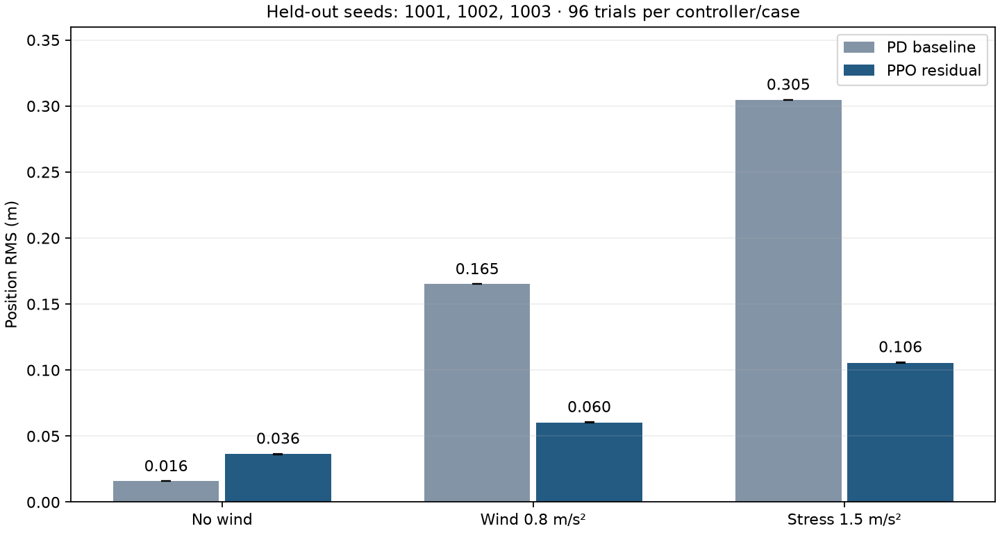

Figure 7-1. Held-out comparison for the CPU hover exercise.

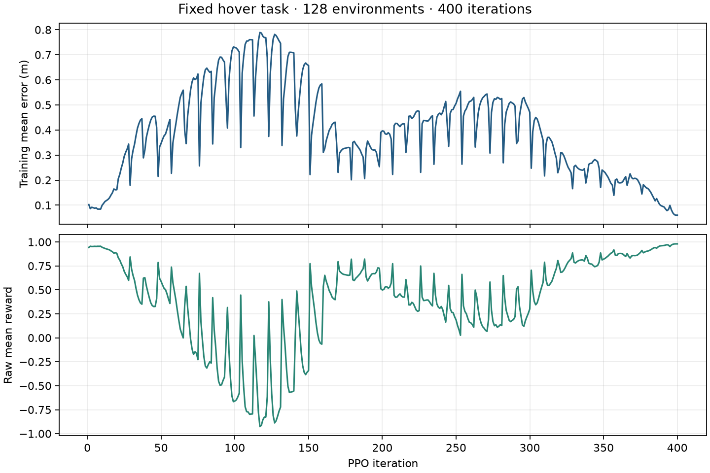

Figure 7-2. Training reward and error curves.

### 7.5 Extend hover to continuous flight

The full demonstration tracks a figure-eight through ten rings, climbs a spiral, and holds position in gusts. A program defines the trajectory; PPO learns tracking corrections and disturbance compensation.

Compare fixed-camera hovering under the same disturbance:

[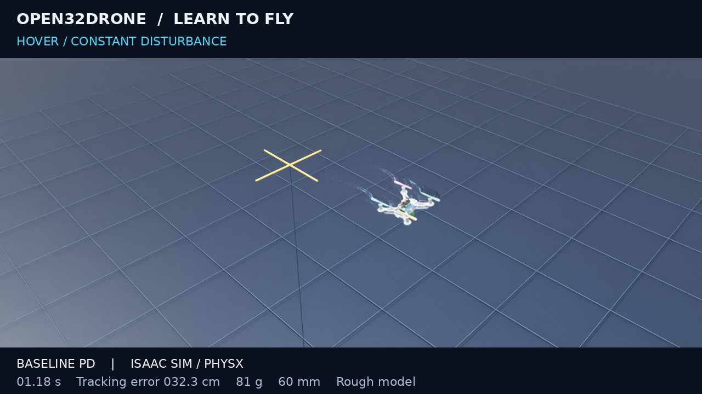](img/videos/hover-pd.mp4)

[Open video: base PD hover](img/videos/hover-pd.mp4)

Base PD develops a larger steady offset under sustained disturbance.

[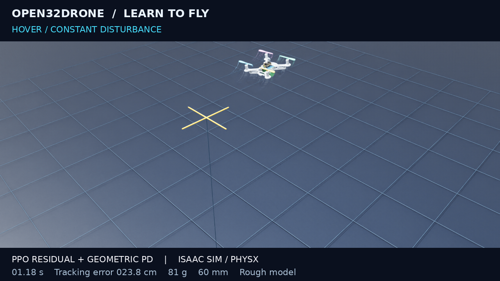](img/videos/hover-ppo.mp4)

[Open video: residual PPO hover](img/videos/hover-ppo.mp4)

Residual PPO plus PD compensates the disturbance and returns closer to the target.

The 60-second overview includes the model, training workflow, hover comparison, figure-eight rings, spiral, and gust recovery:

[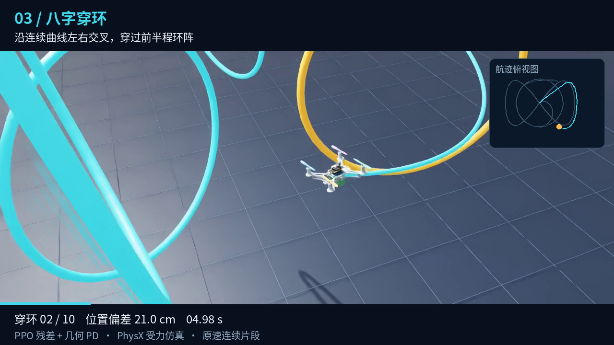](img/videos/rl-demo-60s.mp4)

[Open video: complete learning demonstration, 60 seconds](img/videos/rl-demo-60s.mp4)

The companion guide reports 10/10 rings, approximately 12.11 cm position RMS error, and approximately 1.10 m/s maximum speed during a 34-second Isaac Sim flight. Its independent simulation scenarios below are a separate evaluation from the CPU exercise above.

| Scenario | Base PD | Residual PPO + PD |
| --- | ---: | ---: |
| Calm | 2.72 cm | 8.19 cm |
| Sustained disturbance | 51.33 cm | 18.43 cm |
| Motor variation and mass error | 53.81 cm | 14.28 cm |
| Abrupt gust | 34.46 cm | 26.92 cm |

### 7.6 Reproduce full training and Isaac Sim

The full training script uses CUDA. Run physics checks on the training workstation:

```bash
cd /path/to/osrdrone/simulation/rl_demo
python3 physics_checks.py \
  --output ../../output/rl-demo/my-run/physics-checks.json
```

Train, evaluate, and check the course:

```bash
python3 train.py \
  --output ../../output/rl-demo/my-run \
  --iterations 1200 --envs 1024

python3 evaluate.py --run ../../output/rl-demo/my-run
python3 preflight.py --run ../../output/rl-demo/my-run
```

Training and evaluation use the PyTorch simulation environment; Isaac Sim/PhysX provides a separate validation and visualization stage. Prepare the `OPEN32DRON_fixed_81g` model package first, checking its instructions, mass parameters, and USD resources. If you have only the source checkout, prepare the model following repository `docs/SIMULATION_MODEL.zh-CN.md`; do not pass an empty directory to `--package`.

Launch Isaac's own Python environment with its `python.sh`:

```bash
/path/to/isaac-sim/python.sh \
  /path/to/osrdrone/simulation/rl_demo/native_isaac.py \
  --package /path/to/osrdrone/output/simulation-model/OPEN32DRON_fixed_81g \
  --run /path/to/osrdrone/output/rl-demo/my-run \
  --output /path/to/osrdrone/output/rl-demo/my-run/native \
  --seconds 34 --record --visible
```

`native_isaac.py` applies the combined motor force and torque every 5 ms. PhysX integrates position and attitude; the trajectory, rings, and camera do not reposition the aircraft frame by frame.

### 7.7 Progress toward a real-aircraft policy

Three useful next steps are:

1. Replace initial maximum thrust, response-time, and reaction-torque values with thrust-stand measurements.
2. Add IMU, optical-flow, and ToF noise, latency, and dropped measurements to training.
3. Convert ROS recordings into the policy's 35-dimensional input, beginning with replay inference, then constrained bench work and low-altitude trials.

The current policy uses simulation state and task-provided ring positions. Future camera work can add localization or detection. Begin with bounded acceleration or velocity corrections through ROS and the existing flight-control loop; investigate lower-level actuator control only after sufficient bench evidence.

The development route now connects manufactured hardware, stabilizing firmware, ROS interfaces, URDF/USD models, and a policy that can adapt control to selected disturbances and model errors.

<a id="development"></a>

## Appendix A: Source builds and architecture

### A.1 When to build from source

Use Chapter 4's matching release bundle for the standard aircraft. Build from source when changing sensors, pins, control logic, or communication. Keep firmware, Android, and ROS 2 versions compatible; record the source revision, build options, and parameter snapshot after each change.

### A.2 Fixed development environment

| Item | Matching version or option |
| --- | --- |
| Arduino IDE | 2.x, or use Arduino CLI |
| Arduino-ESP32 | 3.3.6 |
| FlixPeriph | 1.10.4, including IMU/SBUS peripheral support |
| MAVLink Arduino library | 2.0.25 |
| Board | `esp32:esp32:XIAO_ESP32S3` |
| PSRAM | OPI |
| Partition / flash mode | `default_8MB` / DIO |
| Standard IMU | MPU6500/MPU9250; validate alternatives separately |

Add the ESP32 board index in Arduino IDE, install the specified version, and select XIAO ESP32-S3 and the actual serial port. Follow the table for configuration; the retained screenshots only illustrate menu locations.

```text
https://espressif.github.io/arduino-esp32/package_esp32_index.json
```


From the source root, Arduino CLI can build with:

```bash
arduino-cli core install esp32:esp32@3.3.6 \
  --additional-urls https://espressif.github.io/arduino-esp32/package_esp32_index.json
arduino-cli lib install "FlixPeriph@1.10.4" "MAVLink@2.0.25"
arduino-cli compile --clean \
  --fqbn 'esp32:esp32:XIAO_ESP32S3:PSRAM=opi,PartitionScheme=default_8MB,FlashMode=dio' \
  --output-dir /tmp/open32drone-build firmware
```

Open `firmware/firmware.ino` in Arduino IDE; all `.ino` tabs in that directory form one sketch. Remove propellers and close competing serial applications before uploading. Successful compilation still requires sensor, motor-mapping, and controlled-flight checks. Use Chapter 4's merged image to install the full partition layout on a new board; a sketch application file does not replace it.

<a id="firmware-architecture"></a>

### A.3 Flight-control firmware architecture

The flight-critical chain runs in a fixed order: input acquisition, state estimation, target selection, cascaded control, mixing, and motor output. The main-loop target is 300 Hz. Optical-flow/ToF state and dependent control update on new valid measurements. Network, camera, and maintenance functions cannot replace the motor-control chain.

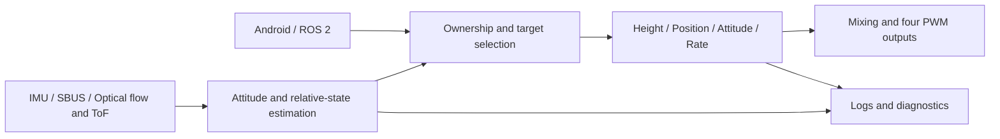
```mermaid
flowchart LR
    INPUT[IMU / SBUS / Optical flow and ToF] --> EST[Attitude and relative-state estimation]
    EST --> TARGET[Ownership and target selection]
    TARGET --> CTRL[Height / Position / Attitude / Rate]
    CTRL --> MOTOR[Mixing and four PWM outputs]
    EST --> LOG[Logs and diagnostics]
    CTRL --> LOG
    NET[Android / ROS 2] --> TARGET
```

| Responsibility | Source entry | What to inspect |
| --- | --- | --- |
| Startup and scheduling | `firmware.ino`, `time.ino` | Initialization, control period, rate-limited services |
| Sensors and RC | `imu_backend.h`, `imu.ino`, `rc.ino`, `flow.ino` | Axes, calibration, sequence numbers, timestamps, freshness |
| State estimation | `estimate.ino` | Attitude, ToF height/vertical velocity, flow rotation and mounting-offset compensation |
| Modes and external control | `control.ino`, `control_modes.ino`, `control_offboard.ino` | Shared state, ownership, target-stream warmup and admission |
| Automatic flight | `control_auto_flight.ino` | Preflight, climb, takeover, descent, touchdown |
| Cascaded control | `control_altitude.ino`, `control_position.ino`, `control_stabilization.ino` | Outer targets through attitude, rates, and mixing |
| Motors and power | `motors.ino`, `power.ino` | Numbering, PWM, voltage measurement and compensation |
| Failure handling | `safety.ino` | Preflight, connection-loss behavior, sustained-overturn motor stop |
| Communication and updates | `mavlink.ino`, `wifi.ino`, `camera.ino`, `ota.ino` | AP/STA, gated commands, optional streaming, A/B OTA |
| Diagnostics and parameters | `cli.ino`, `log.ino`, `parameters.ino` | CLI, RAM logs, timing samples, NVS |

These are responsibility boundaries, not separate threads. Height comes from downward ToF; Minimal has no barometer control path. Firmware owns automatic takeoff/landing, while Android and ROS request the action. See the [firmware architecture document](docs/FIRMWARE_ARCHITECTURE.md) for further call relationships.

### A.4 Wiring reference

Motor numbering matches Chapter 3. Check the schematic and voltage requirements before changing a board or pin mapping.

| Interface | GPIO | Connection |
| --- | --- | --- |
| IMU SDA / SCL | 2 / 43 | I²C data / clock |
| Optical-flow RX / TX | 8 / 7 | Module TX / RX, respectively; 115200 baud |
| SBUS RX / TX | 44 / 9 | Follow receiver and board interface definitions |
| Battery ADC | 1 / A0 | 100 kΩ / 100 kΩ divider |
| M0 / M1 / M2 / M3 | 4 / 3 / 6 / 5 | Rear left / rear right / front right / front left |

Confirm actual motor directions without propellers and match the current mixer requirements: diagonals share a direction and adjacent motors are opposite. Do not assume an old wiring table describes the present assembly.

<a id="maintenance"></a>

## Appendix B: A/B OTA and maintenance

### B.1 Full installation versus wireless update

For a new device or partition recovery, write `Open32Drone-minimal-merged.bin` over USB at `0x0`. For an existing matching A/B layout, use `Open32Drone-minimal-app.bin` for wireless updates. A complete erase removes calibration, parameters, and Wi-Fi settings and requires recalibration.

### B.2 Update the application

1. Land, disarm, remove propellers, and stop automatic flight, Offboard, and streaming.
2. Check matching firmware/APK/ROS versions and verify the app image with `SHA256SUMS`.
3. Run `ota` in the local serial terminal for slot state and the device upload token.
4. Select the aircraft address and app image in the matching Android or ROS uploader, supplying the token when prompted.
5. The uploader supplies length and SHA-256; firmware writes the inactive slot.
6. After reboot, check `sys`, `imu`, `flow`, and `ota`, then complete propeller-off acceptance checks.

The new slot must pass startup health checks before confirmation; failure invokes rollback to the previous slot. Never submit the merged image to the wireless uploader. Further maintenance details are in the companion ROS/automatic-flight document and source-repository `releases/minimal/README.md`.

### B.3 Networks and clients

Use `wifi` to inspect AP/STA, aircraft IP, and connection state. The default recovery hotspot is `open32drone`; saved custom settings take precedence, so use the actual serial output. Configure networking with `ap <ssid> <password>` or `sta <ssid> <password>`, reboot, and check the result.

Use one ordinary control client at a time. Physical SBUS actions can take ownership; Android and ROS should not transmit competing control streams. QGroundControl is limited to standard parameter inspection/editing while disarmed, not tutorial takeoff or route control. Optional MJPEG does not participate in position estimation, and the ROS package does not provide its `camera_info`.

<a id="diagnostics"></a>

## Appendix C: Diagnostics and experiment records

### C.1 Common serial commands

| Command | Purpose |
| --- | --- |
| `help` | Commands actually supported by the installed firmware |
| `sys`, `time`, `perf` | Firmware identity, loop periods, stage execution times |
| `imu`, `ps`, `psq` | IMU calibration, Euler angles, quaternion |
| `flow`, `alt` | Flow/ToF, estimates, altitude-control state, admission/rejection reasons |
| `pw` | Battery ADC and calibrated voltage |
| `rc`, `cr` | Receiver state and calibration |
| `ca` | Six-face accelerometer calibration |
| `mrl`, `mrr`, `mfr`, `mfl` | Propeller-off motor tests, M0/M1/M2/M3 in order |
| `mot` | Four motor outputs |
| `p`, `p <name>`, `p <name> <value>` | List/read parameters and modify while landed/disarmed |
| `log dump` | Export RAM CSV after flight, disarmed with motors stopped |
| `wifi`, `ota` | Network and A/B update state |

RAM logs retain a limited recent history, approximately 25 Hz and 12 seconds in the matching implementation. Export promptly after flight. They are not persistent black-box recordings and there is no separate collision-event buffer. Assess period distributions, overruns, and stage timing instead of average frequency alone.

### C.2 Troubleshoot by symptom

| Symptom | Check in order |
| --- | --- |
| No USB serial port | Data cable, BOOT/RESET, actual port, other applications holding the port |
| Startup calibration does not finish | Keep still, IMU power/cable, rigid mounting, `imu` |
| Immediate tip or uncontrolled yaw | Stop motors, positions/directions, propellers, board/IMU axes |
| Position correction increases error | Flow translation signs, rotation compensation, ToF scale, admission state; do not increase gains first |
| Height jumps | ToF window/floor, mounting angle, cable/freshness, `alt` and logs |
| Sinking or saturation after battery change | Voltage calibration, sag, balance, motors/propellers |
| App unavailable or ROS disconnected | Actual Wi-Fi, IP, UDP 14550, competing clients, heartbeat |
| Unexpected motion after ROS velocity stops | Offboard node, position feedback, logs; distinguish input timeout from aircraft stream loss |
| PPO/Isaac will not run | Dependencies, CPU/CUDA route, model package, policy outputs, paths |

### C.3 Keep a reproducible record

For each run, save hardware configuration and mass, firmware/client versions, old/new parameters, battery state, floor/lighting, test action, CSV/rosbag, and observations. For simulation also save configuration, seeds, policy files, and evaluation results.

After changing sensors, frame, motors, or flight-critical code, repeat build checks, propeller-off validation, controlled low-altitude flight, and log review. Use Chapter 4's calibrated SBUS or Android first-flight route. Build ROS and policy experiments on repeatable basic flight.
