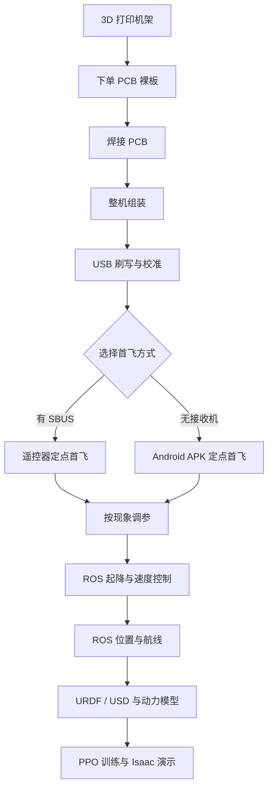
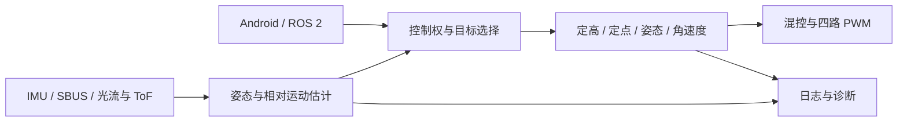

# Open32Drone：从硬件制作到 ROS 2 与强化学习

[简体中文](tutorial_zh_CN.md) · [English](tutorial.md) · [项目总览](README_zh_CN.md)


本教程按“制造硬件 → 刷写与首飞 → 调参 → ROS 控制 → 仿真与学习”的顺序组织，适用于本仓库配套的 Open32Drone Minimal。先使用匹配发布包完成首飞，需要修改固件时再阅读开发附录。

文中的 `hardware/`、`firmware/`、`ros2/`、`simulation/` 和 `releases/minimal/` 都相对于完整源码仓库根目录；请先取得完整仓库，不能只下载本教程后直接运行命令。`/path/to/osrdrone` 是需要替换的示例路径。标注为 `bash` 的命令在 Linux/macOS 终端执行，`powershell` 在 Windows PowerShell 执行，`text` 中的设备命令逐行输入 115200 波特率串口。

## 目录

- [1. 项目介绍](#chapter-1)
- [2. 制作目标与学习路线](#chapter-2)
- [3. 硬件焊接与组装](#chapter-3)
- [4. 固件、校准与起飞](#chapter-4)
- [5. 飞行调参](#chapter-5)
- [6. ROS 2 控制](#chapter-6)
- [7. 仿真与强化学习](#chapter-7)
- [附录 A：源码构建与架构](#development)
- [附录 B：A/B OTA 与维护](#maintenance)
- [附录 C：诊断速查与实验记录](#diagnostics)

<a id="chapter-1"></a>

## 1. 项目介绍

### 一架从制造开始的微型无人机

Open32Drone 是一套需要亲手制作的开源四旋翼项目。制作者先用 3D 打印机完成机架，再使用配套生产文件向 PCB 厂下单底板，焊接分立器件和连接器，最后安装主控、传感器、电机、电池与桨叶。飞起来只是第一阶段，后续还可以继续修改固件、接入 ROS 2，并在 Gazebo 或 Isaac Sim 中完成强化学习实验。

项目采用模块化电子结构，并未交付一块集成好所有功能的成品飞控板。紫色 Open32Drone PCB 负责供电、四路有刷电机驱动和模块连接；XIAO ESP32-S3、IMU、光流/ToF 都是需要安装的独立模块。打印、下单、焊接、检查和装配因此成为项目的核心内容，而不是开机前的一段准备工作。

参考样机使用 8520 空心杯电机和 1S 电池完成室内飞行，以 ESP32-S3 运行 300 Hz 飞控，通过 IMU 感知姿态，通过向下安装的光流/ToF 一体模块保持水平位置和离地高度。

项目最初的飞控核心来自 Oleg Kalachev 的 Flix。Open32Drone 在这个基础上加入了实际主控板的引脚映射、四路有刷电机输出、光流/ToF 定高定点、电池电压补偿、自动起降、参数保存，以及 Android 和 ROS 2 控制接口。今天的仓库已经不仅是一份飞控代码，还包括机械文件、固件、手机控制端、ROS 驱动、仿真模型和强化学习示例。

### 系统由哪些部分组成

飞机上的部件可以分成四层。

| 层次 | 主要部件 | 作用 |
| --- | --- | --- |
| 结构与动力 | 打印机架、4 个 8520 电机、4 个 60/65 mm 桨叶、橡胶电机圈 | 承载零件并产生升力和姿态力矩 |
| 飞控与传感 | Open32Drone PCB 底板、XIAO ESP32-S3、IMU、光流/ToF 一体模块 | 完成电机驱动、状态估计与控制计算 |
| 能源与通信 | 1S 电池、SBUS 接收机、Wi-Fi | 给系统供电，并接收遥控或程序命令 |
| 上位机与仿真 | Android APK、ROS 2、URDF/USD、Gazebo、Isaac Sim、PPO 示例 | 人工飞行、机器人编程、模型验证与学习控制 |

PCB 底板把整个系统连接在一起。XIAO 模块提供计算和 Wi-Fi；IMU 是按固定轴向焊接在底板上的独立模块；光流与 ToF 共用一块向下看的模块并通过线束连接；四个电机由底板上的 MOSFET 直接驱动。相机属于可选外设，可用于图传和后续视觉实验；普通定点与现有强化学习示例不依赖相机。

### 一条完整的数据链

飞行控制每秒循环 300 次。IMU 提供角速度和加速度，ToF 提供离地高度，光流提供地面相对运动。飞控把这些测量组合成姿态、速度和位置估计，再根据驾驶员或 ROS 给出的目标计算四路电机输出。

```text
传感器测量 → 状态估计 → 姿态/高度/位置控制 → 电机混控 → 飞机运动
       ↑                                                   │
       └────────────────── 下一周期的新测量 ───────────────┘
```

本项目的残差 PPO 示例目前运行于仿真，沿用“状态反馈—控制—动力学”的闭环结构；它尚未接入真机固件。在该示例中，基础几何控制器继续负责姿态和升力分配，神经网络学习三轴加速度修正，用来补偿风、动力变化和模型误差。这样既保留传统控制器清晰的结构，也便于比较学习方法在不同扰动下的收益与代价。

### 参考样机

教程使用以下装机作为贯穿示例：

- 机架外形约 103.3 × 103.3 mm；
- 四个 8520 电机，8 × 20 mm，1 mm 轴；
- 四个 60 mm 桨叶，两只 CW、两只 CCW；
- 18350 1S 1300 mAh 电池，实测质量 25 g；
- 含电池起飞重量约 81 g，水平重心位于机体中央；
- XIAO ESP32-S3、MPU6500/MPU9250 IMU、光流/ToF 一体模块；
- 物理 SBUS、Android APK、ROS 2 三种控制入口。

这套配置已经可以完成手动定高、光流定点、自动起降、ROS 速度/位置控制，以及 Isaac Sim 中的残差 PPO 演示。它也给后续工作留下了清晰接口：可以换传感器、加入相机算法、建立更精确的推力模型，或者把仿真策略逐步迁移到真机。

### 仓库地图

| 目录 | 内容 |
| --- | --- |
| `hardware/` | 机架 3MF/STEP、机械规格和采购信息 |
| `firmware/` | ESP32-S3 飞控源码 |
| `android/` | 手机控制端源码 |
| `ros2/` | ROS 2 驱动、控制命令、RViz 配置 |
| `simulation/` | 教学实验、动力学、Gazebo/Isaac 与强化学习代码 |
| `releases/minimal/` | 相互匹配的完整固件、OTA 镜像、APK 和 ROS 包 |
| `docs/` | 安装、参数、故障排查与项目教程 |

下一章先确定整条制作路线以及每个阶段会得到什么结果，然后开始制作硬件。

<a id="chapter-2"></a>

## 2. 制作目标与学习路线

这套项目将建立一条能够自己制造、维护、扩展和复现实验的无人机开发链。完成全部章节后，你将知道飞机怎样从数字文件变成真实硬件、为什么能够稳定飞行、问题出现在哪一层，以及怎样把一个控制想法从电脑送进仿真和真机接口。

### 最终能完成什么

#### 做出一架真实可飞的飞机

你会打印机架，使用与硬件版本匹配的生产文件下单 PCB 裸板，按照 BOM 和位号图完成器件、连接器、供电小板与 IMU 的焊接，随后安装光流/ToF、XIAO、四个电机和电池。你会建立清楚的机头、电机编号和桨叶方向，并把每一步做成可以检查和复现的装配记录。

#### 理解并刷入固件

你会区分第一次 USB 完整刷写和以后使用的应用镜像，完成 IMU、遥控器和电池电压校准，并用拆桨电机测试确认四路输出。完成后可以在两种入口中任选一种起飞：

- 有 SBUS 接收机和遥控器时，使用实体摇杆与三段模式；
- 没有接收机时，手机直接连接飞机热点，使用配套 Android APK 自动起飞和降落。

#### 根据飞行现象调参

你会把“飞得不好”拆成可观察的现象：快速抖动、缓慢摆动、定高上下跳、水平漂移、换电后下沉等。教程会给出对应的机械、传感器和控制参数检查顺序，并坚持每次只改一个变量。

#### 用 ROS 控制运动

你会在 ROS 2 中看到 IMU、距离、电池和里程计，调用自动起降命令，发送机体系速度和局部位置目标。随后把基本动作组合成前进、横移、转向、方形航线，并用 rosbag 保存一次实验。

#### 建立仿真与强化学习流程

你会理解 URDF/USD 的 link、joint、质量和碰撞结构怎样对应真实飞机，使用 81 g 粗动力模型运行一个 CPU 悬停练习，再训练完整 PPO 残差策略。最后在 Isaac Sim 中观察策略完成八字穿环、螺旋爬升、定点停驻和阵风恢复。

### 推荐学习路线



第一次制作建议完整走完打印、下单、焊接和装机过程。已有可飞样机的开发者可以从 ROS 章节开始；强化学习不要求先精通所有飞控公式，但需要理解坐标、速度、位置目标和闭环控制，因此建议先完成 ROS 的方形航线。

### 开始前需要的基础

硬件部分需要基本的焊接、万用表和锂电池使用经验。软件部分需要能够在终端中切换目录并运行命令。ROS 与强化学习章节会逐条给出命令，不要求预先会写复杂节点；读者如果了解 Python、向量和 PID，会更容易理解背后的原理。

真实飞行请使用有纹理、光照均匀的室内地面，周围至少留出 2 m 空间。焊接、刷写、校准和电机测试阶段均不安装桨叶；只有四路电机位置与转向确认后，才进入装桨首飞。

下一章从机架文件和 PCB 生产资料开始，把数字设计变成一架完整飞机。

<a id="chapter-3"></a>

## 3. 硬件焊接与组装

这一章从数字制造文件开始，最后得到一架完成焊接、装配和方向标记的飞机。Open32Drone 使用需要自行打印的机架、需要向板厂下单的 PCB 底板，以及分别安装的 XIAO、IMU 和光流/ToF 模块。整套硬件制作依次经过机架打印、PCB 下单、焊接检测和整机装配。

### 3.1 打印机架并下单 PCB

#### 打印机架

仓库中的 `hardware/3d-model/open32drone-frame.3mf` 是推荐的打印工程文件。导入切片软件后保持 100% 比例，主机架外形应约为 103.3 × 103.3 mm。根据实际打印机、喷嘴和材料检查层高、壁厚、支撑与首层附着；打印完成后清理支撑，确认四个电机安装位没有变形，PCB 安装孔能够自然对齐。

`hardware/3d-model/open32drone-frame.stp` 用于修改结构或在其他 CAD 软件中检查尺寸。导入 STEP 后同样以 103.3 mm 左右的主机架外形复核单位，不要凭软件默认单位直接缩放。

#### 向板厂下单 PCB 底板

PCB 下单前准备同一硬件版本的四类文件：Gerber 与钻孔生产包、电子 BOM、正反面位号图、接口与电压定义。生产文件决定板厚、铜厚、表面处理、阻焊颜色和其他工艺选项；在板厂页面逐项按文件要求填写，不根据照片估计参数。

收到裸板后先检查板框、槽孔、通孔、阻焊、焊盘和丝印，再将实物版本与 BOM、位号图对应。教程中的照片用于辨认真实结构和工序状态，不能替代生产文件或位号图。


图 3-1　Open32Drone PCB 底板正反面。底板负责电源、电机驱动和模块连接，XIAO、IMU 与光流/ToF 需要另行安装。

### 3.2 准备零件和工具

标准样机需要以下部件：

| 部件 | 规格 | 数量 |
| --- | --- | ---: |
| Open32Drone PCB 底板 | 与生产文件、电子 BOM、位号图配套 | 1 |
| XIAO ESP32-S3 | 主控计算与 Wi-Fi | 1 |
| IMU 模块 | MPU6500/MPU9250，固定在主控板上 | 1 |
| 光流/ToF 一体模块 | 向下安装，配套线束 | 1 |
| 打印机架 | 主体约 103.3 × 103.3 mm | 1 套 |
| 8520 电机 | 8 × 20 mm、1 mm 轴、MX1.25 | 4 |
| 电机橡胶圈 | 内孔 Ø8 mm、卡槽 2 mm | 4 |
| 桨叶 | 60 mm 或 65 mm，同一直径，CW/CCW 各 2 | 4 |
| PWA 自攻螺丝 | 1.4 × 4 × 4 mm | 12 |
| 电池 | 1S；参考样机为 18350 1300 mAh、25 g | 1 |
| SBUS 接收机 | 仅遥控器路线需要 | 0 或 1 |
| 相机 | 图传或视觉扩展使用 | 0 或 1 |

准备恒温烙铁或适合所用焊膏的加热设备、细头镊子、助焊剂、吸锡带、放大镜、万用表、螺丝刀、电子秤和非导电垫。焊接温度与回流曲线按焊料和器件的数据手册设置；照片里的热台读数只代表拍摄时的操作状态。

### 3.3 焊接 PCB 底板

#### 第一步：按 BOM 分组

把阻容、二极管、MOSFET、连接器、排针和模块分别放在小格中。每次只拿出一组器件，在贴装图上完成一组就勾掉一组。有极性的器件先找 Pin 1、阴极或连接器开口方向。


图 3-2　焊接前的 PCB、连接器、供电小板和 IMU。

#### 第二步：先焊低矮贴片器件

清洁焊盘，均匀施加焊膏或预上锡。按照“低矮、小封装在前，连接器和模块在后”的顺序贴装：

1. 电阻、电容和小信号器件；
2. MOSFET、二极管和其他有方向器件；
3. 电机接口、电源开关等连接器；
4. 排针、排母、供电小板和 IMU。

器件放下后先从正上方看是否居中，再从侧面看两端是否都落在焊盘上。偏移的器件在加热前调整；已经形成锡桥时，用助焊剂和吸锡带处理，不要反复用烙铁推挤相邻器件。


图 3-3　贴片器件完成定位后的状态。板上的机头箭头始终作为方向基准。

#### 第三步：完成回流或逐点焊接

使用热台时，让 PCB 平整贴在工作面上，按焊料规定的预热、回流和冷却过程操作。观察焊料熔化后器件是否回正；焊完自然冷却，再移动电路板。使用烙铁时，先固定一个引脚，复查方向和位置，然后完成其余焊点。


图 3-4　连接器装好后的主板。连接器开口朝向要与外部线束的出线方向一致。

#### 第四步：检查焊点

用放大镜沿着电源入口、四路电机驱动、排针、连接器逐区检查。合格焊点应完整润湿焊盘和引脚，没有相邻短路、虚焊、翘脚或多余锡珠。


图 3-5　焊后正面。检查重点是四路电机输出与中央器件区。

断电后用万用表检查电池正负极是否短路，并核对电源开关前后的连接。第一次供电使用限流电源或带保护的 1S 电池；发现异常发热、气味或电流快速上升时立即断电。

#### 第五步：安装供电小板、排母和 IMU

先装背面的供电小板，确认输入、输出和 GND 与主板丝印一致。再焊接 XIAO 使用的排母，让两排保持平行，XIAO 能够自然插入。


图 3-6　背面供电小板与主板的安装关系。


图 3-7　排母焊接完成后，从侧面检查高度和垂直度。

IMU 是独立模块，但属于主控板组件。将模块按板上的轴向标识安装，焊接后保持刚性，不能让厚软泡棉使它晃动。标准固件的 IMU 安装旋转为 `roll=π`、`pitch=0`、`yaw=π/2`；使用配套 PCB 与图示方向即可对应这一设置。


图 3-8　IMU 模块及安装完成的主控板。

到这里，主控板应包含电机驱动、电源部分、XIAO 排母和 IMU。光流/ToF 通过线束连接，在下一步随机架安装。

### 3.4 组装机架和传感器

#### 认识方向和电机编号

把机头朝前，从机顶向下看：

```text
                         机头 / +X
                             ↑
              M3 前左                     M2 前右

          +Y（左）←        机体中心         → -Y（右）

              M0 后左                     M1 后右
                             ↓
                         机尾 / -X
```

固件与模型使用同一套编号：

| 位置 | 编号 | GPIO | 拆桨测试命令 | 仿真 link |
| --- | --- | ---: | --- | --- |
| 后左 | M0 | 4 | `mrl` | `rotor_0_link` |
| 后右 | M1 | 3 | `mrr` | `rotor_1_link` |
| 前右 | M2 | 6 | `mfr` | `rotor_2_link` |
| 前左 | M3 | 5 | `mfl` | `rotor_3_link` |

#### 安装光流/ToF 一体模块

把机架翻到底面朝上，将光流/ToF 模块放入前部安装位。镜头和测距窗口朝地面，窗口不能被螺丝、胶带或线束遮挡。模块平面应与四个电机的推力平面平行；标准位置位于机体偏航中心前方约 24 mm，固件会补偿这段偏置。


图 3-9　光流/ToF 一体模块固定在机架前部，线束穿入中央区域。

#### 固定主控板

把机架恢复到正常姿态。整理光流/ToF 线束后放上主控板，使机头箭头与机架机头一致。四个安装孔先全部带上螺丝，再按对角顺序轻轻拧到贴合。主控板应保持平整，下面没有被压住的导线。


图 3-10　主控板、IMU 和光流/ToF 的相对位置。

光流/ToF 使用 UART：模块 TX 接飞控 RX（GPIO8），模块 RX 接飞控 TX（GPIO7），波特率 115200。IMU 使用 I²C：SDA 为 GPIO2，SCL 为 GPIO43。使用配套线束时按 PCB 丝印插接，插拔时握住插头本体。

#### 安装 XIAO 与可选接收机

检查排针无弯折后，把 XIAO ESP32-S3 垂直插入两排排母。USB-C 口应留在机架外侧可接近的位置。使用 SBUS 时，将接收机固定到预留区域并连接 RX/TX 与供电；只使用手机或 ROS 时可以不装接收机。


图 3-11　XIAO 插入主控板排母。

#### 安装橡胶圈和电机

把四个 Ø8 mm 电机橡胶圈压入机架卡槽，沿一圈检查边缘完全就位。再把 8520 电机从正确方向压入橡胶圈，四个电机保持同一高度，轴线彼此平行。操作时握住电机外壳，不推压 1 mm 转轴，也不拉扯电机线。


图 3-12　橡胶圈与电机。橡胶圈既固定电机，也隔离部分振动。

把电机线沿机臂引到对应接口，依照 M0—M3 逐条连接。保留轻微活动余量，并把所有线束移出桨盘。此时仍然不要安装桨叶。


图 3-13　电机线束接好后的状态。

#### 安装并居中电池

参考样机使用 18350 1300 mAh 电池，实测 25 g。把电池固定在机体中央，使左右和前后重心都接近几何中心；电源线不会碰到桨叶，也不会压住光流/ToF 窗口。含电池、桨叶和实际附件称量，参考值约为 81 g。


图 3-14　圆柱电池安装在中央区域。每次换电后保持相同位置。

如果增加相机、支架或更换软包电池，重新移动电池来恢复水平重心。相机的镜头朝向与排线弯曲半径按相机模块要求处理。

### 3.5 电机与桨叶确认（完成第 4 章校准后执行）

组装至此先保持无桨，完成[第 4 章的刷写、校准和电机测试](#chapter-4)，再回到本节安装桨叶。刷好固件后，在串口中依次运行：

```text
mrl
mrr
mfr
mfl
```

每条命令只让对应电机以低输出转动 1 秒。用一小条纸带或手机慢动作观察，从机顶向下记录每个电机是 CW 还是 CCW。M0 与 M2 应为同一方向，M1 与 M3 为相反方向；在四个橡胶圈旁贴上 `M0 CW`、`M1 CCW` 这样的可移除标签。

桨叶上的 CW/CCW 表示它设计的旋转方向。把 CW 桨装到实测 CW 的电机，把 CCW 桨装到实测 CCW 的电机。四只桨必须同一直径，桨毂压到位但不摩擦电机外壳。


图 3-15　桨叶与四个电机的安装关系。最终方向以拆桨实测标签为准。

安装前最后看一遍：主板方向正确，IMU 和光流/ToF 不松动，四个电机轴平行，电池居中，全部线束离开桨盘。下一章将先在无桨状态刷写和校准，完成后再回到这里安装桨叶。


图 3-16　完成组装的参考样机。相机为可选模块；普通定点飞行使用 IMU 与向下安装的光流/ToF。

<a id="chapter-4"></a>

## 4. 固件、校准与起飞

硬件装好后，先保持四个电机都没有桨叶。本章会把完整固件写入 XIAO ESP32-S3，完成传感器与电压校准，再根据手上的设备选择 SBUS 遥控器或 Android 手机完成第一次定点起飞。

### 4.1 认识发布包

`releases/minimal/` 中最常用的三个文件是：

| 文件 | 用途 |
| --- | --- |
| `Open32Drone-minimal-merged.bin` | 第一次 USB 刷写使用，包含引导程序、分区表和应用 |
| `Open32Drone-minimal-app.bin` | 飞机已经安装完整分区后，用于 A/B OTA 更新 |
| `Open32Drone-Controller-0.1.apk` | Android 手机控制端 |

新 XIAO、整片擦除后的 XIAO，以及第一次安装这套分区时，都从地址 `0x0` 写入 merged 镜像。app 镜像从属于已有分区，不能代替第一次完整刷写。

先进入 `releases/minimal/` 校验下载文件：

```bash
cd /path/to/osrdrone/releases/minimal
shasum -a 256 -c SHA256SUMS       # macOS
# sha256sum -c SHA256SUMS         # Linux
```

Windows 可在发布目录运行以下 PowerShell 命令，将每个文件的哈希与 `SHA256SUMS` 比较：

```powershell
Get-Content .\SHA256SUMS | ForEach-Object {
    if ($_ -match '^([0-9a-fA-F]{64})\s+\*?(.+)$') {
        $expectedHash = $Matches[1]
        $releaseFile = $Matches[2].Trim()
        $actualHash = (Get-FileHash -LiteralPath $releaseFile -Algorithm SHA256).Hash
        if ($actualHash -ine $expectedHash) { throw "SHA256 mismatch: $releaseFile" }
        Write-Output "OK: $releaseFile"
    }
}
```

### 4.2 USB 完整刷写

安装 Python 3 与 esptool：

```bash
python3 -m pip install --user esptool
```

用 USB 数据线连接 XIAO。在 macOS 上可用下面的命令找到串口：

```bash
ls /dev/cu.usb*
```

Windows 使用设备管理器显示的 `COMx`，Linux 通常是 `/dev/ttyACM0`。如果串口没有出现，让 XIAO 进入 Bootloader：按住 `BOOT`，按一下 `RESET`，然后松开 `BOOT`。

以下是首次安装的完整恢复流程。`erase-flash` 会清除 NVS 中的参数、校准和网络配置；保留已有设备配置时使用[附录 B 的 OTA 流程](#maintenance)。把示例端口替换为自己的端口，并确认终端位于 `releases/minimal/`：

```bash
python3 -m esptool --chip esp32s3 \
  --port /dev/cu.usbmodemXXXX erase-flash

python3 -m esptool --chip esp32s3 \
  --port /dev/cu.usbmodemXXXX --baud 921600 \
  write-flash 0x0 Open32Drone-minimal-merged.bin
```

Windows 在发布目录中使用 `py`，将 `COM5` 替换为设备管理器中的实际端口：

```powershell
py -m pip install --user esptool
py -m esptool --chip esp32s3 --port COM5 erase-flash
py -m esptool --chip esp32s3 --port COM5 --baud 921600 write-flash 0x0 Open32Drone-minimal-merged.bin
```

Windows 可用 Arduino IDE 串口监视器查看输出，设置为 115200 波特率；刷写前关闭占用同一端口的监视器。出现传输错误时把波特率改为 `460800`，仍不稳定再改为 `115200`。写入完成后按一下 RESET，打开 115200 波特率串口：

```bash
screen /dev/cu.usbmodemXXXX 115200
```

开机时把飞机水平放在硬桌面上，不要触碰。串口会依次显示电机通道、Wi-Fi、IMU、光流/ToF 和陀螺仪初始化，最后出现：

```text
Gyro calibration complete
Initializing complete
```

### 4.3 检查传感器

在串口中输入以下命令，每行回车：

```text
sys
imu
flow
pw
```

`sys` 显示固件身份和 300 Hz 主循环状态；`imu` 显示传感器型号、采样和陀螺校准；`flow` 显示光流/ToF 的数据包与高度；`pw` 显示 ADC 和换算后的电池电压。

飞机放在地面时，ToF 可能处于约 20 mm 的近距离盲区。将飞机平稳抬到 20–60 cm 后，距离应随高度变化；在有纹理地面上缓慢水平移动，光流数据也应变化。

### 4.4 校准这台飞机

#### 六面加速度计校准

第一次装机、更换 IMU 或完整擦除后，运行 `ca`。按照串口提示依次放置：

1. 水平；
2. 机头向上；
3. 机头向下；
4. 右侧着地；
5. 左侧着地；
6. 倒置。

每次摆好后松手，让飞机在刚性平面上静止采样。出现 `Accelerometer calibration accepted` 后，把飞机恢复水平，等待陀螺再次完成，再执行 `imu`。静止时加速度模长应接近 `9.81 m/s²`。

#### 电池电压校准

用万用表测量电池端电压，记为 `V_DMM`；运行 `pw` 读取飞控显示电压，记为 `V_FW`。先运行 `p PWR_VOLT_SCALE` 读取现值，再计算：

```text
新比例 = 旧比例 × V_DMM ÷ V_FW
```

写入后等待一秒，再用 `pw` 检查：

```text
p PWR_VOLT_SCALE 你的新数值
```

例如旧比例为 2.000，万用表为 4.10 V，飞控为 4.00 V，新比例就是 `2.000 × 4.10 ÷ 4.00 = 2.050`。

#### SBUS 校准（遥控器路线）

安装了接收机时，打开遥控器并运行 `cr`。完成串口给出的八个摇杆和开关动作，然后用 `rc` 查看结果：

| 操作 | 正常读数 |
| --- | --- |
| 横滚、俯仰、偏航回中 | 接近 0 |
| 油门最低 / 最高 | 接近 0 / 1 |
| 三段模式开关 | 接近 0 / 0.5 / 1 |

只用 Android 或 ROS 的飞机不需要执行 `cr`。

### 4.5 拆桨完成四路电机测试

飞机保持上锁，依次运行：

```text
mrl
mrr
mfr
mfl
```

四条命令依次对应后左 M0、后右 M1、前右 M2、前左 M3；串口中只输入命令本身。每条命令只允许一个电机转动约 1 秒。把位置与从机顶观察到的 CW/CCW 写在电机标签上，然后按上一章的方法安装对应桨叶。

### 4.6 选择起飞方式

SBUS 和 Android 都能完成首飞。判断方法很简单：

| 手上设备 | 使用路线 | 需要什么 |
| --- | --- | --- |
| 有 SBUS 接收机和已配对遥控器 | 路线 A：遥控器 | 执行 `cr`，熟悉急停摇杆动作 |
| 没有接收机，或想快速体验 | 路线 B：Android APK | 一台 Android 手机，连接飞机 Wi-Fi |

第一次飞行只打开一个控制端。使用手机时关闭 ROS 与其他 MAVLink 客户端；使用遥控器时先让手机 App 停止控制。

#### 路线 A：SBUS 遥控器

三段开关对应三个模式：

| 开关位置 | 模式 | 操作感觉 |
| --- | --- | --- |
| 低 | STAB 姿态 | 油门直接控制推力，适合熟练飞手 |
| 中 | ALT_HOLD 定高 | 油门回中保持高度 |
| 高 | POS_HOLD 定点 | 光流保持水平位置，首飞推荐 |

把模式放到高档定点。油门最低、偏航最右完成解锁；电机会以约 10% 怠速转动。将油门保持在 62.5% 以上约 0.2 秒，飞机进入辅助起飞并爬升到默认 0.60 m。起飞后让油门回到中位，轻量修正水平位置。

降落时把油门保持在 5% 以下约 0.3 秒，飞机会自动下降并在接地后停桨。需要取消下降时将油门推到 60% 以上。

急停动作是油门最低、偏航最左保持至少 150 ms。急停会立即停桨，飞机在空中会直接下落，因此只在即将碰人、缠绕或姿态失控时使用。

#### 路线 B：Android APK

把 `Open32Drone-Controller-0.1.apk` 复制到手机并安装。Android 可能要求为文件管理器临时允许“安装未知应用”。

飞机完整擦除后的默认热点是：

```text
Wi-Fi: open32drone
密码: 12345678
飞机地址: 192.168.4.1
MAVLink UDP: 14550
```

手机连接这个热点，系统提示“无互联网”时选择继续连接。打开 Open32Drone Controller，顶部应出现实时飞控状态。输入相对高度 `0.65`，长按“一键起飞”约 0.60 秒；固件会完成解锁、爬升并进入定点。

左摇杆控制升降与偏航，右摇杆控制前后与左右。第一次只做 5–10 秒小范围悬停，然后长按“降落”。如果飞机向人、墙或家具快速移动，优先按“降落”；已经无法安全降落时长按“紧急上锁”。

Android 不依赖实体遥控器。按钮变灰时先看顶部是否仍有 MAVLink 心跳，并确认手机仍连接 `open32drone`，没有切回蜂窝网络或其他 Wi-Fi。

### 4.7 第一次飞行

选择有纹理、光照均匀的地面，在飞机四周留出至少 2 m。将电池放在装机时确定的中央位置，镜头朝下且洁净。上电后等到陀螺校准完成，再走一遍：

1. 低高度起飞到 0.60–0.65 m；
2. 双手或摇杆回中，观察 5 秒；
3. 小幅向前、向后、向左、向右移动；
4. 回到原区域；
5. 自动降落，确认接地停桨。

起飞后马上向一侧翻通常是电机位置、转向、桨叶或 IMU 方向问题，应立即停桨并回到拆桨检查。能够平稳离地但有小幅抖动、漂移或高度变化，则进入下一章按现象调参。

<a id="chapter-5"></a>

## 5. 飞行调参

调参从观察现象开始。先把机械、传感器和供电恢复到一致状态，再动控制参数；每次只改一个值，完成同样的短飞行后比较。用同样的动作和日志比较修改前后的变化。

### 5.1 先判断是不是参数问题

下面这些现象应先回到硬件：

| 现象 | 先检查 |
| --- | --- |
| 起飞瞬间向一侧翻倒 | M0–M3 位置、转向、CW/CCW 桨、IMU 朝向 |
| 某一侧始终无力 | 桨叶损伤、电机弯轴、接头、电机温度与电池压降 |
| 高频细碎振动 | 桨叶变形、电机轴、橡胶圈、电机高度、IMU 固定 |
| 定点只在某种地面失效 | 地面纹理、反光、光照、光流窗口 |
| 高度值跳变 | ToF 窗口、模块倾斜、近距离盲区和线束 |
| 换电以后重心变化 | 电池位置、附件位置和实际起飞重量 |

机械状态稳定后，用同一块电池、同一处地面和同一高度做对比。首选的测试动作是“0.65 m 起飞 → 回中悬停 5 秒 → 降落”。

### 5.2 认识四层控制

Open32Drone 的控制器由内到外依次工作：

```text
角速度环 → 姿态角环 → 高度/速度环 → 水平位置环
```

内环必须先稳定，外环才能调好。P 决定纠正有多积极；I 用来消除持续偏差；D 抑制变化过快造成的过冲。调参时通常先看 P，再看 I，最后只在确有需要时调整 D。

查看所有参数：

```text
p
```

查看或写入单个参数：

```text
p CTL_R_P
p CTL_R_P 4.02
```

所有参数修改都在落地上锁、电机停止后进行；固件在允许写入时保存到 NVS。改之前记录旧值，改完等待一秒再读取确认。下表是配套源码的默认值，设备可能保留旧 NVS 参数，实际值以 `p 参数名` 回读为准。

### 5.3 姿态抖动与回正

标准姿态参数如下：

| 功能 | Roll | Pitch | 默认值 |
| --- | --- | --- | ---: |
| 角度 P | `CTL_R_P` | `CTL_P_P` | 4.47 |
| 角速度 P | `CTL_R_RATE_P` | `CTL_P_RATE_P` | 0.05 |
| 角速度 I | `CTL_R_RATE_I` | `CTL_P_RATE_I` | 0.20 |
| 角速度 D | `CTL_R_RATE_D` | `CTL_P_RATE_D` | 0.001 |

#### 高频抖动

如果飞机能起飞，但机身快速、连续地抖动，先修复桨和电机振动。机械正常后，将对应轴的角速度 P 降低 5–10%。例如 Roll 从 `0.050` 改为 `0.045`：

```text
p CTL_R_RATE_P 0.045
```

重新做同样的 5 秒悬停。抖动减轻且控制仍有力度，再在 Pitch 轴按同样幅度处理；不要一次同时改 P、I、D。

#### 慢速来回摆动或回正过猛

低频、大幅度摆动更可能来自外层角度 P。把 `CTL_R_P` 或 `CTL_P_P` 降低约 10%，例如 `4.47 → 4.02`。如果飞机显得反应迟钝、松杆后很久才回平，可向原值方向小幅增加。

#### 持续偏向一侧

固定方向的倾斜通常由重心、弱电机、机架变形或加速度计偏置造成。先移动电池让重心回到中央，再重新运行 `ca`。只有机械与校准一致、偏差仍可重复时，才分析 I 项。

### 5.4 高度问题

高度控制的主要参数是：

| 参数 | 默认值 | 作用 |
| --- | ---: | --- |
| `ALT_P` | 0.747 | 高度误差的主要纠正力度 |
| `ALT_I` | 0.10 | 消除长期高度偏差 |
| `ALT_D` | 0.20 | 根据垂直速度抑制过冲 |
| `ALT_HOVER` | 0.49 | 标称悬停推力前馈 |
| `ALT_VEL_MAX` | 0.45 | 最大升降速度 |

飞机围绕目标高度缓慢上下摆动时，先确认 ToF 数据连续，再把 `ALT_P` 降低约 10%，例如：

```text
p ALT_P 0.67
```

起飞后稳定，但高度长期慢慢偏低或偏高，可以小幅检查 `ALT_I`。接近目标时明显冲过头再反向，则重点观察 ToF 速度和 `ALT_D`。

`ALT_HOVER` 表示标准电压附近维持高度所需的集体推力。81 g、60 mm 桨的参考值是 0.49。飞机在传感器正常、姿态平稳的情况下长期靠较大高度修正支撑，可从飞行日志估计悬停电机均值，再以很小幅度调整。不要用提高 `ALT_HOVER` 掩盖电池老化或弱电机。

### 5.5 水平漂移与定点

定点控制依赖光流，默认参数为：

| 参数 | 默认值 | 作用 |
| --- | ---: | --- |
| `POS_HOLD_P` | 0.85 | 位置误差转换为目标速度 |
| `POS_VEL_P_X/Y` | 0.35 | 水平速度 P |
| `POS_VEL_I_X/Y` | 0.04 | 水平速度 I |
| `POS_STICK_V` | 0.70 | 摇杆最大水平速度 |

先在清晰纹理地面上运行 `flow`，确认数据新鲜。原地偏航时若位置出现圆周漂移，检查模块是否位于标准前移 24 mm 位置、安装平面是否水平。持续向固定方向漂移时重新检查光流零偏、电池重心和 IMU 校准。

飞机慢慢离开目标而不积极回来，可以小幅增加 `POS_HOLD_P`；围绕目标左右来回摆，则小幅降低。一次改 5–10%，每次使用相同的定点高度和飞行时间。

### 5.6 电池与动力变化

参考电池满电约 4.2 V，放电过程中电机可用推力会下降。主板通过 `GPIO1/A0` 读取 100 kΩ / 100 kΩ 分压后的电压，辅助定高和定点使用有界前馈补偿。

先用 `pw` 和万用表把 `PWR_VOLT_SCALE` 校准准确。新电池和低电量电池各做一次同样的 5 秒悬停，比较日志里的 `voltage`、`hoverFF`、`voltComp` 和四路电机输出。如果电压下降时四路同时接近饱和，优先检查电池内阻、桨叶和电机，而不是继续提高 PID。

### 5.7 用日志比较两次飞行

飞机上锁后运行：

```text
log dump
```

保存 CSV 后，可用仓库中的分析脚本快速检查：

```bash
python3 simulation/course/analyze_log.py \
  --csv /path/to/flight.csv \
  --output output/my-flight-analysis
```

至少比较以下曲线或字段：

- 姿态目标与实际 Roll/Pitch；
- ToF 高度与高度目标；
- 光流速度与位置误差；
- 四路电机输出及其是否饱和；
- 电池电压和补偿量；
- 问题发生前后的时间点。

一次有效调参记录只需要四项：原参数、修改值、相同飞行动作、观察结果。变好就保留并继续小幅调整；变差就恢复旧值。这样很快能形成适合这台飞机的参数表。

当飞机能重复完成定点起飞、5–10 秒悬停、小范围平移和自动降落，就可以把控制权交给 ROS。

<a id="chapter-6"></a>

## 6. ROS 2 控制

飞机已经能稳定起降后，ROS 2 会把它变成一台可以编程的空中机器人。你可以订阅 IMU、距离、电池和里程计，也可以发送起飞、降落、速度和位置命令。下面从一次最简单的自动起降开始，再逐步组合成方形航线。

### 6.1 准备 ROS 电脑

推荐使用 Ubuntu 24.04 与 ROS 2 Jazzy。先按 [ROS 2 官方安装说明](https://docs.ros.org/en/jazzy/Installation/Ubuntu-Install-Debs.html)安装 Desktop 版本，再安装 MAVROS 和构建工具：

```bash
sudo apt update
sudo apt install ros-jazzy-mavros ros-jazzy-mavros-extras \
  python3-colcon-common-extensions python3-rosdep
sudo ros2 run mavros install_geographiclib_datasets.sh
```

把仓库中的 ROS 包放进工作空间：

```bash
source /opt/ros/jazzy/setup.bash
mkdir -p ~/osdrone_ws/src
cp -a /path/to/osrdrone/ros2 ~/osdrone_ws/src/open32drone_driver
cd ~/osdrone_ws
rosdep install --from-paths src --ignore-src -r -y
colcon build --symlink-install
source install/setup.bash
```

以后每次打开终端先执行：

```bash
source /opt/ros/jazzy/setup.bash
source ~/osdrone_ws/install/setup.bash
```

### 6.2 连接飞机

最简单的方式是让 ROS 电脑直接连接飞机热点 `open32drone`。确认 Android 手机已经停止控制，电脑也没有运行其他占用该连接的客户端，然后测试：

```bash
ping -c 3 192.168.4.1
```

在第一个终端启动完整驱动：

```bash
ros2 launch open32drone_driver open32drone.launch.py
```

如果飞机已经通过 `sta` 命令接入路由器，使用 `wifi` 查到它的地址，再启动：

```bash
ros2 launch open32drone_driver open32drone.launch.py \
  aircraft_ip:=192.168.1.42
```

第二个终端查看状态：

```bash
ros2 run open32drone_driver control status
ros2 topic echo /open32drone/connected --once
```

`connected` 为 `true` 后，再看实时传感器：

```bash
ros2 topic hz /open32drone/imu/data
ros2 topic echo /open32drone/range/downward --once
ros2 topic echo /open32drone/battery --once
ros2 topic echo /open32drone/odom --once
```

### 6.3 认识常用话题

| 话题 | 类型 | 内容 |
| --- | --- | --- |
| `/open32drone/connected` | `std_msgs/Bool` | 飞控心跳连接 |
| `/open32drone/imu/data` | `sensor_msgs/Imu` | 姿态、角速度和加速度 |
| `/open32drone/range/downward` | `sensor_msgs/Range` | 向下 ToF 距离 |
| `/open32drone/battery` | `sensor_msgs/BatteryState` | 实测电池电压 |
| `/open32drone/odom` | `nav_msgs/Odometry` | 局部位置和速度 |
| `/open32drone/cmd_vel` | `geometry_msgs/Twist` | 机体系速度目标 |
| `/open32drone/goal_pose` | `geometry_msgs/PoseStamped` | 局部坐标中的位置目标 |

`cmd_vel` 使用机体系：`x` 向前、`y` 向左、`z` 向上。`goal_pose` 使用固定的局部 `odom` 坐标，不随当前机头转动；以下方形示例假定起始机头与局部 +X 对齐，且中途不偏航。里程计来自机载相对估计，不是外部绝对定位真值。TF 树的主要关系是：

```text
open32drone/odom → open32drone/base_link → open32drone/tof_link
```

### 6.4 第一个 ROS 飞行

首次接入先拆桨运行 `ros2 run open32drone_driver bench_test --duration 5`，确认连接、传感器和状态正常。完成后断电装桨，把飞机放到飞行区中央，上电并等待陀螺完成。运行下面的监督式测试：

```bash
ros2 run open32drone_driver flight_test --height 0.65 --hover 5
```

程序会依次等待实时连接、发送起飞、等待到达目标高度、悬停 5 秒、发送降落，并等待接地上锁。终端最后会打印高度、持续时间和水平移动范围。

同样的动作也可以逐条运行：

```bash
ros2 run open32drone_driver control status
ros2 run open32drone_driver control takeoff --height 0.65
ros2 run open32drone_driver control land
```

需要立即停桨时：

```bash
ros2 run open32drone_driver control emergency-stop
```

急停不会执行下降过程，只用于已经无法安全降落的情况。

### 6.5 速度控制：让飞机移动

`control velocity` 的四个量分别是前进、向左、向上和偏航角速度。命令会自动准备 Offboard，持续发送指定时间，结束后再发送 0 速度。

起飞后，以 0.15 m/s 向前飞 1.5 秒：

```bash
ros2 run open32drone_driver control velocity 0.15 0.00 0.00 \
  --duration 1.5
```

向左：

```bash
ros2 run open32drone_driver control velocity 0.00 0.15 0.00 \
  --duration 1.5
```

原地以 0.4 rad/s 左转：

```bash
ros2 run open32drone_driver control velocity 0.00 0.00 0.00 \
  --yaw-rate 0.4 --duration 1.5
```

负数表示反方向。第一次练习将速度限制在 `±0.15 m/s`、时间限制在 1.5 秒以内，每条命令后观察飞机是否停住。

#### 用速度画一个小方形

飞机起飞并稳定后，依次运行：

```bash
# 前、左、后、右，每条边约 0.225 m
ros2 run open32drone_driver control velocity  0.15  0.00 0.00 --duration 1.5
ros2 run open32drone_driver control velocity  0.00  0.15 0.00 --duration 1.5
ros2 run open32drone_driver control velocity -0.15  0.00 0.00 --duration 1.5
ros2 run open32drone_driver control velocity  0.00 -0.15 0.00 --duration 1.5
ros2 run open32drone_driver control land
```

这个练习展示的是“动作积分成路径”：速度大小决定移动快慢，持续时间决定边长。由于每条命令之间飞机会重新捕获位置，实际方形会有圆角和少量闭合误差。

### 6.6 位置控制：直接指定航点

`control position x y z` 使用 `open32drone/odom` 坐标中的绝对位置。起飞后先读取一次里程计，确认地面原点和当前高度。若起飞点附近为 `(0, 0, 0)`，可以发送：

```bash
ros2 run open32drone_driver control position 0.25 0.00 0.65
```

飞机会向前 25 cm，同时保持 65 cm 高度。下面四个航点组成边长 25 cm 的方形：

```bash
ros2 run open32drone_driver control position 0.25 0.00 0.65
sleep 3
ros2 run open32drone_driver control position 0.25 0.25 0.65
sleep 3
ros2 run open32drone_driver control position 0.00 0.25 0.65
sleep 3
ros2 run open32drone_driver control position 0.00 0.00 0.65
sleep 3
ros2 run open32drone_driver control land
```

如果本机里程计起点不是 0，就把四个点加到起飞时的 `x0`、`y0` 和地面 `z0` 上。一次新目标与当前位置的水平距离保持在 0.8 m 内。

### 6.7 直接发布 ROS 消息

自己的节点可以连续发布 `Twist`。先启动 Offboard：

```bash
ros2 run open32drone_driver control offboard start
```

然后以至少 10 Hz 发布速度。终端试验可用：

```bash
ros2 topic pub -r 20 /open32drone/cmd_vel geometry_msgs/msg/Twist \
  "{linear: {x: 0.10, y: 0.0, z: 0.0}, angular: {z: 0.0}}"
```

按 `Ctrl+C` 停止速度发布后，若 ROS Offboard 节点仍运行且定位反馈有效，它在默认 0.50 秒命令超时后捕获当前位置并继续发送保持目标。若机载端连目标流也收不到，则由固件独立的 0.30 秒 Offboard 超时逻辑处置；两者不是同一个计时器。正式程序应在退出前主动发送零速度并调用降落。

### 6.8 用 RViz 和 rosbag 看懂飞行

启动时打开 RViz：

```bash
ros2 launch open32drone_driver open32drone.launch.py use_rviz:=true
```

记录一次 ROS 飞行：

```bash
ros2 bag record \
  /open32drone/imu/data \
  /open32drone/range/downward \
  /open32drone/odom \
  /open32drone/battery \
  /open32drone/flight/status \
  /open32drone/offboard/status
```

回放后可以比较目标动作、实际轨迹、高度和电压。到这里，你已经把“状态、目标、动作、反馈”连接成一个程序闭环；强化学习在这个闭环中增加一个能够从大量仿真经验中优化动作的策略。

多机命名、接口说明与维护入口见[ROS 2 配套软件与自动飞行](docs/AUTOMATIC_FLIGHT_AND_ROS2.zh-CN.md)。

<a id="chapter-7"></a>

## 7. 仿真与强化学习

ROS 章节已经把飞行拆成状态、目标和动作：里程计告诉程序飞机在哪里，速度或位置命令告诉飞机往哪里去，传感器反馈再修正下一次动作。强化学习沿用同一个闭环，只是让策略在大量仿真飞行中自己调整动作，学会处理风、动力差异和模型误差。

本项目采用残差强化学习。几何 PD 控制器继续承担姿态稳定和四电机分配，PPO 网络输出三轴加速度修正。这个结构适合 81 g 微型飞机：基础控制器使动作具有明确物理意义，策略把学习能力集中到传统模型最难描述的部分。

### 7.1 先把真实飞机变成机器人模型

Open32Drone 的 URDF/USD 使用一个刚性机身和四个旋翼关节：

```text
base_link
├── rotor_0_link  — continuous — 后左 M0
├── rotor_1_link  — continuous — 后右 M1
├── rotor_2_link  — continuous — 前右 M2
├── rotor_3_link  — continuous — 前左 M3
├── battery_link — fixed
├── camera_link  — fixed
├── imu_link     — fixed sensor frame
└── flow_tof_link — fixed
    ├── flow_link — fixed optical frame
    └── tof_link  — fixed range frame
```

`base_link` 包含不会相对机身运动的主体：打印机架、主控 PCB、XIAO、橡胶圈、电机外壳、供电与固定结构。IMU 和光流/ToF 都有固定坐标系，方便 ROS 和仿真传感器引用；它们的实体质量已计入刚性机身。电池单独保留 `battery_link`，便于更换质量或位置；相机也是固定 link；四副桨叶各自是一个 `continuous` link。

参考模型的质量分配为：

| 部分 | 质量 |
| --- | ---: |
| 刚性机身 `base_link` | 54.2547 g |
| 4 副桨叶 | 约 1.4542 g |
| 18350 电池 | 25.0000 g |
| 相机 | 约 0.2911 g |
| 合计 | 81.0000 g |

下面的视频把四段 Isaac Sim 检查合在一起：外观与 81 g 配置、主控 PCB 近景、无动力自由落体、四个旋翼关节运动。

[](img/videos/model-checks.mp4)

[打开视频：机器人模型与物理检查](img/videos/model-checks.mp4)

### 7.2 没有完整电机曲线，怎样先建立模型

8520 电机只给出尺寸和最高 50,000 rpm，不能直接得到带 60 mm 桨时的推力。最高转速换算为角速度是：

```text
50,000 × 2π ÷ 60 = 5,235.99 rad/s
```

这个数适合设置关节速度上限，但不等于实际带桨转速或推力。最实用的第一步是利用真实悬停：

```text
单电机平均悬停推力
= 总质量 × 重力加速度 ÷ 4
= 0.081 kg × 9.80665 m/s² ÷ 4
≈ 0.1986 N
≈ 20.25 gf
```

再从含电压日志读取稳定悬停时的四路平均命令。参考日志约为 47.4%，因此粗模型把满命令推力外推为约 0.419 N/电机，并用 40 ms 作为电机响应初值。训练时同时随机改变推力增益、质量、惯量、电压和响应时间，让策略不要过度依赖某一个精确数值。

这套方法足以跑通训练、评估和 Isaac 展示。以后做一个简单单电机推力台，在 4.2、3.9、3.7、3.5 V 下记录多个 PWM 点，就能逐步替换粗估值，而无需等待完整厂家模型。

### 7.3 训练任务是什么

悬停练习的观测有 35 维，包含位置/速度误差、姿态矩阵、角速度、参考速度与加速度、上一步动作、误差积分、电机估计力和电压。网络输出 3 维动作，分别是 x、y、z 方向的残差加速度，范围为 `±4 m/s²`。

每个仿真环境都从略有不同的初始姿态、动力参数和风扰开始。策略在每一步得到奖励：

- 接近目标位置与速度；
- 保持姿态和飞行高度；
- 动作平滑，不频繁大幅修正；
- 不发生翻覆、撞地或飞出范围。

PPO 会同时运行许多环境，收集“观测 → 动作 → 结果”，再更新策略。训练结束后用训练期间未见过的种子和更强扰动比较基础 PD 与 PPO 残差。

### 7.4 在普通电脑上跑第一个 PPO

从仓库根目录创建 Python 环境：

```bash
python3 -m venv .venv
source .venv/bin/activate
python3 -m pip install --upgrade pip
python3 -m pip install numpy torch matplotlib
```

运行 CPU 悬停练习：

```bash
python3 simulation/course/hover_lab.py \
  --output output/my-first-hover \
  --iterations 400 --envs 128 --device cpu
```

输出目录会包含：

| 文件 | 内容 |
| --- | --- |
| `training.csv` | 每轮奖励、位置误差和失败数 |
| `policy_initial.pt` / `policy_final.pt` | 初始与最终策略 |
| `actor.pt` | 可独立加载的 TorchScript 策略 |
| `evaluation.json` | PD 与 PPO 在留出工况中的结果 |
| `config.json` | 训练使用的全部设置 |

以下数值转录自配套 guide 的参考仿真运行，表示 96 个完整回合的平均 RMS 位置误差，供复现时比较；它们不是本教程更新时重新执行的结果，也不代表真机飞行精度：

| 水平扰动 | 基础 PD | PPO 残差 |
| ---: | ---: | ---: |
| 0.0 m/s² | 1.58 cm | 3.64 cm |
| 0.8 m/s² | 16.51 cm | 6.03 cm |
| 1.5 m/s² | 30.48 cm | 10.56 cm |

平静环境里，简单 PD 更准确；风扰增强后，PPO 学到的补偿明显降低了位置误差。残差策略的主要作用是处理持续扰动和模型误差，基础控制器仍负责稳定飞行。


图 7-1　CPU 悬停练习的留出工况对比。


图 7-2　训练过程中的奖励与误差变化。

### 7.5 从悬停到技巧飞行

完整演示把定点扩展成连续轨迹：先沿八字曲线穿过 10 个环，再螺旋爬升，最后在阵风中停驻。目标轨迹由程序给出，PPO 学习的是跟踪和扰动补偿。

先看相同扰动下的固定镜头悬停。第一段是基础 PD，第二段是 PPO 残差：


  
    [](img/videos/hover-pd.mp4)

[打开视频：基础 PD 悬停](img/videos/hover-pd.mp4)
    基础 PD：受到持续扰动后出现较大的稳态偏移。
  
  
    [](img/videos/hover-ppo.mp4)

[打开视频：PPO 残差悬停](img/videos/hover-ppo.mp4)
    PPO 残差 + PD：策略主动补偿扰动并回到目标附近。
  


下面是 60 秒完整演示，包括模型、训练流程、悬停对照、八字穿环、螺旋和阵风恢复：

[](img/videos/rl-demo-60s.mp4)

[打开视频：强化学习完整演示（60 秒）](img/videos/rl-demo-60s.mp4)

Isaac Sim 中的 34 秒连续飞行通过了 10/10 个环，位置 RMS 误差约 12.11 cm，最高速度约 1.10 m/s。配套 guide 报告的独立仿真工况对比如下（与上面的 CPU 悬停练习为不同评估）：

| 工况 | 基础 PD | PPO 残差 + PD |
| --- | ---: | ---: |
| 平静 | 2.72 cm | 8.19 cm |
| 持续扰动 | 51.33 cm | 18.43 cm |
| 电机差异与质量误差 | 53.81 cm | 14.28 cm |
| 突变阵风 | 34.46 cm | 26.92 cm |

### 7.6 复现完整训练与 Isaac Sim

完整训练脚本使用 CUDA。先在训练工作站运行物理检查：

```bash
cd /path/to/osrdrone/simulation/rl_demo
python3 physics_checks.py \
  --output ../../output/rl-demo/my-run/physics-checks.json
```

然后训练、评估并做赛道预检：

```bash
python3 train.py \
  --output ../../output/rl-demo/my-run \
  --iterations 1200 --envs 1024

python3 evaluate.py --run ../../output/rl-demo/my-run
python3 preflight.py --run ../../output/rl-demo/my-run
```

训练和评估在 PyTorch 仿真环境中进行；下面用 Isaac Sim/PhysX 单独验证和展示。启动前需要已经准备好的 `OPEN32DRON_fixed_81g` 模型交付包，检查包内使用说明、质量参数及 USD 资源；只有源码而没有此包时，先按仓库 `docs/SIMULATION_MODEL.zh-CN.md` 准备模型。不能把空目录传给 `--package`。Isaac Sim 的独立 Python 环境用它自带的 `python.sh` 启动：

```bash
/path/to/isaac-sim/python.sh \
  /path/to/osrdrone/simulation/rl_demo/native_isaac.py \
  --package /path/to/osrdrone/output/simulation-model/OPEN32DRON_fixed_81g \
  --run /path/to/osrdrone/output/rl-demo/my-run \
  --output /path/to/osrdrone/output/rl-demo/my-run/native \
  --seconds 34 --record --visible
```

`native_isaac.py` 每 5 ms 向刚体施加四电机合力与力矩，飞机的位置和姿态来自 PhysX 积分；轨迹、环和摄影机用于展示，不会逐帧拖动飞机。

### 7.7 怎样继续走向真机策略

接下来的工作可以沿三条线并行推进：

1. 用单电机推力台替换满推力、响应时间和反扭矩初值；
2. 把 IMU、光流和 ToF 的噪声、延迟、丢帧加入训练环境；
3. 将 ROS 记录的状态整理成与策略 35 维观测一致的输入，先做回放推理，再做受限台架与低高度试验。

示例策略使用仿真状态，圆环位置由任务直接给出。下一阶段可以用相机加入视觉定位或目标识别；策略先输出有界加速度或速度修正，通过 ROS 接入现有飞控闭环，待台架数据充分后再研究更底层的执行器控制。

至此，Open32Drone 的整条开发链已经连通：PCB 与机架构成真实飞机，固件让它稳定起飞，ROS 提供程序接口，URDF/USD 把结构带入仿真，PPO 再为控制器增加对扰动和模型误差的适应能力。

<a id="development"></a>

## 附录 A：源码构建与架构

### A.1 什么时候需要源码构建

只体验标准样机时，使用第 4 章的匹配发布包。需要改传感器、引脚、控制逻辑或通信接口时，再从源码构建。固件、Android 和 ROS 2 必须来自相互匹配的版本；每次修改后记录源码版本、编译选项和参数快照。

### A.2 固定开发环境

| 项目 | 配套版本或选项 |
| --- | --- |
| Arduino IDE | 2.x；也可使用 Arduino CLI |
| Arduino-ESP32 | 3.3.6 |
| FlixPeriph | 1.10.4，含 IMU/SBUS 外设支持 |
| MAVLink Arduino 库 | 2.0.25 |
| 板卡 | `esp32:esp32:XIAO_ESP32S3` |
| PSRAM | OPI |
| 分区 / Flash | `default_8MB` / DIO |
| 标准 IMU | MPU6500/MPU9250；其他后端需分别验证 |

Arduino IDE 中添加 ESP32 开发板索引，安装指定版本，选择 XIAO ESP32-S3 和实际串口。以本表为配置依据，下面的旧版界面截图只用于辨认菜单位置。

```text
https://espressif.github.io/arduino-esp32/package_esp32_index.json
```


Arduino CLI 可在源码根目录执行：

```bash
arduino-cli core install esp32:esp32@3.3.6 \
  --additional-urls https://espressif.github.io/arduino-esp32/package_esp32_index.json
arduino-cli lib install "FlixPeriph@1.10.4" "MAVLink@2.0.25"
arduino-cli compile --clean \
  --fqbn 'esp32:esp32:XIAO_ESP32S3:PSRAM=opi,PartitionScheme=default_8MB,FlashMode=dio' \
  --output-dir /tmp/open32drone-build firmware
```

Arduino IDE 打开 `firmware/firmware.ino`，同目录 `.ino` 页签属于同一个草图。上传前拆桨，关闭占用串口的其他程序。源码编译成功后仍需完成传感器、电机映射和受控飞行检查。新板的完整分区安装使用第 4 章的 merged 镜像流程；普通草图应用文件不能直接替代该镜像。

<a id="firmware-architecture"></a>

### A.3 飞控代码架构

飞行关键链按固定顺序执行：输入采集、状态估计、控制目标选择、级联控制、混控与电机输出。主循环目标为 300 Hz；光流/ToF 状态和相关控制只在新有效测量到达时更新。网络、图传和维护操作不能直接替代电机控制链。



| 职责 | 源码入口 | 阅读重点 |
| --- | --- | --- |
| 启动与调度 | `firmware.ino`、`time.ino` | 初始化顺序、控制周期和限频服务 |
| 传感器与遥控 | `imu_backend.h`、`imu.ino`、`rc.ino`、`flow.ino` | 轴向、校准、包序号、时间戳与新鲜度 |
| 状态估计 | `estimate.ino` | 姿态、ToF 高度/垂直速度、光流旋转与安装偏移补偿 |
| 模式与外部控制 | `control.ino`、`control_modes.ino`、`control_offboard.ino` | 共享状态、控制权、目标流预热与接入 |
| 自动起降 | `control_auto_flight.ino` | 预检、爬升、接管、下降和接地 |
| 级联控制 | `control_altitude.ino`、`control_position.ino`、`control_stabilization.ino` | 从外环目标到姿态、角速度和混控 |
| 电机与电源 | `motors.ino`、`power.ino` | 电机编号、PWM、电压采样与补偿 |
| 失效处理 | `safety.ino` | 预检、失联处置和持续翻覆停桨 |
| 通信与升级 | `mavlink.ino`、`wifi.ino`、`camera.ino`、`ota.ino` | AP/STA、受门控指令、可选图传、A/B OTA |
| 诊断与参数 | `cli.ino`、`log.ino`、`parameters.ino` | CLI、RAM 日志、性能采样和 NVS |

这些文件按职责划分，不是每个文件一个线程。高度来自向下 ToF；当前 Minimal 没有气压计控制路径。自动起降由固件实现，Android 和 ROS 只请求动作。更多调用关系见[固件架构说明](docs/FIRMWARE_ARCHITECTURE.zh-CN.md)。

### A.4 接线速查

引脚表与第 3 章的电机编号一致；更换载板时先核对原理图和电压，再改软件映射。

| 接口 | GPIO | 连接 |
| --- | --- | --- |
| IMU SDA / SCL | 2 / 43 | I²C 数据 / 时钟 |
| 光流 RX / TX | 8 / 7 | 分别接模块 TX / RX，115200 波特率 |
| SBUS RX / TX | 44 / 9 | 按接收机与底板接口定义连接 |
| 电池 ADC | 1 / A0 | 100 kΩ / 100 kΩ 分压采样 |
| M0 / M1 / M2 / M3 | 4 / 3 / 6 / 5 | 后左 / 后右 / 前右 / 前左 |

电机转向按拆桨实测确认，并与当前混控要求一致；对角同向、相邻反向。不要将旧接线表中的转向文字直接当成当前安装结果。

<a id="maintenance"></a>

## 附录 B：A/B OTA 与维护

### B.1 区分完整刷写与无线更新

新设备或需要重建分区时，从 USB 地址 `0x0` 写入 `Open32Drone-minimal-merged.bin`。已采用匹配 A/B 分区的设备，无线升级选择 `Open32Drone-minimal-app.bin`。完整擦除会移除校准、参数和 Wi-Fi 设置，之后必须重新校准。

### B.2 执行应用更新

1. 落地、上锁、拆桨，停止自动飞行、Offboard 和图传。
2. 核对固件、APK 和 ROS 包的版本；用 `SHA256SUMS` 校验应用镜像。
3. 在本地串口执行 `ota`，读取 A/B 状态和本机上传令牌。
4. 在配套 Android 或 ROS 上传器中选择飞机地址和 app 镜像，按提示填写令牌。
5. 上传器携带长度与 SHA-256，固件写入非活动应用槽。
6. 重启后用 `sys`、`imu`、`flow`、`ota` 检查启动与传感器状态，再进行拆桨验收。

新槽需要通过启动健康检查才会被确认；确认失败时由回滚机制恢复旧槽。不要向无线上传器提交 merged 镜像。更详细的维护接口见配套 ROS/自动飞行文档和源码仓库 `releases/minimal/README.zh-CN.md`。

### B.3 网络与客户端

使用 `wifi` 查看 AP/STA、飞机 IP 和连接状态。默认恢复热点是 `open32drone`；设备保存过自定义配置时，以实际串口输出为准。`ap <ssid> <password>` 或 `sta <ssid> <password>` 用于设置网络，重启后检查结果。

同一时间只使用一个常规控制客户端。物理 SBUS 动作可取得控制权，Android 与 ROS 不能同时发送控制流。QGroundControl 仅用于上锁状态的标准参数查看和修改，不作为本教程的起降或航线客户端。可选 MJPEG 图传不参与定点估计；ROS 包也不提供它的 `camera_info`。

<a id="diagnostics"></a>

## 附录 C：诊断速查与实验记录

### C.1 常用串口命令

| 命令 | 用途 |
| --- | --- |
| `help` | 查看当前固件实际支持的命令 |
| `sys`、`time`、`perf` | 固件身份、循环周期、分阶段执行耗时 |
| `imu`、`ps`、`psq` | IMU 校准、欧拉角、四元数 |
| `flow`、`alt` | 光流/ToF、估计和定高状态、接入或拒绝原因 |
| `pw` | 电池 ADC 和校准后电压 |
| `rc`、`cr` | 遥控状态、遥控校准 |
| `ca` | 六面加速度计校准 |
| `mrl`、`mrr`、`mfr`、`mfl` | 拆桨单电机测试，依次为 M0、M1、M2、M3 |
| `mot` | 四路电机输出 |
| `p`、`p <name>`、`p <name> <value>` | 参数列表、回读、落地上锁后修改 |
| `log dump` | 飞后、上锁、电机停止时导出 RAM CSV |
| `wifi`、`ota` | 网络与 A/B 升级状态 |

RAM 日志只保留有限的最近历史（配套实现约 25 Hz、12 秒），飞后及时导出。它不是持续写入的黑匣子，也没有独立碰撞事故缓冲。性能分析应比较周期分布、超时与各阶段耗时，不能只看平均频率。

### C.2 按症状定位

| 症状 | 检查顺序 |
| --- | --- |
| 没有 USB 串口 | 数据线 → BOOT/RESET → 实际端口 → 是否被其他程序占用 |
| 开机校准不结束 | 保持静止 → IMU 供电与连接 → 安装刚性 → `imu` |
| 起飞即翻或偏航失控 | 停桨 → 电机位置/转向 → 桨叶 → 主板与 IMU 轴向 |
| 定点越修越远 | 光流平移符号 → 旋转补偿 → ToF 尺度 → 接入状态；不先加大增益 |
| 高度跳变 | ToF 窗口与地面 → 安装角度 → 线束与新鲜度 → `alt` 和日志 |
| 换电后下沉或电机饱和 | 电压校准 → 电池压降 → 重心 → 电机/桨叶 |
| App 状态灰或 ROS 不连接 | 实际 Wi-Fi → 飞机 IP → UDP 14550 → 竞争客户端 → 心跳 |
| ROS 速度停止后仍有异常运动 | 检查 Offboard 节点、定位反馈和日志，区分输入超时与机载断流 |
| PPO 或 Isaac 无法运行 | Python 依赖 → CPU/CUDA 路线 → 模型包 → 策略输出 → 命令路径 |

### C.3 保存一条可复现记录

每轮至少保存：硬件配置与质量、固件/客户端版本、参数旧值和新值、电池状态、地面与照明、相同测试动作、CSV/rosbag 和观察结果。仿真另存训练配置、随机种子、策略文件和评估结果。

改变传感器、机架、电机或关键控制代码后，重新经过“构建检查 → 拆桨验证 → 受控低空飞行 → 日志复核”。首飞采用第 4 章对应的已校准 SBUS 或 Android 路线；ROS 和策略实验建立在可重复的基础飞行之上。
